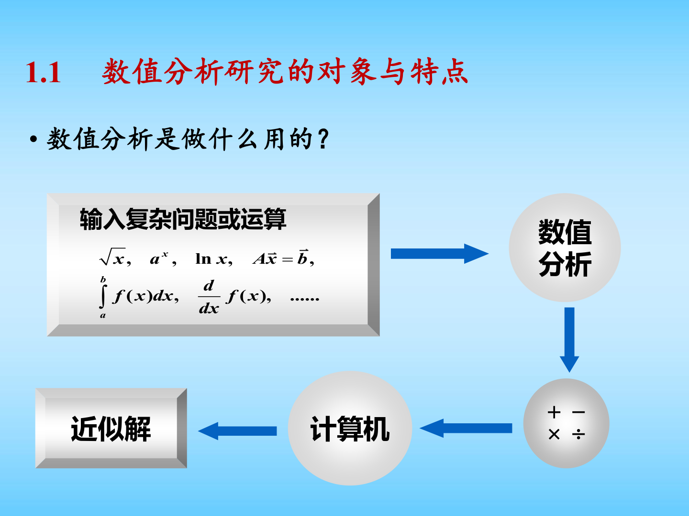
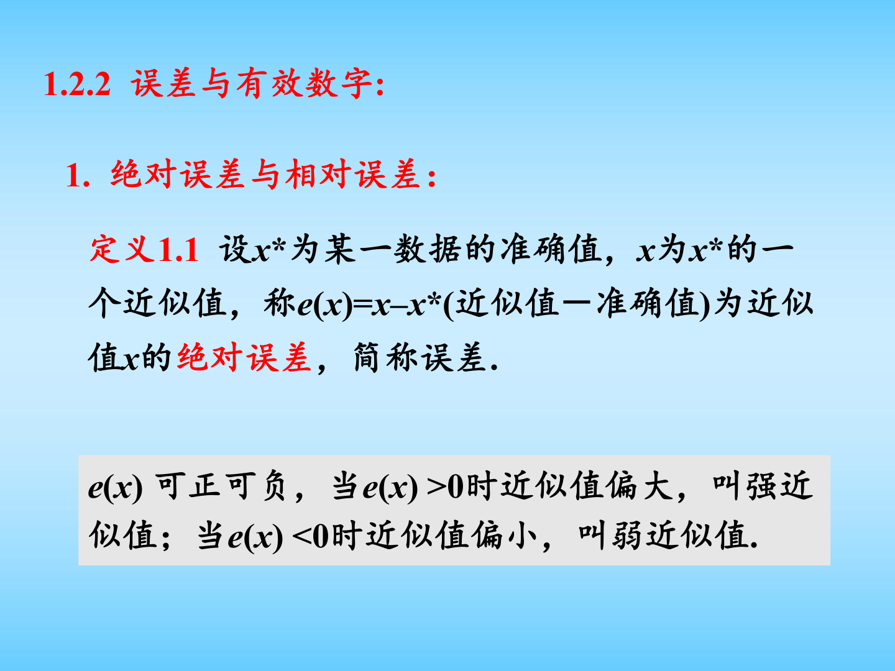

# 第一章 引论图文复习笔记

对应课件：`第一章 引论.pdf`

说明：本文件保留原有的细化总结，并补充了课件中的关键页面截图，方便把“概念定义、误差公式、数值原则”与课件原图对照复习。

## 0. 课件图示导读

图示说明：这页把数值分析的任务概括成“复杂问题或运算 $\to$ 数值分析 $\to$ 计算机 $\to$ 近似解”。复习时要抓住一个核心事实：数值分析不追求抽象的精确解析表达式，而是追求可计算、可控制误差、可评估效率的近似解。

图示说明：这一页是全章最基础的定义页。后面所有“误差估计”“有效数字”“稳定性分析”都依赖这里的绝对误差与相对误差概念。复习时不要只记名称，要能立刻写出

$$
e(x)=x-x^*, \qquad \delta(x)=\frac{x-x^*}{x^*},
$$

并明确二者一个衡量“偏差大小”，一个衡量“偏差占真值的比例”。

图示说明：这页适合考前速记。五条原则分别对应五类常见数值风险：小除数导致误差放大，相近数相减导致有效数字丢失，大数吃小数体现浮点分辨率有限，运算次数过多会累积舍入误差，算法不稳定则会把前面所有误差继续放大。

## 0.5 学习导读

这一章不要当成“定义堆积”去背，而要把它看成整门课的开场说明。学这一章时，最好的顺序不是按页背概念，而是按下面四个问题去理解：

1. 数值分析到底在研究什么。
2. 为什么数值计算一定会有误差。
3. 误差该怎么衡量、怎么传播。
4. 做数值计算时最容易踩哪些坑。

如果这一章学明白了，后面学求根、解线性方程组、插值、积分时，你就会知道：每一种方法最后都必须回答三件事，分别是“算不算得出来”“误差大不大”“过程稳不稳定”。

你可以把这一章当成整门课的方法论总论。后面所有章节，本质上都在重复这里立下来的规则。

## 1. 数值分析研究的对象与特点

### 1.1 数值分析研究什么

数值分析研究的是：如何把实际问题转化为数学模型，再设计适合计算机实现的数值算法，在满足精度要求的前提下高效地求出近似解。

典型流程是：

$$
\text{实际问题} \to \text{数学模型} \to \text{数值方法} \to \text{程序设计} \to \text{计算结果}
$$

其中：

- 从实际问题建立数学模型，主要属于应用数学任务。
- 从数学模型到数值算法、程序实现和结果分析，主要属于计算数学任务。
- 数值分析正是计算数学的核心组成部分。

### 1.2 数值分析的主要特点

- 面向计算机，强调算法可实现。
- 既要能算，又要有理论保证，如收敛性、稳定性、误差控制。
- 要考虑计算复杂度，尽量节省时间和存储。
- 要通过数值实验检验算法是否有效。

### 1.3 常见处理思想

课件中提到的常用思想包括：

- 构造性方法
- 离散化方法
- 递推化方法
- 迭代法
- 近似替代法
- 以直代曲法
- 化整为零法
- 外推法

这些思想几乎贯穿整个数值分析课程。

## 2. 本章涉及的数学基础

### 2.1 Taylor 公式

设函数 $f$ 在 $x^*$ 的邻域内足够光滑，则一元 Taylor 展开为

$$
f(x)=f(x^*)+f'(x^*)(x-x^*)+\frac{f''(x^*)}{2!}(x-x^*)^2+\cdots+\frac{f^{(n)}(x^*)}{n!}(x-x^*)^n+\frac{f^{(n+1)}(\xi)}{(n+1)!}(x-x^*)^{n+1},
$$

其中 $\xi$ 介于 $x$ 与 $x^*$ 之间。

也常写成

$$
f(x)=f(x^*)+f'(x^*)(x-x^*)+\cdots+\frac{f^{(n)}(x^*)}{n!}(x-x^*)^n+O\!\left((x-x^*)^{n+1}\right).
$$

Taylor 公式是误差分析、迭代法收敛性分析、插值与数值积分的基础。

### 2.2 微分中值定理

若 $f\in C[a,b]$ 且在 $(a,b)$ 上可导，则存在 $\xi\in(a,b)$，使得

$$
f(b)-f(a)=f'(\xi)(b-a).
$$

它常用来：

- 证明不动点迭代的收敛性；
- 建立函数值误差与自变量误差之间的联系；
- 分析近似计算中误差如何传播。

### 2.3 介值定理

若 $f\in C[a,b]$，且 $w$ 介于 $f(a)$ 与 $f(b)$ 之间，则存在 $c\in[a,b]$ 使得

$$
f(c)=w.
$$

特别地，若

$$
f(a)f(b)<0,
$$

则方程 $f(x)=0$ 在 $(a,b)$ 内至少有一个实根。这是二分法的理论基础。

### 2.4 积分中值定理

若 $f\in C[a,b]$，则至少存在 $\xi\in[a,b]$ 使得

$$
\int_a^b f(x)\,\mathrm{d}x=f(\xi)(b-a).
$$

更一般地，若 $f,g\in C[a,b]$ 且 $g$ 在 $[a,b]$ 上不变号，则存在 $\xi\in[a,b]$ 使得

$$
\int_a^b f(x)g(x)\,\mathrm{d}x=f(\xi)\int_a^b g(x)\,\mathrm{d}x.
$$

### 2.5 渐近阶与大 $O$ 记号

若存在常数 $C>0$ 和足够小的 $h$，使得

$$
|y_h-y|\le C h^\beta,
$$

则记为

$$
y_h=y+O(h^\beta)\qquad (h\to 0).
$$

这里 $\beta$ 描述误差随步长缩小的速度，是“精度阶”的核心概念。

## 3. 数值计算中的误差与有效数字

## 3.1 误差来源

课件把误差分为两大类。

### 3.1.1 固有误差

固有误差在计算开始之前就已经存在，包括：

- 模型误差：实际问题抽象成数学模型时产生；
- 观测误差：测量工具精度有限或观测随机性导致。

### 3.1.2 计算误差

计算误差发生在数值计算过程中，包括：

- 截断误差：用有限过程代替无限过程，用简单模型代替复杂模型时产生；
- 舍入误差：计算机位数有限，浮点数只能取近似表示。

### 3.1.3 截断误差示例

例如，

$$
e^x=1+x+\frac{x^2}{2!}+\cdots+\frac{x^n}{n!}+R_n(x),
$$

其中余项可写为

$$
R_n(x)=\frac{e^\theta x^{n+1}}{(n+1)!},\qquad 0<\theta<x.
$$

若用前 $n+1$ 项部分和

$$
S_n(x)=1+x+\frac{x^2}{2!}+\cdots+\frac{x^n}{n!}
$$

来近似 $e^x$，那么 $R_n(x)$ 就是截断误差。

### 3.1.4 舍入误差示例

例如：

$$
\pi=3.14159265\cdots \approx 3.1415927,
$$

$$
\sqrt{2}=1.41421356\cdots \approx 1.4142136,
$$

$$
\frac{1}{6}=0.16666666\cdots \approx 0.16666667.
$$

这些都是有限位浮点表示带来的舍入误差。

### 3.1.5 误差传播与积累

课件用“蝴蝶效应”说明：即使初始误差很小，在病态问题或不稳定算法中也可能被迅速放大。因此不能只关心初始误差大小，更要关心算法是否稳定。

## 3.2 绝对误差与相对误差

设准确值为 $x^*$，近似值为 $x$。

### 3.2.1 绝对误差

定义

$$
e(x)=x-x^*.
$$

其绝对值

$$
|e(x)|=|x-x^*|
$$

称为绝对误差。

若存在正数 $\varepsilon(x)$，使得

$$
|x-x^*|\le \varepsilon(x),
$$

则称 $\varepsilon(x)$ 为绝对误差限，也可记成

$$
x^*=x\pm \varepsilon(x).
$$

### 3.2.2 相对误差

仅看绝对误差并不能完全反映精度。例如 $2$ 的误差和 $1000$ 的误差不能直接比较，所以要引入相对误差：

$$
e_r(x)=\frac{x-x^*}{x^*},\qquad x^*\ne 0.
$$

相对误差限定义为

$$
|e_r(x)|=\left|\frac{x-x^*}{x^*}\right|\le \varepsilon_r(x).
$$

实际计算时，由于 $x^*$ 通常未知，常把分母中的 $x^*$ 近似换成 $x$，即

$$
|e_r(x)|\approx \left|\frac{x-x^*}{x}\right|.
$$

### 3.2.3 误差限与取值范围

若给定相对误差限 $\varepsilon_r$，则有

$$
\left|\frac{x-x^*}{x^*}\right|\le \varepsilon_r
\quad\Longrightarrow\quad
x^*(1-\varepsilon_r)\le x\le x^*(1+\varepsilon_r).
$$

这一点在工程允许偏差分析中很常见。

## 3.3 有效数字

### 3.3.1 定义

若近似值 $x$ 可写成规范化形式

$$
x=\pm 0.a_1a_2\cdots a_n\times 10^m,\qquad a_1\ne 0,
$$

并且其绝对误差限满足

$$
|x-x^*|\le \frac{1}{2}\times 10^{m-n},
$$

则称 $x$ 具有 $n$ 位有效数字。

直观理解：

- 某一位上的误差不超过该位半个单位；
- 从第一位非零数字开始往后数，共有 $n$ 位可信。

### 3.3.2 典型例子

以 $\pi$ 为例：

- $x=3.14$，因为
  $$
  |\pi-3.14|<0.005,
  $$
  所以有 $3$ 位有效数字；
- $x=3.1416$，因为
  $$
  |\pi-3.1416|<0.00005,
  $$
  所以有 $5$ 位有效数字。

### 3.3.3 有效数字与相对误差的关系

若

$$
x=\pm 0.a_1a_2\cdots a_n\times 10^m
$$

有 $n$ 位有效数字，则其相对误差限满足

$$
|e_r(x)|\le \frac{1}{2a_1}\times 10^{1-n}.
$$

反过来，若

$$
|e_r(x)|\le \frac{1}{2(a_1+1)}\times 10^{1-n},
$$

则 $x$ 至少有 $n$ 位有效数字。

这个定理非常重要，因为很多题目都是“给定相对误差限，问至少保留几位有效数字”。

### 3.3.4 应用理解

- 测量数据通常默认绝对误差不超过最小刻度的一半；
- 工程分级经常按相对误差限划分；
- 有效数字越多，不代表计算一定越稳定，只代表输入精度更高。

## 4. 数值运算中的误差估计

## 4.1 函数运算误差估计

### 4.1.1 一元函数

设 $y=f(x)$，则由 Taylor 公式可得

$$
\varepsilon(y)\approx |f'(x)|\,\varepsilon(x).
$$

对应的相对误差估计为

$$
\varepsilon_r(y)\approx \left|\frac{x f'(x)}{f(x)}\right|\varepsilon_r(x).
$$

这说明：

- 当 $|f'(x)|$ 很大时，输入误差会被放大；
- 相对误差分析中，关键量是 $\left|\dfrac{x f'(x)}{f(x)}\right|$。

### 4.1.2 多元函数

若

$$
z=f(x_1,x_2,\dots,x_n),
$$

则绝对误差近似为

$$
\varepsilon(z)\approx \sum_{k=1}^n \left|\frac{\partial z}{\partial x_k}\right|\varepsilon(x_k).
$$

相对误差近似为

$$
\varepsilon_r(z)\approx \sum_{k=1}^n \left|\frac{x_k}{z}\frac{\partial z}{\partial x_k}\right|\varepsilon_r(x_k).
$$

## 4.2 四则运算误差估计

设 $x_1,x_2$ 为近似数，则常用误差估计为

### 4.2.1 加减法

$$
\varepsilon(x_1\pm x_2)\le \varepsilon(x_1)+\varepsilon(x_2).
$$

### 4.2.2 乘法

$$
\varepsilon(x_1x_2)\approx |x_2|\,\varepsilon(x_1)+|x_1|\,\varepsilon(x_2).
$$

若用相对误差表示，则常近似写成

$$
\varepsilon_r(x_1x_2)\approx \varepsilon_r(x_1)+\varepsilon_r(x_2).
$$

### 4.2.3 除法

$$
\varepsilon\!\left(\frac{x_1}{x_2}\right)\approx \frac{\varepsilon(x_1)}{|x_2|}+\frac{|x_1|}{|x_2|^2}\varepsilon(x_2).
$$

相对误差常近似写成

$$
\varepsilon_r\!\left(\frac{x_1}{x_2}\right)\approx \varepsilon_r(x_1)+\varepsilon_r(x_2).
$$

### 4.2.4 课件例题的结构

若

$$
p=a+bc,
$$

则误差估计可写成

$$
\varepsilon(p)\approx \varepsilon(a)+|b|\,\varepsilon(c)+|c|\,\varepsilon(b).
$$

这类题本质上就是把复合运算拆开逐层估计。

## 5. 数值计算中的基本原则

## 5.1 避免除数绝对值远小于被除数绝对值

若计算

$$
z=\frac{y}{x},
$$

则

$$
\varepsilon(z)\approx \frac{\varepsilon(y)}{|x|}+\frac{|y|}{|x|^2}\varepsilon(x).
$$

当 $|x|$ 很小时，误差会被显著放大。

## 5.2 避免两个相近的数相减

若

$$
z=y-x,\qquad y\approx x,
$$

则

$$
\varepsilon(z)\le \varepsilon(y)+\varepsilon(x),
$$

但因为 $|z|=|y-x|$ 很小，所以相对误差

$$
\varepsilon_r(z)=\frac{\varepsilon(z)}{|z|}
$$

可能非常大，这就是“有效数字严重丢失”。

常见改写：

$$
\sqrt{x+1}-\sqrt{x}=\frac{1}{\sqrt{x+1}+\sqrt{x}},
$$

$$
1-\cos x=2\sin^2\frac{x}{2},
$$

当 $|x|$ 很小时，

$$
e^x-1=x+\frac{x^2}{2!}+\frac{x^3}{3!}+\cdots
$$

往往比直接相减更稳定。

## 5.3 防止大数“吃掉”小数

若一组数绝对值差异很大，则计算机在对齐指数时可能把小数直接舍去。

因此求和时应尽量按绝对值从小到大累加：

$$
|x_1|\le |x_2|\le \cdots \le |x_n|
\quad\Rightarrow\quad
(((x_1+x_2)+x_3)+\cdots)+x_n.
$$

## 5.4 简化计算步骤，减少运算次数

课件强调：减少运算次数不仅省时，也能减少舍入误差传播。

例如多项式

$$
P_n(x)=a_nx^n+a_{n-1}x^{n-1}+\cdots+a_1x+a_0
$$

可改写为秦九韶格式

$$
P_n(x)=\bigl(\cdots((a_nx+a_{n-1})x+a_{n-2})x+\cdots+a_1\bigr)x+a_0.
$$

这样乘法次数从约 $\dfrac{n(n+1)}{2}$ 次降为 $n$ 次。

## 5.5 选择数值稳定性好的算法

若输入数据带有误差，但计算过程中误差不会明显增长，则称算法稳定；反之称不稳定。

课件中的递推例子说明：若初始误差为 $\delta$，经过若干步递推后误差可能扩大到

$$
10^{10}\delta,
$$

这说明递推过程极不稳定。

稳定性是数值分析的核心标准之一，因为不稳定算法即使形式上正确，也可能给出完全不可信的结果。

## 6. 本章最后应掌握的三个核心指标

### 6.1 准确性

要知道结果误差有多大、是否可信、能否满足精度要求。

### 6.2 效率

要考虑算法耗费的时间和存储量，避免“能算但代价太大”。

### 6.3 稳定性

要判断算法是否会放大初值误差、模型误差和舍入误差。

## 7. 复习时重点记忆的结论

建议至少熟记以下内容：

1. 介值定理与二分法的关系。
2. 绝对误差、相对误差、误差限的定义。
3. 有效数字的判定条件。
4. 有效数字与相对误差限之间的定量关系。
5. 一元函数与多元函数的误差传播公式。
6. 加减乘除的误差估计规律。
7. 五条数值计算基本原则：小除数、相消、大吃小、运算量、稳定性。

## 8. 补充推导

### 8.1 有效数字判据的来龙去脉

设准确值写成规范化形式

$$
x^*=\pm 10^m(0.a_1a_2\cdots a_n a_{n+1}\cdots),\qquad a_1\ne 0.
$$

若近似值 $x$ 与 $x^*$ 前 $n$ 位有效数字相同，则二者的差最多出现在第 $n+1$ 位，因此有

$$
|x-x^*|\le \frac{1}{2}\times 10^{m-n}.
$$

另一方面，由于 $a_1\ge 1$，故

$$
|x^*|\ge 0.1\times 10^m = 10^{m-1}.
$$

于是相对误差满足

$$
\left|\frac{x-x^*}{x^*}\right|
\le
\frac{\frac12 10^{m-n}}{10^{m-1}}
=
\frac12 10^{1-n}.
$$

这说明下面的结论是成立的：

若近似值 $x$ 具有 $n$ 位有效数字，则其相对误差一定满足

$$
\left|\frac{x-x^*}{x^*}\right|
\le
\frac12 10^{1-n}.
$$

反过来，在实际判断中，常把这个不等式当成“至少有 $n$ 位有效数字”的充分判据来用。

### 8.2 一元函数误差传播公式推导

设

$$
y=f(x),
$$

当 $x$ 有小扰动 $\Delta x$ 时，由 Taylor 展开可得

$$
f(x+\Delta x)=f(x)+f'(x)\Delta x+\frac{f''(\xi)}{2}(\Delta x)^2.
$$

当 $\Delta x$ 足够小时，二次项可以忽略，于是

$$
\Delta y \approx f'(x)\Delta x.
$$

因此绝对误差近似满足

$$
|\Delta y| \approx |f'(x)|\,|\Delta x|.
$$

若 $f(x)\ne 0$，则相对误差近似为

$$
\left|\frac{\Delta y}{y}\right|
\approx
\left|\frac{x f'(x)}{f(x)}\right|
\left|\frac{\Delta x}{x}\right|.
$$

这个系数

$$
\left|\frac{x f'(x)}{f(x)}\right|
$$

可以理解为函数对输入误差的“放大倍数”。

### 8.3 多元函数误差传播公式推导

设

$$
y=f(x_1,x_2,\dots,x_m),
$$

则其一阶全微分为

$$
\mathrm{d}y
=
\sum_{i=1}^m \frac{\partial f}{\partial x_i}\mathrm{d}x_i.
$$

把各变量的小误差 $\Delta x_i$ 看成微分量，就得到近似误差传播式

$$
\Delta y \approx \sum_{i=1}^m \frac{\partial f}{\partial x_i}\Delta x_i.
$$

从而绝对误差限可估计为

$$
|\Delta y|
\lesssim
\sum_{i=1}^m \left|\frac{\partial f}{\partial x_i}\right|\,|\Delta x_i|.
$$

这是工程上最常用的误差传播公式之一。它的意义在于：哪个偏导数大，哪个输入误差就对结果更敏感。

### 8.4 乘除法相对误差为什么容易写成“相加”

若

$$
z=xy,
$$

则由微分公式有

$$
\mathrm{d}z = y\,\mathrm{d}x + x\,\mathrm{d}y.
$$

两边同除以 $z=xy$，得

$$
\frac{\mathrm{d}z}{z}
=
\frac{\mathrm{d}x}{x}
+
\frac{\mathrm{d}y}{y}.
$$

因此乘法的相对误差近似满足

$$
\frac{\Delta z}{z}
\approx
\frac{\Delta x}{x}
+
\frac{\Delta y}{y}.
$$

同理，若

$$
z=\frac{x}{y},
$$

则

$$
\frac{\Delta z}{z}
\approx
\frac{\Delta x}{x}
-
\frac{\Delta y}{y}.
$$

若只关心误差限，则常写成

$$
\left|\frac{\Delta z}{z}\right|
\lesssim
\left|\frac{\Delta x}{x}\right|
+
\left|\frac{\Delta y}{y}\right|.
$$

这就是为什么在数值分析里经常说“乘除法的相对误差大致相加”。

## 9. 经典例题

### 9.1 例题 1：避免相近数相减

计算

$$
y=\sqrt{10001}-100.
$$

#### 直接观察

因为

$$
\sqrt{10001}\approx 100.004999875\cdots,
$$

所以

$$
y\approx 0.004999875\cdots.
$$

这里存在明显问题：两个数都约为 $100$，但差值只有 $10^{-3}$ 量级。若前面的大数已经带有舍入误差，则相减后有效数字会大量丢失。

#### 稳定改写

对表达式有理化：

$$
y
=
\sqrt{10001}-100
=
\frac{(\sqrt{10001}-100)(\sqrt{10001}+100)}{\sqrt{10001}+100}
=
\frac{1}{\sqrt{10001}+100}.
$$

于是

$$
y\approx \frac{1}{200.004999875}\approx 0.004999875006.
$$

#### 例题结论

这道题是“避免相近数相减”的标准模型。真正要记住的不是最终数值，而是处理套路：

当出现

$$
\sqrt{a+b}-\sqrt{a}
$$

这种结构时，应优先考虑有理化。

### 9.2 例题 2：面积公式中的误差传播

已知圆半径测得为

$$
r=10.00\pm 0.01\ \text{cm},
$$

求面积

$$
A=\pi r^2
$$

的绝对误差与相对误差估计。

#### 解

由一元函数误差传播公式

$$
\Delta A \approx A'(r)\Delta r = 2\pi r \Delta r.
$$

代入 $r=10$，$\Delta r=0.01$，得

$$
|\Delta A|
\approx
2\pi \times 10 \times 0.01
=
0.2\pi
\approx
0.6283\ \text{cm}^2.
$$

面积近似值为

$$
A=\pi r^2 \approx 100\pi \approx 314.1593\ \text{cm}^2.
$$

因此相对误差约为

$$
\left|\frac{\Delta A}{A}\right|
\approx
\frac{0.6283}{314.1593}
\approx
0.002
=
0.2\%.
$$

#### 更快的相对误差写法

因为

$$
A=\pi r^2,
$$

所以

$$
\frac{\Delta A}{A}
\approx
2\frac{\Delta r}{r}.
$$

代入即可得

$$
\left|\frac{\Delta A}{A}\right|
\approx
2\times \frac{0.01}{10}
=
0.002.
$$

#### 例题结论

幂函数 $y=x^m$ 的相对误差近似会被放大为

$$
\frac{\Delta y}{y}\approx m\frac{\Delta x}{x}.
$$

这类题在误差传播章节中非常高频。
