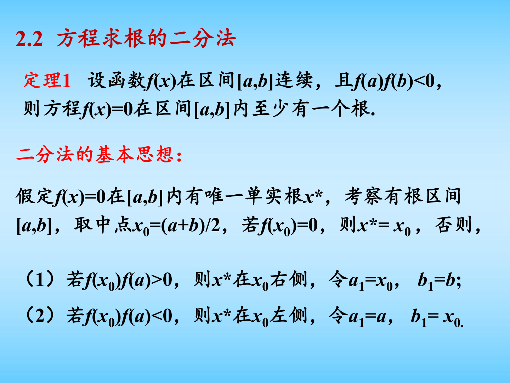
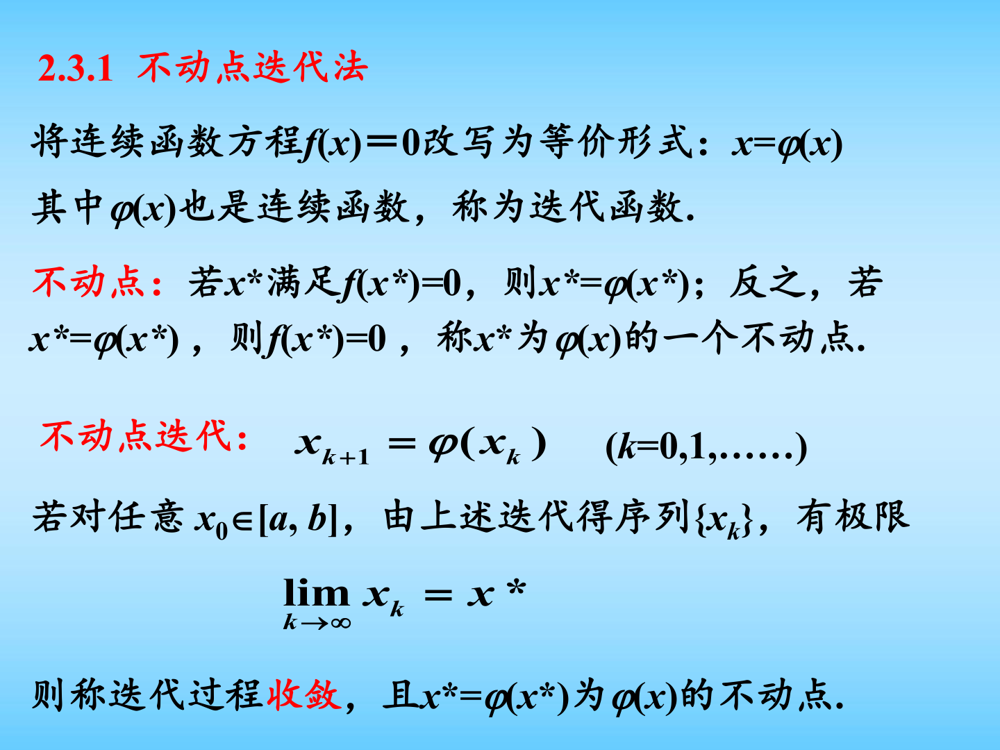
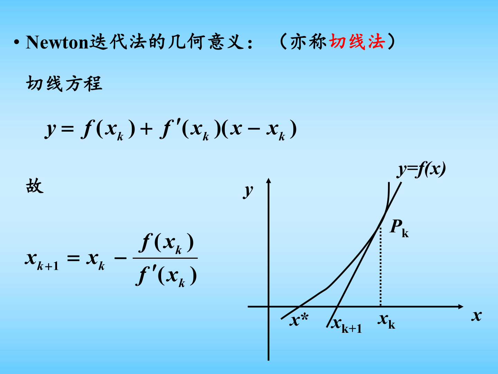
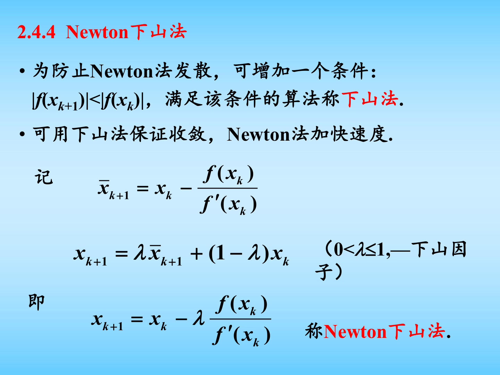

# 第二章 非线性方程求根方法图文复习笔记

对应课件：`第二章 非线性方程求根方法.pdf`

说明：这份笔记在原有详细总结基础上，额外加入了“二分法、不动点迭代、Newton 法、Newton 下山法”的关键页面截图。复习时建议先看图抓方法直觉，再回到公式与收敛性定理。

## 0. 课件图示导读

图示说明：二分法最重要的不是公式，而是“保持隔根区间不丢失”的思想。每一次都把区间长度缩半，因此它的优势是稳，弱点是慢。

图示说明：求根问题先改写成

$$
x=\varphi(x),
$$

然后迭代

$$
x_{k+1}=\varphi(x_k).
$$

真正决定收敛与否的不是原方程本身，而是你选取的**迭代函数 $\varphi(x)$ 是否是压缩映射**。

图示说明：Newton 法的直观解释就是“用当前点处的切线去逼近曲线，并取切线与 $x$ 轴的交点作为下一次迭代”。因为它利用了一阶导数信息，所以在单根附近通常远快于普通不动点迭代。

图示说明：当普通 Newton 法步长过大、可能发散时，可以乘上一个下山因子 $\lambda$，令每步都满足函数值下降。这是把“局部快”与“全局稳”结合起来的常见技巧。

## 0.5 学习导读

这一章学习时，最好按“稳 -> 活 -> 快”的顺序理解。

- `二分法` 最稳：只要连续且有隔根区间，就能往下做。
- `不动点迭代` 最灵活：同一个方程能写出很多迭代格式，但不一定都收敛。
- `Newton 法` 最快：只要初值够好、导数条件合适，后期收敛会非常快。

所以这章真正的主线不是“记三种算法”，而是理解三层问题：

1. 怎么先把根圈住。
2. 怎么构造一个会收敛的迭代格式。
3. 怎么利用导数信息把收敛速度提上去。

如果你顺着这条线往下读，这章会比单纯按方法分块背公式容易很多。

## 1. 引言

非线性方程的一般形式是

$$
f(x)=0.
$$

按函数类型可分为：

- 代数方程：$f(x)=a_0+a_1x+\cdots+a_nx^n$；
- 超越方程：$f(x)$ 中含指数、对数、三角函数等超越函数。

用数值方法求根通常分两步：

1. 找隔根区间；
2. 用迭代方法把根逐步精确化。

所谓隔根区间，是指只含一个实根的区间。

## 2. 二分法

## 2.1 基本定理

若 $f\in C[a,b]$，且

$$
f(a)f(b)<0,
$$

则方程 $f(x)=0$ 在 $(a,b)$ 内至少有一个实根。

这就是二分法成立的基础。

## 2.2 基本思想

设方程在 $[a,b]$ 上有唯一实根 $x^*$，令

$$
x_k=\frac{a_k+b_k}{2}.
$$

若 $f(x_k)=0$，则 $x_k$ 就是根；否则根据符号变化重新保留含根的一半区间：

- 若 $f(a_k)f(x_k)<0$，则取新区间 $[a_{k+1},b_{k+1}]=[a_k,x_k]$；
- 若 $f(a_k)f(x_k)>0$，则取新区间 $[a_{k+1},b_{k+1}]=[x_k,b_k]$。

这样不断二分，区间长度越来越短，近似根越来越精确。

## 2.3 重要性质

每一步迭代后都保持：

$$
f(a_k)f(b_k)<0.
$$

区间长度满足

$$
b_k-a_k=\frac{b-a}{2^k}.
$$

由此可得误差估计

$$
|x_k-x^*|\le \frac{b_k-a_k}{2}=\frac{b-a}{2^{k+1}}.
$$

这说明二分法一定收敛，但收敛速度是线性的，比较慢。

## 2.4 停止准则

课件给出的常用停止条件是：

$$
|f(x_k)|<\varepsilon_0
$$

或

$$
b_k-a_k<\varepsilon_1.
$$

满足任意一个都可停止。

## 2.5 优缺点

优点：

- 思想简单；
- 对函数要求低，只需连续；
- 收敛性有保证。

缺点：

- 收敛速度慢；
- 不能直接处理重根、复根；
- 若区间中有多个根，不能一次全部求出。

## 3. 不动点迭代法

## 3.1 基本思想

把方程

$$
f(x)=0
$$

改写为等价形式

$$
x=\varphi(x).
$$

若某点 $x^*$ 满足

$$
x^*=\varphi(x^*),
$$

则称 $x^*$ 是 $\varphi$ 的不动点，也就是原方程的根。

给定初值 $x_0$ 后，构造迭代

$$
x_{k+1}=\varphi(x_k),\qquad k=0,1,2,\dots
$$

若 $x_k\to x^*$，则称该迭代收敛。

## 3.2 几何意义

在平面上画出

$$
y=\varphi(x),\qquad y=x.
$$

两条曲线交点的横坐标就是不动点。迭代过程可理解为在曲线 $y=\varphi(x)$ 与直线 $y=x$ 之间作“阶梯逼近”。

## 3.3 为什么有的格式收敛，有的格式发散

同一个方程可以写成许多不同的迭代格式，不同格式的收敛性差别可能极大。

例如课件中对同一个方程，某种写法迭代到

$$
x^*\approx 1.32472,
$$

而另一种写法则会迅速发散。

结论是：不动点迭代的关键不在“能不能改写”，而在“改写后 $\varphi$ 的性质是否合适”。

## 4. 不动点的存在性与收敛性

## 4.1 不动点存在唯一性定理

若 $\varphi(x)\in C[a,b]$，并满足：

$$
a\le \varphi(x)\le b,\qquad \forall x\in[a,b],
$$

且 $\varphi$ 在 $[a,b]$ 上一阶连续可导，并存在常数 $L$，满足

$$
|\varphi'(x)|\le L<1,\qquad \forall x\in[a,b],
$$

则 $\varphi$ 在 $[a,b]$ 上存在唯一不动点 $x^*$。

这个条件的本质是：$\varphi$ 把区间映到自身，而且是压缩映射。

## 4.2 全局收敛性定理

在上述条件下，对任意初值 $x_0\in[a,b]$，由

$$
x_{n+1}=\varphi(x_n)
$$

得到的迭代序列都收敛到唯一不动点 $x^*$。

## 4.3 误差估计

课件给出两个非常重要的误差估计式：

### 4.3.1 后验误差估计

$$
|x_n-x^*|\le \frac{L}{1-L}|x_n-x_{n-1}|.
$$

它可以用已经算出的相邻两次迭代值来估计当前误差。

### 4.3.2 先验误差估计

$$
|x_n-x^*|\le \frac{L^n}{1-L}|x_1-x_0|.
$$

它可以在迭代前估计需要多少步才能达到目标精度。

## 4.4 局部收敛性定理

若 $x^*$ 是不动点，$\varphi'(x)$ 在 $x^*$ 的某邻域连续，且

$$
|\varphi'(x^*)|<1,
$$

则只要初值 $x_0$ 足够接近 $x^*$，迭代

$$
x_{k+1}=\varphi(x_k)
$$

就收敛到 $x^*$。

这叫局部收敛。它比全局收敛更弱，但在实际中更常见。

## 5. 收敛阶

设误差

$$
e_k=x_k-x^*.
$$

若存在常数 $c\ne 0$，使得

$$
\lim_{k\to\infty}\frac{|e_{k+1}|}{|e_k|^r}=c,
$$

则称该迭代过程是 $r$ 阶收敛。

其中：

- $r=1$：线性收敛；
- $r=2$：平方收敛；
- $r>1$：超线性收敛。

收敛阶越高，通常意味着后期收敛越快。

## 5.1 高阶收敛判据

若 $\varphi$ 在 $x^*$ 附近具有 $p$ 次连续导数，且满足

$$
\varphi'(x^*)=\varphi''(x^*)=\cdots=\varphi^{(p-1)}(x^*)=0,\qquad \varphi^{(p)}(x^*)\ne 0,
$$

则迭代

$$
x_{n+1}=\varphi(x_n)
$$

在 $x^*$ 附近是 $p$ 阶收敛的。

这个结论解释了为什么 Newton 法通常比普通不动点迭代快得多。

## 6. 迭代收敛的加速方法

## 6.1 Aitken $\Delta^2$ 加速

对线性收敛序列 $\{x_k\}$，Aitken 加速公式为

$$
\hat{x}_k=x_k-\frac{(x_{k+1}-x_k)^2}{x_{k+2}-2x_{k+1}+x_k}.
$$

作用：

- 不改变原问题；
- 利用三个连续迭代值构造更快收敛的新序列；
- 对线性收敛序列效果明显。

## 6.2 Steffensen 迭代法

把 Aitken 技巧与不动点迭代结合，可得 Steffensen 迭代。

设

$$
y_k=\varphi(x_k),\qquad z_k=\varphi(y_k),
$$

则

$$
x_{k+1}=x_k-\frac{(y_k-x_k)^2}{z_k-2y_k+x_k}.
$$

也可写成

$$
x_{k+1}=x_k-\frac{(\varphi(x_k)-x_k)^2}{\varphi(\varphi(x_k))-2\varphi(x_k)+x_k}.
$$

Steffensen 法的优点是：

- 不需要求导；
- 往往比普通不动点迭代快得多；
- 有时即使原不动点迭代发散，Steffensen 法仍可能收敛。

## 7. Newton 迭代法

## 7.1 基本思想

设 $x_k$ 是方程 $f(x)=0$ 的近似根，在 $x_k$ 处做 Taylor 展开：

$$
f(x)\approx f(x_k)+f'(x_k)(x-x_k).
$$

令右端线性近似等于 $0$，得到下一次迭代点

$$
x_{k+1}=x_k-\frac{f(x_k)}{f'(x_k)}.
$$

这就是 Newton 迭代公式。

## 7.2 几何意义

Newton 法也叫切线法。

在点 $(x_k,f(x_k))$ 处作曲线 $y=f(x)$ 的切线，切线与 $x$ 轴交点的横坐标就是 $x_{k+1}$。

因此 Newton 法本质上是“用切线代替曲线，再求线性方程的根”。

## 7.3 Newton 法的优点

- 若初值足够接近单根，收敛非常快；
- 常只需少量迭代即可达到高精度；
- 局部至少二阶收敛。

## 7.4 Newton 法的局部收敛性

若：

- $f(x^*)=0$；
- $f'(x^*)\ne 0$；
- $f$ 在 $x^*$ 附近有连续二阶导数；

则对充分靠近 $x^*$ 的初值 $x_0$，Newton 迭代产生的序列至少平方收敛到 $x^*$。

平方收敛意味着：

$$
|e_{k+1}|\approx C|e_k|^2.
$$

误差一旦足够小，就会下降得非常快。

## 7.5 正数平方根的 Newton 迭代

要求 $\sqrt{C}$，可令

$$
f(x)=x^2-C.
$$

代入 Newton 公式得

$$
x_{n+1}=x_n-\frac{x_n^2-C}{2x_n}
=\frac{1}{2}\left(x_n+\frac{C}{x_n}\right).
$$

这是经典的开平方算法。

课件中还给出重要恒等式

$$
\frac{x_{n+1}-\sqrt{C}}{x_{n+1}+\sqrt{C}}
=
\left(\frac{x_n-\sqrt{C}}{x_n+\sqrt{C}}\right)^2,
$$

由此可直接看出其二阶收敛性。

## 7.6 Newton 法与不动点迭代的速度比较

课件中方程

$$
xe^x-1=0
$$

用 Newton 法只需约 $3$ 次迭代即可达到较高精度，而普通不动点迭代达到同一精度需要更多步。这是 Newton 法“局部快收敛”的典型体现。

## 7.7 Newton 法的缺陷

课件强调了两个主要风险：

1. 分母 $f'(x_k)$ 可能接近零，导致被零除或步长过大；
2. 初值选不好时可能发散，甚至进入死循环。

因此 Newton 法并不是“总是最好”，它强依赖初值位置和函数局部形态。

## 8. 简化 Newton 法

把 Newton 法中的导数换成某个固定常数的倒数，可得

$$
x_{k+1}=x_k-cf(x_k),\qquad c\ne 0.
$$

其迭代函数为

$$
\varphi(x)=x-cf(x).
$$

若在根附近有

$$
|\varphi'(x)|=|1-cf'(x)|<1,
$$

即

$$
0<cf'(x)<2,
$$

则迭代收敛。

若取

$$
c=\frac{1}{f'(x_0)},
$$

就得到课件中的简化 Newton 法，也称平行弦法。

特点：

- 每次不再重复求导；
- 单步开销小；
- 一般比标准 Newton 法慢。

## 9. 弦截法

在 Newton 公式中用差商近似导数：

$$
f'(x_k)\approx \frac{f(x_k)-f(x_{k-1})}{x_k-x_{k-1}},
$$

则得到弦截法

$$
x_{k+1}
=
x_k-\frac{f(x_k)(x_k-x_{k-1})}{f(x_k)-f(x_{k-1})}.
$$

几何意义：用过两点 $(x_{k-1},f(x_{k-1}))$、$(x_k,f(x_k))$ 的割线代替切线。

特点：

- 不需要导数；
- 一般比简化 Newton 法快；
- 但通常不如标准 Newton 法快，也需要两个初值。

## 10. Newton 下山法

为了避免 Newton 法发散，课件引入“下山因子” $\lambda_k$。

先计算标准 Newton 点

$$
\bar{x}_{k+1}=x_k-\frac{f(x_k)}{f'(x_k)},
$$

再令

$$
x_{k+1}=x_k+\lambda_k(\bar{x}_{k+1}-x_k),
\qquad 0<\lambda_k\le 1.
$$

等价写成

$$
x_{k+1}=x_k-\lambda_k\frac{f(x_k)}{f'(x_k)}.
$$

### 10.1 下降条件

选择 $\lambda_k$ 使得

$$
|f(x_{k+1})|<|f(x_k)|.
$$

### 10.2 课件中的选取策略

从

$$
\lambda_k=1
$$

开始，若不满足下降条件，就依次尝试

$$
1,\ \frac{1}{2},\ \frac{1}{4},\ \frac{1}{8},\dots
$$

直到条件成立。

这种方法兼顾了：

- Newton 法的快速性；
- 迭代过程的可靠性。

## 11. 重根情形

若

$$
f(x)=(x-x^*)^m g(x),\qquad m\ge 2,\quad g(x^*)\ne 0,
$$

则 $x^*$ 是 $m$ 重根。

## 11.1 直接使用 Newton 法

仍然可以用

$$
x_{k+1}=x_k-\frac{f(x_k)}{f'(x_k)}
$$

迭代，但这时通常只表现为线性收敛，不再具有标准 Newton 法的二阶速度。

## 11.2 已知重数时的修正 Newton 法

若重数 $m$ 已知，可改为

$$
x_{k+1}=x_k-m\frac{f(x_k)}{f'(x_k)}.
$$

这时在重根附近可恢复二阶收敛。

## 11.3 不知道重数时的修正方法

课件定义

$$
\mu(x)=\frac{f(x)}{f'(x)}.
$$

由于重根 $x^*$ 是 $\mu(x)=0$ 的单根，对 $\mu$ 再用 Newton 法可得

$$
x_{k+1}
=
x_k-\frac{\mu(x_k)}{\mu'(x_k)}
=
x_k-\frac{f(x_k)f'(x_k)}{[f'(x_k)]^2-f(x_k)f''(x_k)}.
$$

该方法对重根仍可达到二阶收敛。

## 12. 本章方法对比

### 12.1 二分法

- 收敛最可靠；
- 速度慢；
- 适合先定位、后精化。

### 12.2 不动点迭代

- 形式灵活；
- 是否收敛高度依赖迭代函数；
- 关键判据是 $|\varphi'(x)|<1$。

### 12.3 Aitken/Steffensen

- 用于加速迭代；
- Steffensen 不需要导数；
- 常明显快于普通不动点迭代。

### 12.4 Newton 法

- 单根附近最快；
- 至少二阶收敛；
- 对初值和导数条件敏感。

### 12.5 简化 Newton 法与弦截法

- 都是在降低 Newton 法的单步代价；
- 简化 Newton 法省去重复求导；
- 弦截法进一步不需要导数。

### 12.6 Newton 下山法

- 用下降条件增强可靠性；
- 是工程中很重要的实用改造。

### 12.7 重根修正

- 普通 Newton 法在重根处退化为线性收敛；
- 修正公式是考试和作业中的高频点。

## 13. 复习时必须掌握的公式

建议重点背熟以下公式：

1. 二分法中点公式
   $$
   x_k=\frac{a_k+b_k}{2}
   $$
2. 二分法误差界
   $$
   |x_k-x^*|\le \frac{b-a}{2^{k+1}}
   $$
3. 不动点迭代
   $$
   x_{k+1}=\varphi(x_k)
   $$
4. 不动点收敛判据
   $$
   |\varphi'(x)|\le L<1
   $$
5. Aitken 加速公式
   $$
   \hat{x}_k=x_k-\frac{(x_{k+1}-x_k)^2}{x_{k+2}-2x_{k+1}+x_k}
   $$
6. Steffensen 公式
   $$
   x_{k+1}=x_k-\frac{(\varphi(x_k)-x_k)^2}{\varphi(\varphi(x_k))-2\varphi(x_k)+x_k}
   $$
7. Newton 公式
   $$
   x_{k+1}=x_k-\frac{f(x_k)}{f'(x_k)}
   $$
8. 弦截法公式
   $$
   x_{k+1}=x_k-\frac{f(x_k)(x_k-x_{k-1})}{f(x_k)-f(x_{k-1})}
   $$
9. Newton 下山法
   $$
   x_{k+1}=x_k-\lambda_k\frac{f(x_k)}{f'(x_k)}
   $$
10. 重根修正公式
   $$
   x_{k+1}=x_k-m\frac{f(x_k)}{f'(x_k)}
   $$

## 14. 补充推导

### 14.1 二分法误差界为什么是 $\dfrac{b-a}{2^{k+1}}$

设原始隔根区间长度为

$$
L_0=b-a.
$$

每做一次二分，区间长度缩短一半，因此第 $k$ 次迭代后有

$$
L_k=\frac{b-a}{2^k}.
$$

若取区间中点

$$
x_k=\frac{a_k+b_k}{2},
$$

而真根 $x^*$ 仍在 $[a_k,b_k]$ 内，则中点到区间任一点的最大距离不会超过半个区间长度，即

$$
|x_k-x^*|\le \frac{L_k}{2}
=
\frac{b-a}{2^{k+1}}.
$$

这个推导说明：二分法误差估计几乎不依赖函数的导数信息，它只利用了“根始终被夹在当前区间里”这一点，所以方法非常稳健。

### 14.2 不动点迭代局部收敛判据的推导

设 $x^*$ 为不动点，即

$$
x^*=\varphi(x^*).
$$

令误差

$$
e_k=x_k-x^*.
$$

则

$$
e_{k+1}
=
x_{k+1}-x^*
=
\varphi(x_k)-\varphi(x^*).
$$

由微分中值定理，存在 $\xi_k$ 介于 $x_k$ 与 $x^*$ 之间，使得

$$
e_{k+1}=\varphi'(\xi_k)e_k.
$$

若在根附近满足

$$
|\varphi'(x)|\le q<1,
$$

则

$$
|e_{k+1}|\le q|e_k|.
$$

不断迭代得到

$$
|e_k|\le q^k |e_0|,
$$

于是 $e_k\to 0$，即迭代收敛。

这个推导也解释了一个事实：如果

$$
|\varphi'(x^*)|>1,
$$

那么误差通常会被放大，迭代大概率发散。

### 14.3 Newton 法二阶收敛的推导

设 $x^*$ 是单根，即

$$
f(x^*)=0,\qquad f'(x^*)\ne 0.
$$

Newton 迭代为

$$
x_{k+1}=x_k-\frac{f(x_k)}{f'(x_k)}.
$$

令

$$
e_k=x_k-x^*.
$$

在 $x^*$ 附近对 $f(x_k)$ 作 Taylor 展开：

$$
f(x_k)
=
f(x^*)+f'(x^*)e_k+\frac{f''(\xi_k)}{2}e_k^2
=
f'(x^*)e_k+\frac{f''(\xi_k)}{2}e_k^2.
$$

同时

$$
f'(x_k)=f'(x^*)+O(e_k).
$$

代回 Newton 公式并整理，可得

$$
e_{k+1}
=
\frac{f''(x^*)}{2f'(x^*)}e_k^2+O(e_k^3).
$$

因此当 $e_k$ 足够小时，有

$$
|e_{k+1}|\approx C|e_k|^2,
$$

这正是二阶收敛的定义。也就是说，误差一旦足够小，下一步大致等于“当前误差的平方”，所以 Newton 法后期会非常快。

### 14.4 重根时为什么普通 Newton 法会退化

若

$$
f(x)=(x-x^*)^m g(x),\qquad m\ge 2,\quad g(x^*)\ne 0,
$$

则

$$
f'(x)
=
m(x-x^*)^{m-1}g(x)+(x-x^*)^m g'(x).
$$

在根附近，主导项满足

$$
\frac{f(x)}{f'(x)}
\approx
\frac{(x-x^*)^m g(x^*)}{m(x-x^*)^{m-1}g(x^*)}
=
\frac{x-x^*}{m}.
$$

所以普通 Newton 迭代近似为

$$
x_{k+1}
\approx
x_k-\frac{x_k-x^*}{m},
$$

即

$$
e_{k+1}\approx \left(1-\frac{1}{m}\right)e_k.
$$

这已经是线性收敛，而不是平方收敛。因此重根场景下必须特别使用修正公式。

## 15. 经典例题

### 15.1 例题 1：用二分法求 $x^3-x-1=0$ 在 $[1,2]$ 上的根

设

$$
f(x)=x^3-x-1.
$$

先验证隔根性：

$$
f(1)=-1<0,\qquad f(2)=5>0.
$$

所以在区间 $[1,2]$ 内至少有一个根。

#### 前四步迭代

1. 第一步：
   $$
   x_1=\frac{1+2}{2}=1.5,\qquad f(1.5)=0.875>0.
   $$
   故新区间为
   $$
   [1,1.5].
   $$

2. 第二步：
   $$
   x_2=\frac{1+1.5}{2}=1.25,\qquad f(1.25)=-0.296875<0.
   $$
   故新区间为
   $$
   [1.25,1.5].
   $$

3. 第三步：
   $$
   x_3=\frac{1.25+1.5}{2}=1.375,\qquad f(1.375)=0.224609375>0.
   $$
   故新区间为
   $$
   [1.25,1.375].
   $$

4. 第四步：
   $$
   x_4=\frac{1.25+1.375}{2}=1.3125,\qquad f(1.3125)=-0.051513671875<0.
   $$
   故新区间为
   $$
   [1.3125,1.375].
   $$

#### 误差估计

由二分法误差界

$$
|x_4-x^*|\le \frac{2-1}{2^{5}}=\frac{1}{32}=0.03125.
$$

#### 例题结论

二分法的特点在这道题里体现得很明显：

- 每一步都很简单；
- 根始终不会丢失；
- 但区间缩小速度是固定的，所以并不快。

### 15.2 例题 2：用 Newton 法求 $\sqrt{2}$

令

$$
f(x)=x^2-2,
$$

则

$$
f'(x)=2x.
$$

Newton 迭代公式为

$$
x_{k+1}
=
x_k-\frac{x_k^2-2}{2x_k}
=
\frac12\left(x_k+\frac{2}{x_k}\right).
$$

取初值

$$
x_0=1.5.
$$

#### 迭代过程

第一步：

$$
x_1=\frac12\left(1.5+\frac{2}{1.5}\right)=1.4166666667.
$$

第二步：

$$
x_2=\frac12\left(1.4166666667+\frac{2}{1.4166666667}\right)\approx 1.4142156863.
$$

第三步：

$$
x_3=\frac12\left(1.4142156863+\frac{2}{1.4142156863}\right)\approx 1.4142135624.
$$

而

$$
\sqrt{2}\approx 1.4142135624.
$$

#### 例题结论

只需三步就已经达到很高精度。这正是 Newton 法在单根附近二阶收敛的典型表现。

### 15.3 例题 3：重根修正的必要性

考虑方程

$$
f(x)=(x-1)^2=0.
$$

#### 普通 Newton 法

有

$$
f'(x)=2(x-1),
$$

因此

$$
x_{k+1}
=
x_k-\frac{(x_k-1)^2}{2(x_k-1)}
=
\frac{x_k+1}{2}.
$$

于是误差满足

$$
e_{k+1}=\frac12 e_k.
$$

这只是线性收敛。

#### 修正 Newton 法

因为重数 $m=2$，采用修正公式

$$
x_{k+1}=x_k-2\frac{f(x_k)}{f'(x_k)}.
$$

代入即得

$$
x_{k+1}
=
x_k-2\cdot \frac{(x_k-1)^2}{2(x_k-1)}
=
1.
$$

也就是说，只要初值不等于 $1$，一步就能到达精确根。

#### 例题结论

这道题非常经典，因为它把“普通 Newton 法在重根处退化”和“修正 Newton 法恢复高阶收敛”展示得非常直观。
