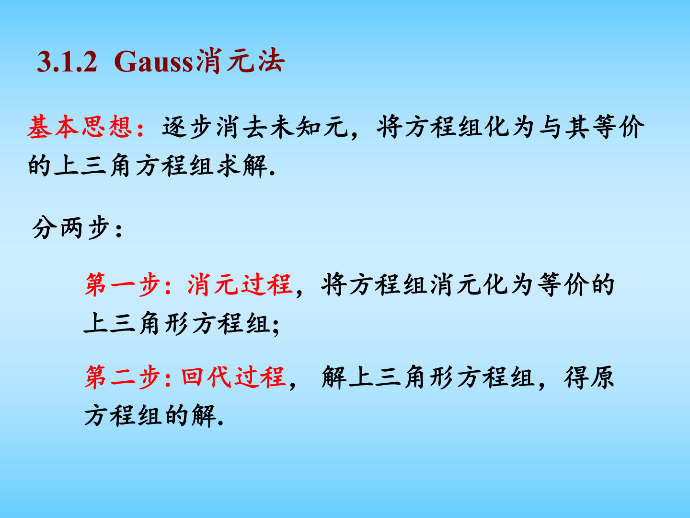
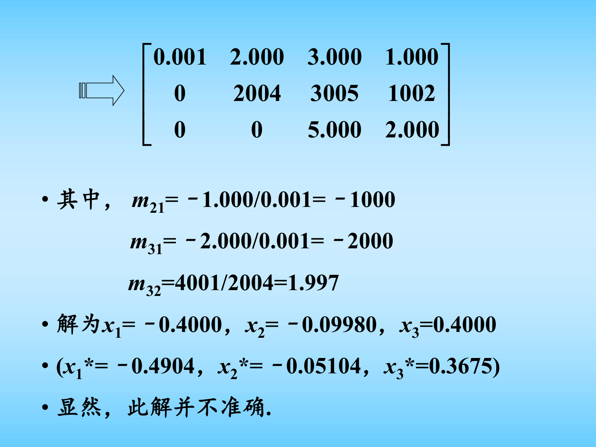
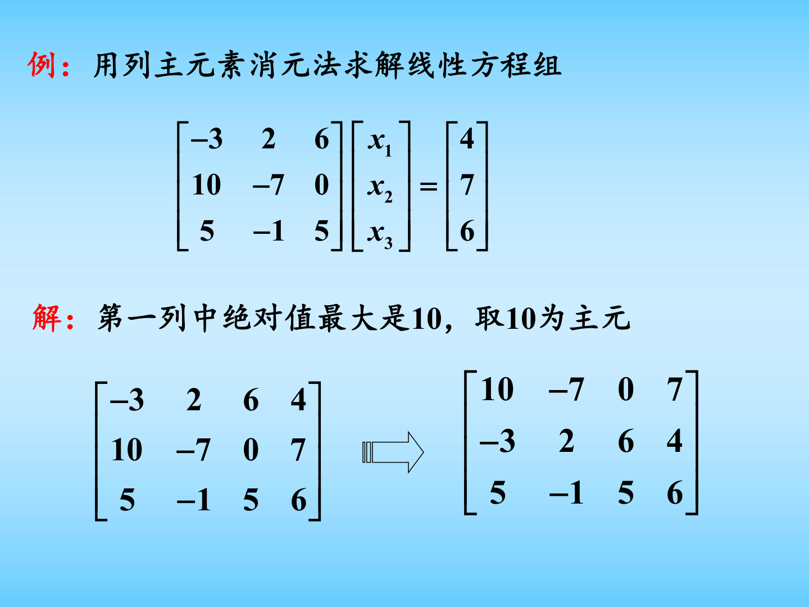

# 第三章 线性方程组的数值解法（一）图文复习笔记

对应课件：`第三章 线性方程组的数值解法（一）.pdf`

## 0. 课件图示导读

图示说明：直接法的核心是“把难解的满矩阵方程组，逐步化成容易回代的上三角方程组”。因此复习时应把“消元”和“回代”作为两个阶段来记。

图示说明：这一页很好地展示了为什么不能机械套公式。若主元非常小，则消元乘子

$$
m_{ik}=\frac{a_{ik}^{(k-1)}}{a_{kk}^{(k-1)}}
$$

会变得很大，舍入误差就会被显著放大，从而得到很差的近似解。

图示说明：列主元法的动作很简单，就是每一列优先选绝对值最大的元素作为主元再消元。它不改变数学解，却常常显著改善数值稳定性。

说明：本份 PDF 实际展开的内容主要是线性方程组的直接法，包括 Gauss 消元、列主元消元、三角分解以及全主元消元的基本思想。目录页中提到的“向量和矩阵的范数”“误差分析”在当前 PDF 中未继续展开。

## 1. 引言

## 1.1 线性方程组的一般形式

一般线性方程组可写为

$$
Ax=b,
$$

其中

$$
A=(a_{ij})_{n\times n},\qquad
x=
\begin{bmatrix}
x_1\\x_2\\\vdots\\x_n
\end{bmatrix},
\qquad
b=
\begin{bmatrix}
b_1\\b_2\\\vdots\\b_n
\end{bmatrix}.
$$

若

$$
\det(A)\ne 0,
$$

则方程组有唯一解。

## 1.2 Cramer 法则与数值方法

理论上可用 Cramer 法则求解：

$$
x_k=\frac{D_k}{D},
$$

其中 $D=\det(A)$，$D_k$ 是把 $A$ 的第 $k$ 列换成 $b$ 后得到的行列式。

但它只适合低阶方程组。随着维数增大，计算量迅速爆炸，因此高阶线性方程组通常用数值方法求解。

课件将方法分成两类：

- 直接法；
- 迭代法。

本份课件主要讲直接法。

## 1.3 课件中的建模例子

课件以“小行星轨道拟合”为例，说明实际问题最终会转化为线性方程组。对若干观测点代入椭圆方程

$$
a_1x^2+a_2xy+a_3y^2+a_4x+a_5y+1=0
$$

后，可得到关于系数 $a_1,\dots,a_5$ 的线性方程组，从而利用数值线性代数方法求解。

## 2. Gauss 消元法

## 2.1 基本思想

Gauss 消元法的目标是把一般线性方程组逐步化为上三角方程组，然后再回代求解。

整个过程分两步：

1. 消元：把 $A$ 化为上三角矩阵；
2. 回代：从最后一个未知量开始逐个求出。

## 2.2 消元公式

记初始系数为

$$
a_{ij}^{(0)}=a_{ij},\qquad b_i^{(0)}=b_i.
$$

第 $k$ 轮消元中，主元为

$$
a_{kk}^{(k-1)}.
$$

若主元不为零，则对 $i=k+1,\dots,n$ 定义消元乘子

$$
m_{ik}^{(k-1)}=\frac{a_{ik}^{(k-1)}}{a_{kk}^{(k-1)}}.
$$

再更新后续元素：

$$
a_{ij}^{(k)}=a_{ij}^{(k-1)}-m_{ik}^{(k-1)}a_{kj}^{(k-1)},
\qquad i,j=k+1,\dots,n,
$$

$$
b_i^{(k)}=b_i^{(k-1)}-m_{ik}^{(k-1)}b_k^{(k-1)},
\qquad i=k+1,\dots,n.
$$

经过 $n-1$ 轮后，得到等价的上三角方程组

$$
Ux=\tilde{b}.
$$

## 2.3 回代公式

设上三角方程组为

$$
\begin{cases}
u_{11}x_1+u_{12}x_2+\cdots+u_{1n}x_n=\tilde{b}_1,\\
u_{22}x_2+\cdots+u_{2n}x_n=\tilde{b}_2,\\
\qquad\vdots\\
u_{nn}x_n=\tilde{b}_n.
\end{cases}
$$

则回代从最后一行开始：

$$
x_n=\frac{\tilde{b}_n}{u_{nn}},
$$

$$
x_i=\frac{\tilde{b}_i-\sum_{j=i+1}^{n}u_{ij}x_j}{u_{ii}},
\qquad i=n-1,n-2,\dots,1.
$$

## 2.4 计算量

课件给出的总工作量为

$$
S=n^2+\frac{n^3-n}{3}.
$$

因此当 $n$ 很大时，主导项是

$$
\frac{1}{3}n^3.
$$

这说明 Gauss 消元法虽然远优于 Cramer 法则，但在大规模问题上仍然代价不低。

## 2.5 消元可行的条件

课件给出的结论是：

Gauss 消元过程中所有约化主元

$$
a_{k+1,k+1}^{(k)}\ne 0,\qquad k=0,1,\dots,n-1
$$

的充分必要条件是矩阵 $A$ 的各阶顺序主子式均不为零，即

$$
D_k\ne 0,\qquad k=1,2,\dots,n.
$$

其中

$$
D_k=
\begin{vmatrix}
a_{11} & \cdots & a_{1k}\\
\vdots & \ddots & \vdots\\
a_{k1} & \cdots & a_{kk}
\end{vmatrix}.
$$

并且约化主元满足

$$
a_{11}=D_1,\qquad
a_{k+1,k+1}^{(k)}=\frac{D_{k+1}}{D_k}\quad (k=1,2,\dots,n-1).
$$

这个结论既是理论判据，也是 LU 分解存在性的基础。

## 3. 矩阵的三角分解

## 3.1 LU 分解的来源

Gauss 消元的每一步本质上都对应一个初等下三角变换。把所有消元乘子收集起来，就可以把矩阵写成

$$
A=LU,
$$

其中：

- $L$ 是单位下三角矩阵；
- $U$ 是上三角矩阵。

课件中的 $L$ 的下三角元素正是消元乘子：

$$
L=
\begin{bmatrix}
1 & 0 & \cdots & 0\\
m_{21} & 1 & \cdots & 0\\
\vdots & \ddots & \ddots & \vdots\\
m_{n1} & \cdots & m_{n,n-1} & 1
\end{bmatrix}.
$$

## 3.2 LU 分解存在唯一性

若矩阵 $A$ 的顺序主子式满足

$$
D_k\ne 0,\qquad k=1,2,\dots,n-1,
$$

则 $A$ 可以唯一分解为

$$
A=LU.
$$

这一定理是课件中的重点结论。

## 3.3 利用 LU 分解解方程组

若

$$
A=LU,
$$

则

$$
Ax=b \quad\Longleftrightarrow\quad LUx=b.
$$

令

$$
Ux=y,
$$

则求解过程分两步：

1. 先解下三角方程组
   $$
   Ly=b;
   $$
2. 再解上三角方程组
   $$
   Ux=y.
   $$

这对“同一个系数矩阵、多个不同右端项”的情形特别有用，因为 $LU$ 只需分解一次。

## 3.4 顺代与回代

若

$$
Ly=b,
$$

其中 $L$ 为单位下三角矩阵，则顺代公式为

$$
y_1=b_1,
$$

$$
y_i=b_i-\sum_{j=1}^{i-1}l_{ij}y_j,\qquad i=2,3,\dots,n.
$$

随后再对

$$
Ux=y
$$

做回代即可。

## 4. 列主元 Gauss 消元法

## 4.1 为什么要选主元

普通 Gauss 消元若主元非常小，会导致消元乘子

$$
m_{ik}=\frac{a_{ik}}{a_{kk}}
$$

非常大，从而使舍入误差被放大，严重影响结果精度。

课件中的例子里，若直接拿很小的主元 $0.001$ 做除数，会得到

$$
m_{21}=-1000,\qquad m_{31}=-2000,
$$

使计算误差明显恶化。

## 4.2 基本思想

第 $k$ 步消元时，不直接使用当前位置的元素作主元，而是在第 $k$ 列的候选元素中选绝对值最大的一个：

$$
|a_{pk}^{(k-1)}|
=
\max_{i=k,\dots,n}|a_{ik}^{(k-1)}|.
$$

然后交换第 $k$ 行与第 $p$ 行，再进行消元。

这种方法叫列主元消元法，也就是常说的部分选主元法。

## 4.3 优点

- 可有效避免“小主元”引起的数值不稳定；
- 对绝大多数实际问题都很可靠；
- 是工程和软件实现中的标准做法之一。

## 4.4 数值效果

课件用四位浮点数的例子表明：

- 不选主元时，得到的近似解与精确解偏差较大；
- 交换行后再消元，结果显著改善。

这说明“是否选主元”并不只是理论细节，而是直接影响计算质量的关键操作。

## 5. 列主元的三角分解

## 5.1 分解形式

由于列主元法包含行交换，所以此时不再是简单的

$$
A=LU,
$$

而是

$$
PA=LU,
$$

其中：

- $P$ 是排列矩阵，表示若干次行交换；
- $L$ 是单位下三角矩阵；
- $U$ 是上三角矩阵。

这就是列主元的 LU 分解形式。

## 5.2 课件中的结论

课件给出定理：

若 $A$ 非奇异，则存在排列矩阵 $P$，使得

$$
PA=LU.
$$

这说明即使普通 LU 分解因零主元或小主元失败，只要允许交换行，分解通常仍可继续进行。

## 6. 全主元消元法

## 6.1 定义

在第 $k$ 步，不只在第 $k$ 列中选主元，而是在当前剩余子矩阵中寻找绝对值最大的元素：

$$
|a_{pq}^{(k-1)}|
=
\max_{i,j=k,\dots,n}|a_{ij}^{(k-1)}|.
$$

这个元素称为全主元。

## 6.2 基本思想

找到全主元后，需要同时：

- 交换行，把它移到第 $k$ 行；
- 交换列，把它移到第 $k$ 列；

然后再继续消元。

## 6.3 特点

- 数值稳定性通常比列主元法更强；
- 实现更复杂，代价更高；
- 由于交换列，未知量顺序可能被改变，最终要把解的顺序恢复回来。

课件特别提醒：全主元法有可能改变未知数的排列顺序。

## 7. 本章核心思想串联

### 7.1 从方程组到矩阵

线性方程组求解的本质是对矩阵 $A$ 做一系列等价变换，使求解过程简单化。

### 7.2 从消元到分解

Gauss 消元不仅是求解算法，还自然导出矩阵分解：

- 不交换行时得到 $A=LU$；
- 交换行时得到 $PA=LU$。

### 7.3 选主元的本质

选主元不是为了改变数学解，而是为了改善数值过程，降低舍入误差放大风险。

### 7.4 直接法的代价

Gauss 类方法一次求解的复杂度约为 $O(n^3)$，因此当维数继续增大时，还需要研究更高效或更适合稀疏结构的算法。

## 8. 复习时必须掌握的公式

建议重点背熟以下公式：

1. 线性方程组矩阵形式
   $$
   Ax=b
   $$
2. 消元乘子
   $$
   m_{ik}^{(k-1)}=\frac{a_{ik}^{(k-1)}}{a_{kk}^{(k-1)}}
   $$
3. 消元更新公式
   $$
   a_{ij}^{(k)}=a_{ij}^{(k-1)}-m_{ik}^{(k-1)}a_{kj}^{(k-1)}
   $$
   $$
   b_i^{(k)}=b_i^{(k-1)}-m_{ik}^{(k-1)}b_k^{(k-1)}
   $$
4. 回代公式
   $$
   x_i=\frac{\tilde{b}_i-\sum_{j=i+1}^{n}u_{ij}x_j}{u_{ii}}
   $$
5. Gauss 消元总工作量
   $$
   S=n^2+\frac{n^3-n}{3}
   $$
6. 顺序主子式条件
   $$
   D_k\ne 0
   $$
7. 约化主元与顺序主子式关系
   $$
   a_{k+1,k+1}^{(k)}=\frac{D_{k+1}}{D_k}
   $$
8. LU 分解
   $$
   A=LU
   $$
9. 列主元 LU 分解
   $$
   PA=LU
   $$
10. 全主元选择准则
   $$
   |a_{pq}^{(k-1)}|=\max_{i,j=k,\dots,n}|a_{ij}^{(k-1)}|
   $$

## 9. 考试和复习中的高频点

1. 会手算 2 阶或 3 阶方程组的 Gauss 消元过程。
2. 会写出消元乘子、消元后的矩阵和回代步骤。
3. 会判断什么时候普通 Gauss 消元可能数值不稳定。
4. 会解释为什么要使用列主元法。
5. 会把消元过程对应到 LU 分解。
6. 会区分 $A=LU$ 与 $PA=LU$。
7. 知道全主元法比列主元法更稳定，但代价更高、可能改变未知量顺序。

## 10. 矩阵理论补充说明

### 10.1 顺序主子式为什么重要

课件中给出结论：若各阶顺序主子式

$$
D_k \ne 0, \qquad k=1,2,\dots,n-1,
$$

则普通 LU 分解存在且唯一。其本质原因是：Gauss 消元每一步都要把当前主元放到分母位置，若顺序主子式不为零，就能保证每一步都不会遇到“必须除以零”的障碍。

### 10.2 置换矩阵的意义

列主元法中的“交换行”可以写成左乘置换矩阵 $P$，于是

$$
PA = LU.
$$

这里 $P$ 只是记录行交换顺序的矩阵，并满足

$$
P^{-1}=P^T.
$$

这说明列主元 LU 分解本质上是“先重排方程，再做普通三角分解”。

### 10.3 范数与条件数为什么和本章有关

虽然本份课件没有把范数和误差分析完全展开，但理解直接法的稳定性最好补上以下知识。

常用向量无穷范数与矩阵无穷范数为

$$
\|x\|_\infty = \max_{1 \le i \le n} |x_i|,
$$

$$
\|A\|_\infty = \max_{1 \le i \le n} \sum_{j=1}^n |a_{ij}|.
$$

若矩阵可逆，则条件数定义为

$$
\kappa_\infty(A)=\|A\|_\infty \|A^{-1}\|_\infty.
$$

条件数越大，说明问题本身越病态，即输入或舍入中的微小扰动更容易导致解的明显变化。

### 10.4 残差与误差的区别

若 $\hat{x}$ 是数值解，则残差定义为

$$
r=b-A\hat{x}.
$$

真实误差是

$$
e=x-\hat{x}.
$$

两者满足

$$
Ae=r, \qquad e=A^{-1}r.
$$

因此残差小不一定代表误差小；只有当 $A$ 的条件数不太大时，小残差才更可能对应小误差。

利用一致矩阵范数可得到经典估计

$$
\frac{\|e\|}{\|x\|} \le \kappa(A)\frac{\|r\|}{\|b\|}.
$$

这也是为什么直接法里不仅要关心“算出来的残差”，还要关心“矩阵是否病态”。

### 10.5 为什么选主元能提升稳定性

选主元的目标不是改变精确解，而是抑制过大的消元乘子。若当前主元太小，则

$$
|m_{ik}|=\left|\frac{a_{ik}^{(k-1)}}{a_{kk}^{(k-1)}}\right|
$$

可能很大，从而使后续减法中出现严重相消和误差放大。列主元法通过尽量让分母“不要太小”，降低了这种风险。

## 11. 补充推导

### 11.1 从消元过程推导 LU 分解

以三阶情形为例。对矩阵 $A$ 的第一列做消元时，消元矩阵可写成

$$
E_1=
\begin{bmatrix}
1 & 0 & 0\\
-m_{21} & 1 & 0\\
-m_{31} & 0 & 1
\end{bmatrix}.
$$

它左乘在 $A$ 上的效果，就是把第 2、3 行中首列元素消成零。

第二步再对第二列做消元，消元矩阵为

$$
E_2=
\begin{bmatrix}
1 & 0 & 0\\
0 & 1 & 0\\
0 & -m_{32} & 1
\end{bmatrix}.
$$

若两步消元后得到上三角矩阵 $U$，则有

$$
E_2E_1A=U.
$$

于是

$$
A=E_1^{-1}E_2^{-1}U.
$$

而

$$
E_1^{-1}=
\begin{bmatrix}
1 & 0 & 0\\
m_{21} & 1 & 0\\
m_{31} & 0 & 1
\end{bmatrix},
\qquad
E_2^{-1}=
\begin{bmatrix}
1 & 0 & 0\\
0 & 1 & 0\\
0 & m_{32} & 1
\end{bmatrix}.
$$

因此

$$
A=LU,
$$

其中

$$
L=E_1^{-1}E_2^{-1}
=
\begin{bmatrix}
1 & 0 & 0\\
m_{21} & 1 & 0\\
m_{31} & m_{32} & 1
\end{bmatrix}.
$$

这说明 LU 分解并不是额外发明出来的方法，它本质上就是把 Gauss 消元中产生的乘子系统地保存了下来。

### 11.2 为什么列主元法对应 $PA=LU$

若普通消元前要先交换两行，这个操作可写成左乘置换矩阵 $P_1$。在多步消元中，可能反复出现“交换行 + 消元”的组合，于是整体过程可以写成

$$
E_{n-1}P_{n-1}\cdots E_2P_2E_1P_1A=U.
$$

把所有置换矩阵并到左边，就得到

$$
PA=LU.
$$

这里：

- $P$ 负责记录所有行交换；
- $L$ 负责记录所有消元乘子；
- $U$ 是最后得到的上三角矩阵。

因此列主元法并没有破坏 LU 分解结构，只是把“交换行”也纳入了分解表达。

### 11.3 回代公式的推导其实非常直接

对于上三角方程组

$$
Ux=\tilde b,
$$

最后一行只有一个未知量，所以先有

$$
x_n=\frac{\tilde b_n}{u_{nn}}.
$$

倒数第二行中，$x_n$ 已经知道，于是

$$
x_{n-1}
=
\frac{\tilde b_{n-1}-u_{n-1,n}x_n}{u_{n-1,n-1}}.
$$

继续向上递推，就得到一般公式

$$
x_i=
\frac{\tilde b_i-\sum_{j=i+1}^n u_{ij}x_j}{u_{ii}},
\qquad i=n-1,n-2,\dots,1.
$$

本质上，回代法之所以可行，是因为上三角结构保证“每一行新增一个未知量，但其余未知量已经求出”。

## 12. 经典例题

### 12.1 例题 1：用 LU 分解求解线性方程组

求解

$$
\begin{bmatrix}
2 & 1 & 1\\
4 & -6 & 0\\
-2 & 7 & 2
\end{bmatrix}
\begin{bmatrix}
x_1\\
x_2\\
x_3
\end{bmatrix}
=
\begin{bmatrix}
5\\
-2\\
9
\end{bmatrix}.
$$

#### 第一步：做消元

第一列主元为 $2$，消元乘子为

$$
m_{21}=\frac{4}{2}=2,\qquad m_{31}=\frac{-2}{2}=-1.
$$

消元后第二、三行变为

$$
R_2 \leftarrow R_2-2R_1=(0,-8,-2\mid -12),
$$

$$
R_3 \leftarrow R_3+R_1=(0,8,3\mid 14).
$$

第二列继续消元：

$$
m_{32}=\frac{8}{-8}=-1.
$$

于是

$$
R_3 \leftarrow R_3-(-1)R_2=(0,0,1\mid 2).
$$

所以

$$
U=
\begin{bmatrix}
2 & 1 & 1\\
0 & -8 & -2\\
0 & 0 & 1
\end{bmatrix}.
$$

同时

$$
L=
\begin{bmatrix}
1 & 0 & 0\\
2 & 1 & 0\\
-1 & -1 & 1
\end{bmatrix}.
$$

#### 第二步：先解 $Ly=b$

设

$$
y=
\begin{bmatrix}
y_1\\
y_2\\
y_3
\end{bmatrix}.
$$

则

$$
\begin{cases}
y_1=5,\\
2y_1+y_2=-2,\\
-y_1-y_2+y_3=9.
\end{cases}
$$

解得

$$
y_1=5,\qquad y_2=-12,\qquad y_3=2.
$$

#### 第三步：再解 $Ux=y$

即

$$
\begin{cases}
2x_1+x_2+x_3=5,\\
-8x_2-2x_3=-12,\\
x_3=2.
\end{cases}
$$

从第三行起回代：

$$
x_3=2,
$$

$$
-8x_2-4=-12 \Rightarrow x_2=1,
$$

$$
2x_1+1+2=5 \Rightarrow x_1=1.
$$

故解为

$$
x=(1,1,2)^T.
$$

#### 例题结论

这道题展示了 LU 分解求解线性方程组的标准三步：

1. 先分解；
2. 再解下三角方程组；
3. 最后回代解上三角方程组。

### 12.2 例题 2：为什么要选主元

考虑线性方程组

$$
\begin{bmatrix}
10^{-4} & 1\\
1 & 1
\end{bmatrix}
\begin{bmatrix}
x_1\\
x_2
\end{bmatrix}
=
\begin{bmatrix}
1\\
2
\end{bmatrix}.
$$

#### 不交换行时

第一步主元是

$$
a_{11}=10^{-4},
$$

消元乘子为

$$
m_{21}=\frac{1}{10^{-4}}=10^4.
$$

这意味着第二行将减去 $10^4$ 倍第一行，计算中会出现巨大数与巨大数相减，极易放大舍入误差。

#### 若先交换两行

交换后矩阵变为

$$
\begin{bmatrix}
1 & 1\\
10^{-4} & 1
\end{bmatrix},
$$

此时主元是 $1$，消元乘子仅为

$$
m_{21}=10^{-4},
$$

数值过程就稳定得多。

#### 精确解

由原方程组可解得

$$
x_1=\frac{1}{0.9999}\approx 1.00010001,
\qquad
x_2=1-10^{-4}x_1\approx 0.99989999.
$$

#### 例题结论

选主元的本质，不是为了改变方程的数学解，而是为了避免出现过大的消元乘子，降低舍入误差被放大的风险。
