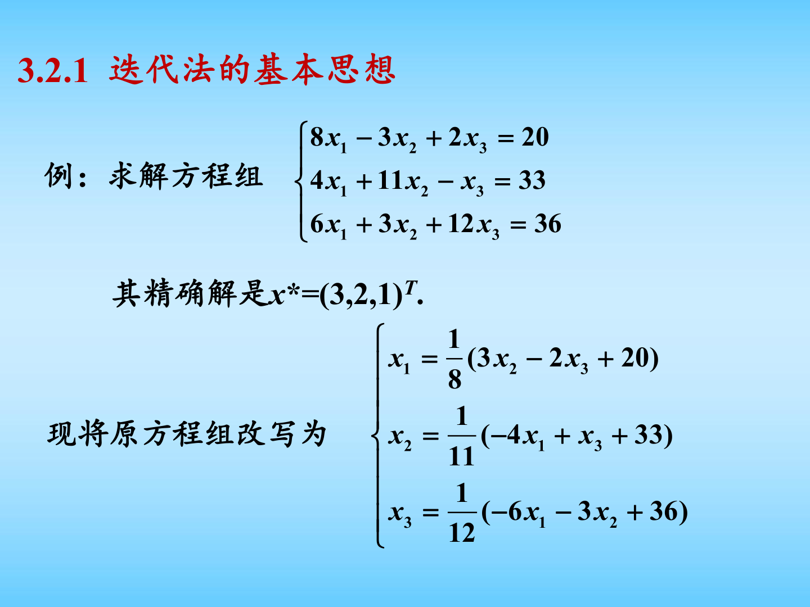
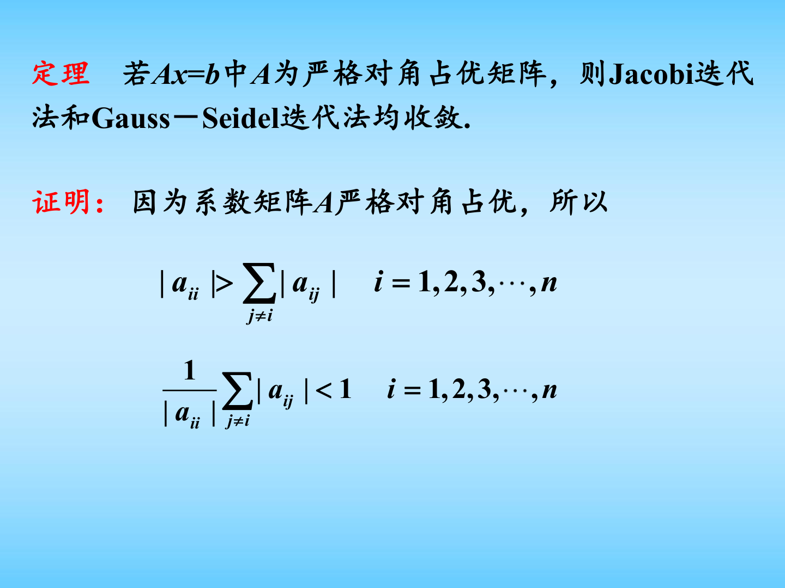
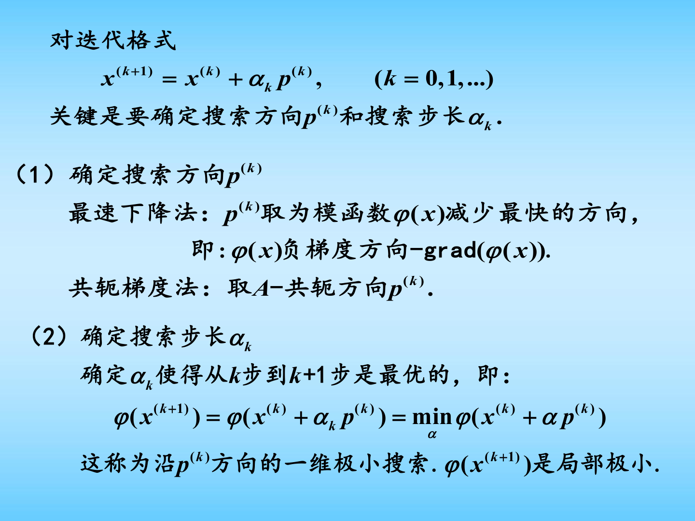
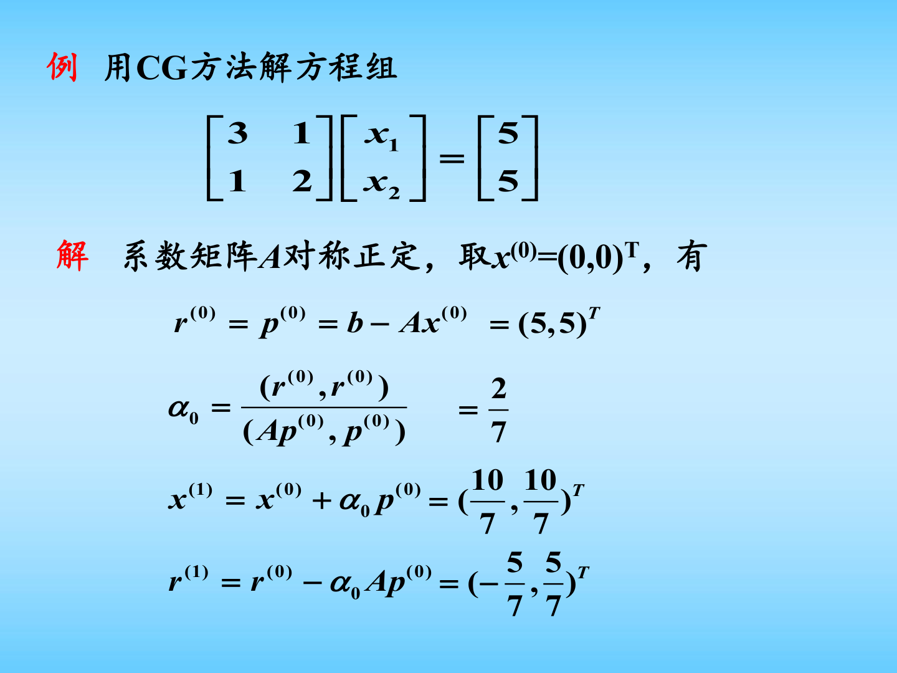

# 第三章 线性方程组的数值解法（二）图文复习笔记

对应课件：`第三章 线性方程组的数值解法（二）—迭代法.pdf`

说明：这一讲内容很多，核心主线可以概括成四句话。

1. 先把 $Ax=b$ 改写成一个迭代格式。
2. 再判断迭代矩阵是否收敛。
3. 在简单迭代基础上用 SOR、分块法做加速。
4. 当 $A$ 是大型稀疏对称正定矩阵时，进一步转向最速下降法、CG 与 PCG。

## 0. 课件图示导读

图示说明：迭代法不直接一步求精确解，而是把原方程组改写成

$$
x = Bx + f,
$$

然后从初值 $x^{(0)}$ 出发不断生成

$$
x^{(k+1)} = Bx^{(k)} + f.
$$

因此迭代法的核心不是“消元一次做完”，而是“误差能否一轮一轮缩小”。

图示说明：这页对应了一个非常实用的收敛判据。若系数矩阵严格对角占优，则 Jacobi 和 Gauss-Seidel 都收敛。考试和作业中，这通常是最快的判断方法之一。

图示说明：当 $A$ 为对称正定矩阵时，解方程组等价于最小化一个二次型函数。于是“解线性方程组”就能转化为“沿某个方向做一维搜索”的优化问题。

图示说明：共轭梯度法不是盲目试探，而是在一组两两 $A$-共轭的方向上逐步逼近真解。它特别适合大型稀疏对称正定系统。

## 0.5 学习导读

这一章最容易学乱，因为方法很多：Jacobi、Gauss-Seidel、SOR、分块法、最速下降、CG、PCG 都放在一起。其实你可以把它压缩成一条主线：

1. 先把 $Ax=b$ 改写成迭代格式。
2. 再判断这个迭代到底收不收敛。
3. 如果太慢，就想办法加速。
4. 当矩阵有对称正定结构时，再从“解方程组”切到“做优化”的视角。

这样看，这章前半段是在学“经典迭代法”，后半段是在学“优化视角下的迭代法”。只要抓住这条线，就不会觉得内容碎。

## 1. 迭代法的总体思想

### 1.1 为什么要研究迭代法

直接法如 Gauss 消元、LU 分解的优点是步骤固定、理论成熟，但对于大型稀疏方程组，它们往往会带来以下问题：

- 计算量通常是 $O(n^3)$；
- 填充现象会破坏稀疏结构；
- 存储量和时间代价都可能过高。

因此需要一种“每一步都只做局部更新、逐步逼近真解”的方法，这就是迭代法。

### 1.2 迭代格式的基本形式

课件把线性方程组的迭代格式写成

$$
x^{(k+1)} = Bx^{(k)} + f, \qquad k=0,1,2,\dots
$$

其中：

- $x^{(0)}$ 是初始向量；
- $B$ 是迭代矩阵；
- $f$ 是常向量。

若极限

$$
\lim_{k \to \infty} x^{(k)} = x^*
$$

存在，则称该迭代法收敛，且极限 $x^*$ 必满足

$$
x^* = Bx^* + f,
$$

也就是原方程组的解。

### 1.3 误差递推公式

定义误差

$$
e^{(k)} = x^{(k)} - x^*.
$$

由迭代式与极限方程相减可得

$$
e^{(k+1)} = B e^{(k)}.
$$

进一步有

$$
e^{(k)} = B^k e^{(0)}.
$$

这个公式极其重要，因为它说明迭代法是否收敛，完全取决于幂矩阵 $B^k$ 是否趋于零。

## 2. 如何从 $Ax=b$ 构造迭代格式

### 2.1 矩阵分裂思想

设

$$
A = D - L - U,
$$

其中：

- $D$ 是 $A$ 的对角部分；
- $-L$ 是严格下三角部分；
- $-U$ 是严格上三角部分。

更一般地，也可以写成

$$
A = M - N,
$$

其中 $M$ 选成容易求逆的矩阵。于是

$$
Ax=b
\quad \Longleftrightarrow \quad
Mx = Nx + b.
$$

若 $M$ 可逆，则得到一般迭代格式

$$
x^{(k+1)} = M^{-1}N x^{(k)} + M^{-1} b.
$$

因此

$$
B = M^{-1}N, \qquad f=M^{-1}b.
$$

### 2.2 这一定义背后的思想

所谓“建立迭代法”，本质上就是在下面两个目标之间做平衡：

- $M$ 必须足够简单，以便每次迭代容易求解；
- $B=M^{-1}N$ 又必须足够“好”，以便迭代收敛且收敛尽量快。

## 3. Jacobi 迭代法与 Gauss-Seidel 迭代法

### 3.1 Jacobi 迭代法

对分裂

$$
A = D - L - U
$$

取

$$
M=D, \qquad N=L+U,
$$

则得到 Jacobi 迭代法

$$
Dx^{(k+1)} = (L+U)x^{(k)} + b,
$$

即

$$
x^{(k+1)} = D^{-1}(L+U)x^{(k)} + D^{-1}b.
$$

因此 Jacobi 迭代矩阵为

$$
B_J = D^{-1}(L+U)=I-D^{-1}A.
$$

分量形式是

$$
x_i^{(k+1)}
=
\frac{1}{a_{ii}}
\left(
b_i-\sum_{j \ne i} a_{ij}x_j^{(k)}
\right),
\qquad i=1,2,\dots,n.
$$

Jacobi 法的特点是：每个分量都只使用“上一轮”的旧值，所以并行性好，但通常收敛较慢。

### 3.2 Gauss-Seidel 迭代法

若取

$$
M=D-L, \qquad N=U,
$$

则得到 Gauss-Seidel 迭代法

$$
(D-L)x^{(k+1)} = Ux^{(k)} + b,
$$

即

$$
x^{(k+1)} = (D-L)^{-1}U x^{(k)} + (D-L)^{-1}b.
$$

其迭代矩阵为

$$
B_{GS} = (D-L)^{-1}U.
$$

分量形式是

$$
x_i^{(k+1)}
=
\frac{1}{a_{ii}}
\left(
b_i
-\sum_{j<i} a_{ij}x_j^{(k+1)}
-\sum_{j>i} a_{ij}x_j^{(k)}
\right).
$$

与 Jacobi 法不同，Gauss-Seidel 在同一轮中会立即使用已经更新过的新值，因此通常比 Jacobi 更快。

### 3.3 两种方法的对比理解

- Jacobi：像“整轮广播更新”，所有分量同步更新。
- Gauss-Seidel：像“按顺序原地更新”，后算的分量立刻使用前面刚算出的新值。

所以从直观上看，Gauss-Seidel 往往更充分地利用了新信息。

### 3.4 一个常见提醒

不同教材对分裂记号可能写成

$$
A=D+L+U
$$

或

$$
A=D-L-U.
$$

两种写法只是在符号上不同，最终的迭代思想完全一致。复习时一定先看清老师或教材对 $L,U$ 的定义。

## 4. 迭代法的收敛性

### 4.1 谱半径判据

课件中的核心定理是：

迭代格式

$$
x^{(k+1)} = Bx^{(k)} + f
$$

收敛的充要条件是

$$
\rho(B) < 1,
$$

其中 $\rho(B)$ 是矩阵 $B$ 的谱半径，定义为

$$
\rho(B)=\max_{\lambda \in \sigma(B)} |\lambda|.
$$

这一定理说明：判断线性迭代是否收敛，归根结底是看迭代矩阵所有特征值的模是否都落在单位圆内。

### 4.2 范数判据

由于谱半径直接算起来可能麻烦，课件给出了更易用的充分条件：若存在某个相容矩阵范数，使得

$$
\|B\|<1,
$$

则迭代收敛。

这是因为总有

$$
\rho(B)\le \|B\|.
$$

所以范数判据是一个“容易验证、但可能偏保守”的条件。

### 4.3 误差估计公式

若 $\|B\|<1$，课件给出两个非常实用的估计。

先验估计：

$$
\|x^{(k)}-x^*\|
\le
\frac{\|B\|^k}{1-\|B\|}
\|x^{(1)}-x^{(0)}\|.
$$

后验估计：

$$
\|x^{(k)}-x^*\|
\le
\frac{\|B\|}{1-\|B\|}
\|x^{(k)}-x^{(k-1)}\|.
$$

前者用于预估需要迭代多少步，后者用于计算过程中判断是否可以停止。

### 4.4 严格对角占优条件

若矩阵 $A=(a_{ij})$ 满足

$$
|a_{ii}| > \sum_{j \ne i} |a_{ij}|, \qquad i=1,2,\dots,n,
$$

则称 $A$ 为严格对角占优矩阵。

课件给出两个重要结论：

1. 严格对角占优矩阵一定非奇异。
2. 若 $A$ 严格对角占优，则 Jacobi 和 Gauss-Seidel 迭代均收敛。

这说明当对角元足够“强”，矩阵耦合就不会把误差越传越大。

### 4.5 对称正定条件

课件还给出结论：

若 $A$ 为对称正定矩阵，则 Gauss-Seidel 迭代法收敛。

这条定理特别重要，因为它把“矩阵的几何性质”和“迭代法的稳定性”联系了起来。后面最速下降法、CG、PCG 也都以对称正定为基础。

## 5. 超松弛迭代法 SOR

### 5.1 基本公式

SOR 法可以看成对 Gauss-Seidel 法的加速，引入松弛因子 $\omega$：

$$
(D-\omega L)x^{(k+1)}
=
\bigl[(1-\omega)D+\omega U\bigr]x^{(k)}+\omega b.
$$

对应的分量公式为

$$
x_i^{(k+1)}
=
(1-\omega)x_i^{(k)}
+\frac{\omega}{a_{ii}}
\left(
b_i
-\sum_{j<i}a_{ij}x_j^{(k+1)}
-\sum_{j>i}a_{ij}x_j^{(k)}
\right).
$$

其迭代矩阵记为

$$
B_\omega = (D-\omega L)^{-1}\bigl[(1-\omega)D+\omega U\bigr].
$$

### 5.2 松弛因子的含义

- $\omega=1$ 时，SOR 退化为 Gauss-Seidel；
- $0<\omega<1$ 称为欠松弛；
- $1<\omega<2$ 称为超松弛。

直观上，SOR 通过人为放大或缩小每一步更新量，希望在“保持收敛”的前提下更快逼近真解。

### 5.3 收敛结论

课件给出的关键结论有：

1. SOR 收敛的充要条件是
   $$
   \rho(B_\omega)<1.
   $$
2. 若 SOR 收敛，则必有
   $$
   0<\omega<2.
   $$
3. 若 $A$ 对称正定且 $0<\omega<2$，则 SOR 收敛。
4. 若 $A$ 严格对角占优且 $0<\omega \le 1$，则 SOR 收敛。

### 5.4 如何理解 SOR

可以把 Gauss-Seidel 看作“按照当前残差修正一步”，而 SOR 则是在这个修正量前乘上一个调节系数。若 $\omega$ 选得合理，收敛速度会明显快于 Gauss-Seidel；若 $\omega$ 选得不好，也可能变慢甚至发散。

## 6. 分块迭代法

### 6.1 为什么要分块

若未知量天然可以分成若干组，例如不同物理变量、不同网格区域或不同子系统，那么逐分量更新未必最合适。此时可以按块写成

$$
A=
\begin{bmatrix}
A_{11} & \cdots & A_{1m}\\
\vdots & \ddots & \vdots\\
A_{m1} & \cdots & A_{mm}
\end{bmatrix},
\qquad
x=
\begin{bmatrix}
x_1\\
\vdots\\
x_m
\end{bmatrix},
\qquad
b=
\begin{bmatrix}
b_1\\
\vdots\\
b_m
\end{bmatrix}.
$$

这样每一块内部的强耦合就能被整体处理。

### 6.2 块 Jacobi、块 Gauss-Seidel、块 SOR

若写成块分裂

$$
A=\mathcal{D}-\mathcal{L}-\mathcal{U},
$$

则对应可以得到：

- 块 Jacobi：
  $$
  \mathcal{D}x^{(k+1)}=(\mathcal{L}+\mathcal{U})x^{(k)}+b.
  $$
- 块 Gauss-Seidel：
  $$
  (\mathcal{D}-\mathcal{L})x^{(k+1)}=\mathcal{U}x^{(k)}+b.
  $$
- 块 SOR：
  $$
  (\mathcal{D}-\omega \mathcal{L})x^{(k+1)}
  =
  \bigl[(1-\omega)\mathcal{D}+\omega \mathcal{U}\bigr]x^{(k)}+\omega b.
  $$

### 6.3 分块法的优势

- 更适合利用问题的结构信息；
- 块内可保留更完整的耦合关系；
- 在并行计算和大型系统中更常见。

## 7. 与线性方程组等价的变分问题

### 7.1 为什么会出现优化观点

设 $A$ 为实对称正定矩阵，定义二次函数

$$
\phi(x)=\frac{1}{2}x^T A x - b^T x.
$$

则其梯度为

$$
\nabla \phi(x)=Ax-b.
$$

因此

$$
\nabla \phi(x^*)=0
\quad \Longleftrightarrow \quad
Ax^*=b.
$$

由于 $A$ 对称正定，$\phi(x)$ 是严格凸函数，所以最小点唯一。于是：

求解线性方程组 $Ax=b$，等价于求解二次函数 $\phi(x)$ 的唯一极小点。

### 7.2 残差的优化含义

定义残差

$$
r^{(k)} = b - Ax^{(k)}.
$$

因为

$$
\nabla \phi(x^{(k)}) = -r^{(k)},
$$

所以残差方向其实就是目标函数的负梯度方向。

## 8. 最速下降法

### 8.1 基本思想

最速下降法每一步都沿着当前函数值下降最快的方向前进，也就是负梯度方向。因此取搜索方向

$$
p^{(k)} = r^{(k)}.
$$

再令

$$
x^{(k+1)} = x^{(k)} + \alpha_k p^{(k)},
$$

并通过一维极小搜索确定最佳步长 $\alpha_k$。

### 8.2 步长公式

对于二次函数情形，可显式得到

$$
\alpha_k
=
\frac{(r^{(k)},r^{(k)})}{(Ar^{(k)},r^{(k)})}.
$$

于是算法写成

$$
x^{(k+1)} = x^{(k)} + \alpha_k r^{(k)},
$$

$$
r^{(k+1)} = r^{(k)} - \alpha_k A r^{(k)}.
$$

### 8.3 性质与局限

课件指出：

- 最速下降法是线性收敛的；
- 相邻两次搜索方向彼此正交；
- 当矩阵条件数较大时，收敛会明显变慢。

这说明它虽然概念清晰，但在病态矩阵上效率并不理想。

## 9. 共轭梯度法 CG

### 9.1 为什么要引入共轭方向

最速下降法每次只利用局部负梯度信息，容易出现“来回折返”的现象。CG 法的改进思路是：不再只要求普通正交，而是构造一组关于矩阵 $A$ 的共轭方向。

若向量组 $\{p_0,p_1,\dots\}$ 满足

$$
p_i^T A p_j = 0, \qquad i \ne j,
$$

则称它们两两 $A$-共轭。

### 9.2 CG 的基本算法

给定初值 $x^{(0)}$，定义

$$
r^{(0)}=b-Ax^{(0)}, \qquad p^{(0)}=r^{(0)}.
$$

对 $k=0,1,2,\dots$，迭代计算：

$$
\alpha_k = \frac{(r^{(k)},r^{(k)})}{(Ap^{(k)},p^{(k)})},
$$

$$
x^{(k+1)} = x^{(k)} + \alpha_k p^{(k)},
$$

$$
r^{(k+1)} = r^{(k)} - \alpha_k A p^{(k)},
$$

$$
\beta_k = \frac{(r^{(k+1)},r^{(k+1)})}{(r^{(k)},r^{(k)})},
$$

$$
p^{(k+1)} = r^{(k+1)} + \beta_k p^{(k)}.
$$

### 9.3 CG 的重要性质

对于实对称正定矩阵 $A$，CG 法有以下典型优点：

- 在精确算术下，理论上最多 $n$ 步可得到精确解；
- 残差彼此正交；
- 搜索方向彼此 $A$-共轭；
- 通常显著快于最速下降法。

### 9.4 为什么 CG 更快

最速下降法只保证“当前这一步下降最快”，而 CG 会避免在已经修正过的方向上重复做无效工作。正因为方向是 $A$-共轭的，新的搜索方向不会破坏旧方向上已经取得的优化效果。

### 9.5 CG 的适用范围

CG 的前提是：

- $A$ 必须对称；
- $A$ 必须正定；
- 最好是大型稀疏矩阵，这样矩阵向量乘 $Ap$ 的代价比较低。

若矩阵不是对称正定，一般不能直接使用标准 CG。

## 10. 预条件共轭梯度法 PCG

### 10.1 为什么要预条件

当 $A$ 的条件数较大时，CG 虽然仍然可能收敛，但速度会变慢。为改善这一点，引入一个预条件矩阵 $M$，要求它满足：

- $M$ 容易求解线性方程组；
- $M \approx A$；
- 通常也希望 $M$ 是对称正定的。

其目标是把原问题变换成条件数更好的等价问题。

### 10.2 PCG 的基本格式

定义

$$
r^{(k)} = b-Ax^{(k)},
$$

每一步先解预条件方程

$$
Mz^{(k)} = r^{(k)}.
$$

再用 $z^{(k)}$ 替代普通 CG 中的残差方向。常用迭代公式为

$$
p^{(0)} = z^{(0)},
$$

$$
\alpha_k = \frac{(r^{(k)},z^{(k)})}{(Ap^{(k)},p^{(k)})},
$$

$$
x^{(k+1)} = x^{(k)} + \alpha_k p^{(k)},
$$

$$
r^{(k+1)} = r^{(k)} - \alpha_k A p^{(k)},
$$

$$
Mz^{(k+1)} = r^{(k+1)},
$$

$$
\beta_k = \frac{(r^{(k+1)},z^{(k+1)})}{(r^{(k)},z^{(k)})},
$$

$$
p^{(k+1)} = z^{(k+1)} + \beta_k p^{(k)}.
$$

### 10.3 常见预条件思想

课件最后提到 MATLAB 中的 `pcg` 调用方式，也暗示了常见的预条件选取方法。实践中常见的预条件包括：

- Jacobi 预条件：取 $M=\operatorname{diag}(A)$；
- SSOR 预条件；
- 不完全 Cholesky 预条件。

预条件做得越好，通常意味着新的系统条件数越小，PCG 迭代次数越少。

## 11. 本章所依赖的矩阵理论补充

### 11.1 谱半径

对矩阵 $B$，谱半径定义为

$$
\rho(B)=\max_{\lambda \in \sigma(B)} |\lambda|.
$$

线性迭代中之所以反复出现它，是因为

$$
e^{(k)}=B^k e^{(0)}.
$$

若所有特征值都在单位圆内，则 $B^k$ 才会衰减到零。

### 11.2 对称正定矩阵

矩阵 $A$ 若满足

$$
A^T=A,
$$

且对任意非零向量 $x$ 都有

$$
x^T A x > 0,
$$

则称 $A$ 为对称正定矩阵。

它的几个重要含义是：

- 所有特征值都为正；
- 可定义能量范数
  $$
  \|x\|_A = \sqrt{x^T A x};
  $$
- 二次函数
  $$
  \phi(x)=\frac12 x^T A x - b^T x
  $$
  严格凸，因此极小点唯一。

### 11.3 严格对角占优为什么能保证收敛

当

$$
|a_{ii}| > \sum_{j \ne i} |a_{ij}|
$$

时，对角元在每一行中占主导地位，意味着每个未知量主要由自身决定，而不是被其他未知量强烈耦合。对 Jacobi 和 Gauss-Seidel 来说，这通常使迭代矩阵的“放大效应”不足以抵消，从而产生收敛。

### 11.4 $A$-共轭与普通正交的区别

普通正交是

$$
p_i^T p_j = 0.
$$

$A$-共轭则是

$$
p_i^T A p_j = 0.
$$

当 $A=I$ 时，两者一致；但一般情况下，$A$-共轭是相对于二次型几何结构定义的“更合适的正交”。这正是 CG 能够避免重复修正的根本原因。

## 12. 各方法的横向比较

### 12.1 Jacobi

- 结构最简单；
- 并行性好；
- 收敛速度通常较慢。

### 12.2 Gauss-Seidel

- 利用新值更充分；
- 常比 Jacobi 快；
- 仍然只适合一定条件下的收敛问题。

### 12.3 SOR

- 可看作 Gauss-Seidel 的加速版；
- 关键在于选好 $\omega$；
- 工程上很常见。

### 12.4 最速下降法

- 适合从优化观点理解问题；
- 实现简单；
- 在线性代数上不如 CG 高效。

### 12.5 CG

- 适合大型稀疏对称正定系统；
- 收敛通常快；
- 不需要显式存储矩阵分解。

### 12.6 PCG

- 在 CG 基础上进一步加速；
- 关键是找到合适的预条件矩阵；
- 是工程计算中的常用主力方法。

## 13. 复习时必须掌握的公式

建议把下面这些公式作为考前必背内容。

1. 一般线性迭代格式
   $$
   x^{(k+1)} = Bx^{(k)} + f
   $$
2. 误差递推
   $$
   e^{(k+1)} = Be^{(k)}
   $$
3. 收敛充要条件
   $$
   \rho(B)<1
   $$
4. Jacobi 迭代
   $$
   x^{(k+1)} = D^{-1}(L+U)x^{(k)} + D^{-1}b
   $$
5. Gauss-Seidel 迭代
   $$
   x^{(k+1)} = (D-L)^{-1}U x^{(k)} + (D-L)^{-1}b
   $$
6. SOR 迭代
   $$
   (D-\omega L)x^{(k+1)} = \bigl[(1-\omega)D+\omega U\bigr]x^{(k)}+\omega b
   $$
7. 最速下降步长
   $$
   \alpha_k = \frac{(r^{(k)},r^{(k)})}{(Ar^{(k)},r^{(k)})}
   $$
8. 共轭梯度步长
   $$
   \alpha_k = \frac{(r^{(k)},r^{(k)})}{(Ap^{(k)},p^{(k)})}
   $$
9. 共轭梯度方向更新
   $$
   p^{(k+1)} = r^{(k+1)} + \beta_k p^{(k)}
   $$
10. PCG 预条件方程
   $$
   Mz^{(k)} = r^{(k)}
   $$

## 14. 本章的复习抓手

如果时间有限，建议按下面顺序抓重点：

1. 先彻底理解 Jacobi、Gauss-Seidel、SOR 三个基本迭代格式。
2. 记住收敛判据的层次：谱半径是充要条件，范数小于 $1$ 是充分条件，严格对角占优和对称正定是常见结构条件。
3. 再把“解方程组 = 极小化二次函数”这条主线建立起来。
4. 最后重点掌握最速下降、CG、PCG 的公式结构和适用条件。

## 15. 补充推导

### 15.1 Jacobi 与 Gauss-Seidel 公式是怎么来的

从

$$
Ax=b
$$

出发，把矩阵分裂成

$$
A=D-L-U.
$$

于是原方程组等价于

$$
(D-L-U)x=b.
$$

如果把“最简单、最容易求逆”的部分放到左边，就得到不同迭代法。

#### Jacobi 法

把对角部分留在左边：

$$
Dx=(L+U)x+b.
$$

把右边的 $x$ 用旧值代替，就得到

$$
Dx^{(k+1)}=(L+U)x^{(k)}+b,
$$

即

$$
x^{(k+1)}=D^{-1}(L+U)x^{(k)}+D^{-1}b.
$$

#### Gauss-Seidel 法

把下三角部分也放在左边：

$$
(D-L)x=Ux+b.
$$

于是用旧值和新值混合更新，得到

$$
(D-L)x^{(k+1)}=Ux^{(k)}+b,
$$

即

$$
x^{(k+1)}=(D-L)^{-1}Ux^{(k)}+(D-L)^{-1}b.
$$

因此可以把 Jacobi 与 Gauss-Seidel 的区别理解为：

- Jacobi 每一轮完全用旧值；
- Gauss-Seidel 在同一轮中尽量立即利用新值。

### 15.2 为什么 $\rho(B)<1$ 是收敛充要条件

由误差递推公式

$$
e^{(k+1)}=Be^{(k)},
$$

可知

$$
e^{(k)}=B^k e^{(0)}.
$$

#### 必要性

若迭代对任意初值都收敛，则必有 $B^k\to 0$。设 $\lambda$ 是 $B$ 的任一特征值，$v$ 是对应特征向量，则

$$
B^k v=\lambda^k v.
$$

要让它趋于零，就必须有

$$
|\lambda|<1.
$$

对所有特征值都如此，因此

$$
\rho(B)<1.
$$

#### 充分性

若

$$
\rho(B)<1,
$$

则矩阵幂 $B^k$ 会衰减到零，因此

$$
e^{(k)}=B^k e^{(0)}\to 0.
$$

于是

$$
x^{(k)}\to x^*.
$$

因此 $\rho(B)<1$ 既必要又充分。

### 15.3 SOR 其实是在 Gauss-Seidel 基础上做加权

设 Gauss-Seidel 给出的“纯更新值”为 $\widetilde{x}^{(k+1)}$。若不直接取它，而是只向这个方向走一部分或更大一步，即定义

$$
x^{(k+1)}=(1-\omega)x^{(k)}+\omega \widetilde{x}^{(k+1)},
$$

就得到松弛思想。

- 当 $\omega=1$ 时，就是 Gauss-Seidel；
- 当 $0<\omega<1$ 时，是欠松弛；
- 当 $1<\omega<2$ 时，是超松弛。

因此 SOR 可以理解为：先做一次 Gauss-Seidel 更新，再用参数 $\omega$ 调整步长。

### 15.4 最速下降法步长公式的推导

设

$$
\phi(x)=\frac12 x^T A x-b^T x,
$$

并沿方向 $p^{(k)}$ 做更新

$$
x^{(k+1)}=x^{(k)}+\alpha p^{(k)}.
$$

把它代入目标函数，得到一元函数

$$
\psi(\alpha)=\phi(x^{(k)}+\alpha p^{(k)}).
$$

展开得

$$
\psi(\alpha)
=
\phi(x^{(k)})
+\alpha (Ax^{(k)}-b,p^{(k)})
+\frac{\alpha^2}{2}(Ap^{(k)},p^{(k)}).
$$

若取最速下降方向

$$
p^{(k)}=r^{(k)}=b-Ax^{(k)},
$$

则

$$
(Ax^{(k)}-b,p^{(k)})=-(r^{(k)},r^{(k)}).
$$

令

$$
\psi'(\alpha)=0,
$$

可得最优步长

$$
\alpha_k
=
\frac{(r^{(k)},r^{(k)})}{(Ar^{(k)},r^{(k)})}.
$$

所以最速下降法并不是随便选步长，而是在当前下降方向上做一次严格的一维极小化。

### 15.5 CG 为什么最多 $n$ 步可精确求解

对 $n$ 维对称正定系统，CG 在每一步都构造一个新的 $A$-共轭方向。若这组方向写成

$$
p^{(0)},p^{(1)},\dots,p^{(n-1)},
$$

它们两两 $A$-共轭，因此线性无关，可以张成整个 $\mathbb{R}^n$。

而 CG 在第 $k$ 步所求的近似解，实际上是把真解在 Krylov 子空间

$$
\mathcal{K}_k(A,r^{(0)})
=
\operatorname{span}\{r^{(0)},Ar^{(0)},\dots,A^{k-1}r^{(0)}\}
$$

中做最优逼近。由于维数最多只有 $n$，所以在精确算术下最多经过 $n$ 步，就能覆盖整个空间，从而到达精确解。

这也是 CG 对大型稀疏对称正定系统特别有吸引力的原因。

## 16. 经典例题

### 16.1 例题 1：比较 Jacobi 与 Gauss-Seidel

求解方程组

$$
\begin{cases}
4x_1+x_2=1,\\
x_1+3x_2=2.
\end{cases}
$$

其精确解为

$$
x^*=\left(\frac{1}{11},\frac{7}{11}\right)^T
\approx
(0.0909,0.6364)^T.
$$

取初值

$$
x^{(0)}=(0,0)^T.
$$

#### Jacobi 迭代

改写为

$$
x_1^{(k+1)}=\frac{1-x_2^{(k)}}{4},
\qquad
x_2^{(k+1)}=\frac{2-x_1^{(k)}}{3}.
$$

于是

$$
x^{(1)}=
\left(
\frac14,\frac23
\right)^T
\approx
(0.25,0.6667)^T,
$$

$$
x^{(2)}=
\left(
\frac{1-\frac23}{4},
\frac{2-\frac14}{3}
\right)^T
=
\left(
\frac{1}{12},
\frac{7}{12}
\right)^T
\approx
(0.0833,0.5833)^T.
$$

#### Gauss-Seidel 迭代

改写为

$$
x_1^{(k+1)}=\frac{1-x_2^{(k)}}{4},
\qquad
x_2^{(k+1)}=\frac{2-x_1^{(k+1)}}{3}.
$$

于是

$$
x^{(1)}=
\left(
\frac14,\frac{2-\frac14}{3}
\right)^T
=
\left(
\frac14,\frac{7}{12}
\right)^T
\approx
(0.25,0.5833)^T,
$$

$$
x^{(2)}=
\left(
\frac{1-\frac{7}{12}}{4},
\frac{2-\frac{5}{48}}{3}
\right)^T
=
\left(
\frac{5}{48},\frac{91}{144}
\right)^T
\approx
(0.1042,0.6319)^T.
$$

#### 例题结论

同样的初值下，Gauss-Seidel 的第二步已经更接近真解。这体现了“同轮立即使用新值”带来的加速效果。

### 16.2 例题 2：用共轭梯度法求解一个 $2\times 2$ 对称正定系统

求解

$$
\begin{bmatrix}
4 & 1\\
1 & 3
\end{bmatrix}
\begin{bmatrix}
x_1\\
x_2
\end{bmatrix}
=
\begin{bmatrix}
1\\
2
\end{bmatrix}.
$$

取

$$
x^{(0)}=(0,0)^T.
$$

则

$$
r^{(0)}=b-Ax^{(0)}=(1,2)^T,
\qquad
p^{(0)}=r^{(0)}.
$$

#### 第一步

先算

$$
Ap^{(0)}=
\begin{bmatrix}
4 & 1\\
1 & 3
\end{bmatrix}
\begin{bmatrix}
1\\
2
\end{bmatrix}
=
\begin{bmatrix}
6\\
7
\end{bmatrix}.
$$

所以

$$
\alpha_0
=
\frac{(r^{(0)},r^{(0)})}{(Ap^{(0)},p^{(0)})}
=
\frac{1^2+2^2}{6\cdot 1+7\cdot 2}
=
\frac{5}{20}
=
\frac14.
$$

于是

$$
x^{(1)}=x^{(0)}+\alpha_0 p^{(0)}
=
\left(\frac14,\frac12\right)^T.
$$

更新残差：

$$
r^{(1)}
=
r^{(0)}-\alpha_0 Ap^{(0)}
=
\begin{bmatrix}
1\\
2
\end{bmatrix}
-
\frac14
\begin{bmatrix}
6\\
7
\end{bmatrix}
=
\left(-\frac12,\frac14\right)^T.
$$

再算

$$
\beta_0
=
\frac{(r^{(1)},r^{(1)})}{(r^{(0)},r^{(0)})}
=
\frac{\frac14+\frac1{16}}{5}
=
\frac{1}{16}.
$$

因此

$$
p^{(1)}
=
r^{(1)}+\beta_0 p^{(0)}
=
\left(-\frac12,\frac14\right)^T
+
\frac{1}{16}
\left(1,2\right)^T
=
\left(-\frac{7}{16},\frac{3}{8}\right)^T.
$$

#### 第二步

先算

$$
Ap^{(1)}
=
\begin{bmatrix}
4 & 1\\
1 & 3
\end{bmatrix}
\begin{bmatrix}
-\frac{7}{16}\\
\frac{3}{8}
\end{bmatrix}
=
\begin{bmatrix}
-\frac{11}{8}\\
\frac{11}{16}
\end{bmatrix}.
$$

于是

$$
\alpha_1
=
\frac{(r^{(1)},r^{(1)})}{(Ap^{(1)},p^{(1)})}
=
\frac{\frac{5}{16}}{\frac{55}{64}}
=
\frac{4}{11}.
$$

从而

$$
x^{(2)}
=
x^{(1)}+\alpha_1 p^{(1)}
=
\left(
\frac14,\frac12
\right)^T
+
\frac{4}{11}
\left(
-\frac{7}{16},\frac{3}{8}
\right)^T
=
\left(
\frac{1}{11},\frac{7}{11}
\right)^T.
$$

这正是精确解。

#### 例题结论

二维对称正定系统在精确算术下，CG 最多两步就能得到精确解。这道题很好地体现了“最多 $n$ 步”的理论结论。
