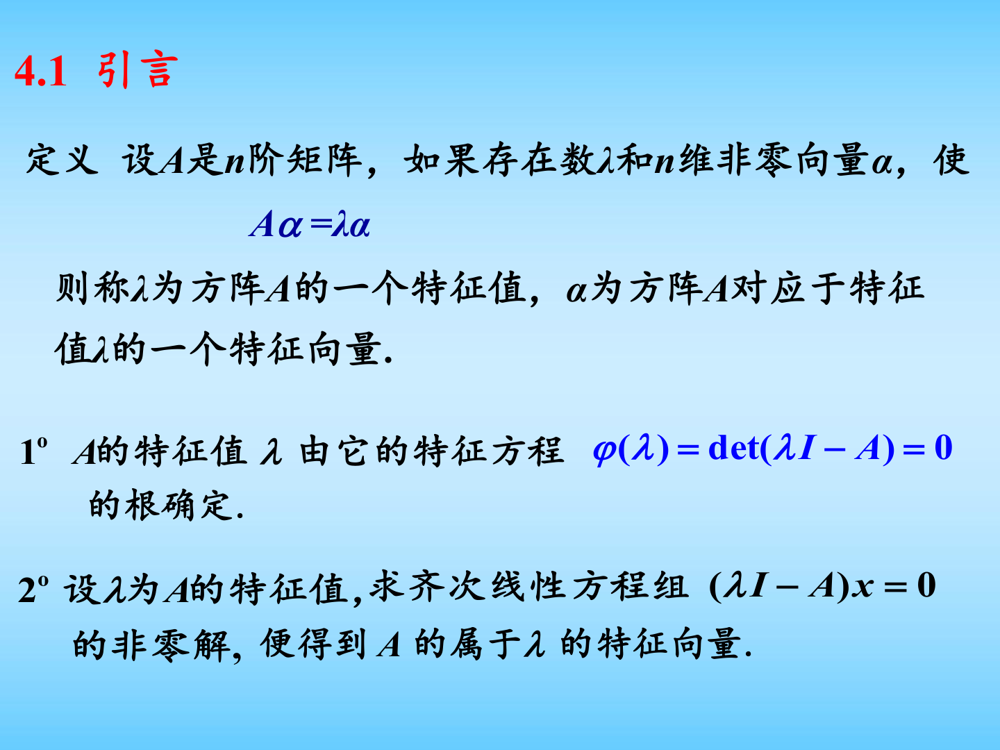
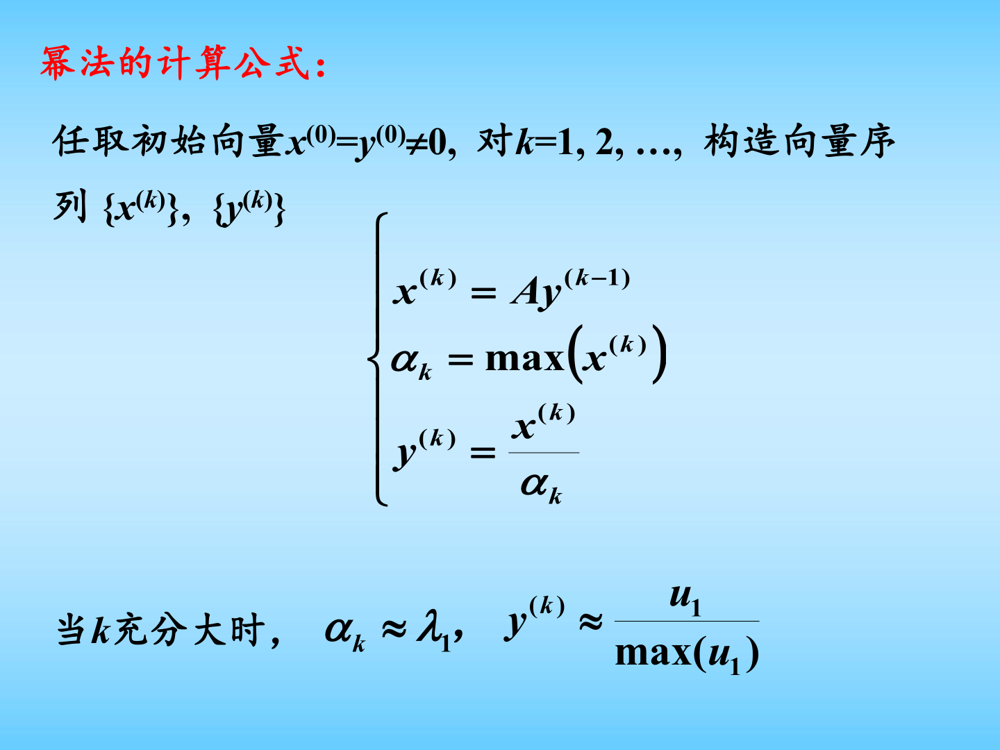
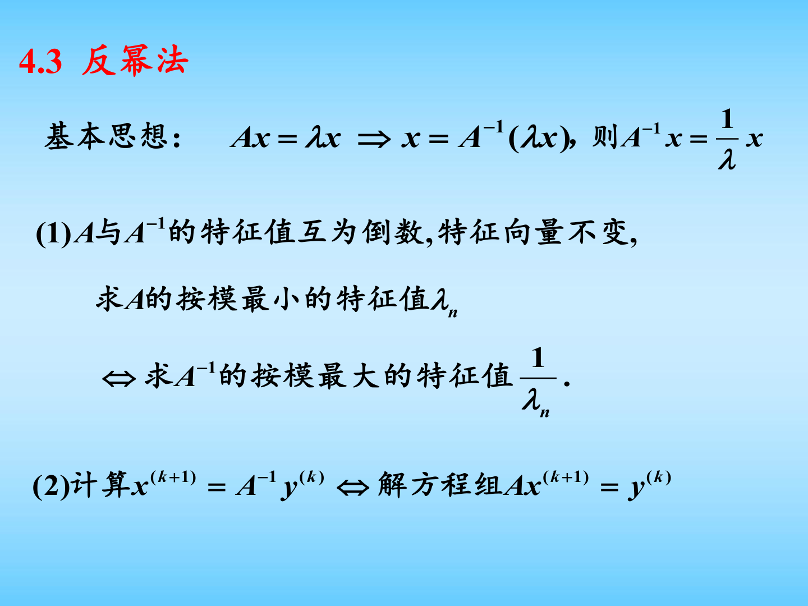
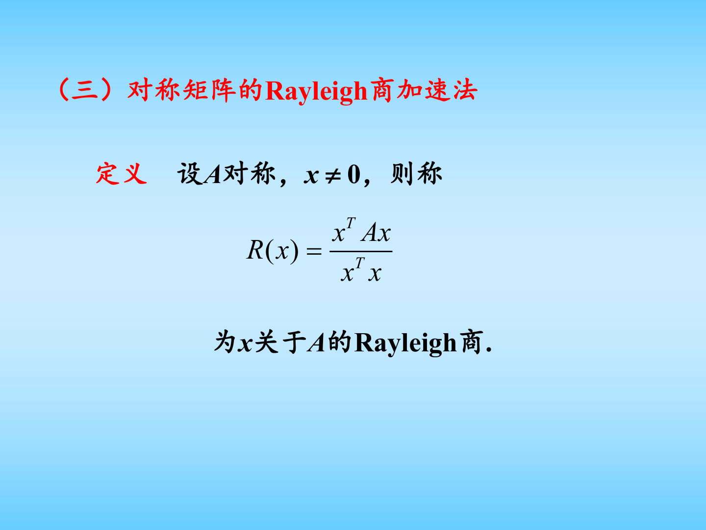

# 第四章 矩阵特征值与特征向量的计算图文复习笔记

对应课件：`第四章 矩阵特征值与特征向量的计算.pdf`

说明：这一章的重点不是“把所有特征值都精确算出来”，而是学习如何对大矩阵、尤其是大型稀疏矩阵，近似求出最重要的特征值与特征向量。课件实际展开的主线主要包括：特征值问题引入、Gerschgorin 圆盘定理、幂法、幂法加速、反幂法、带原点移位的反幂法，以及对称矩阵的 Rayleigh 商加速思想。

## 0. 课件图示导读

图示说明：这一页给出本章最核心的定义。矩阵特征值问题不是额外的新对象，而是线性变换的“内在伸缩方向”问题。后面所有算法，本质上都在近似寻找“哪个方向在矩阵作用下最稳定地只被放大或缩小，而方向不改变”。

图示说明：幂法的课堂核心只有一句话：不断让向量乘矩阵，再做归一化，最后向量会逐步朝主特征向量靠拢。它最适合求按模最大的特征值，是大型稀疏矩阵的基础方法。

图示说明：反幂法本质上是“把求最小特征值问题，转成对逆矩阵应用幂法”。它的关键不是显式求逆，而是每一步去解一个线性方程组，因此会和第三章的 LU 分解直接联系起来。

图示说明：Rayleigh 商给出了一个非常自然的特征值近似公式。对于对称矩阵，它既有清晰的几何意义，又能明显加快迭代过程。它是后面学更高级特征值算法前必须熟悉的概念。

## 0.5 学习导读

这一章学习时，建议一直抓住下面四个问题：

1. 特征值和特征向量到底描述了什么。
2. 为什么大型矩阵不能直接硬算特征多项式。
3. 幂法为什么能找出按模最大的特征值。
4. 如果想找按模最小的特征值或某个指定附近的特征值，应该怎么办。

如果顺着这个思路往下看，这一章其实就是两条主线：

- `幂法主线`：求按模最大的特征值；
- `反幂法主线`：求按模最小的特征值或靠近某个移位点的特征值。

课件里提到的 Aitken 加速、Rayleigh 商加速，都可以看成是在“让幂法类方法收敛更快”。

## 1. 特征值与特征向量的基本概念

设 $A$ 是 $n$ 阶矩阵。如果存在数 $\lambda$ 和非零向量 $\alpha$，使得

$$
A\alpha=\lambda \alpha,
$$

则称：

- $\lambda$ 是矩阵 $A$ 的一个特征值；
- $\alpha$ 是对应于特征值 $\lambda$ 的特征向量。

这句话的几何意义非常重要：

矩阵作用在一般向量上，会改变向量的长度和方向；但作用在特征向量上时，只改变长度，不改变方向。

## 1.1 特征值怎么求

若 $\lambda$ 是特征值，则齐次线性方程组

$$
(\lambda I-A)x=0
$$

必须有非零解。根据线性代数结论，这等价于

$$
\det(\lambda I-A)=0.
$$

这就是特征方程。

所以求矩阵特征值与特征向量的理论步骤是：

1. 先解特征方程
   $$
   \det(\lambda I-A)=0
   $$
   得到特征值；
2. 再对每个特征值求
   $$
   (\lambda I-A)x=0
   $$
   的非零解，得到特征向量。

## 1.2 为什么数值方法还需要研究它

对低阶矩阵，这样做没有问题；但在数值计算里，矩阵往往：

- 阶数很大；
- 结构稀疏；
- 只关心少数几个特征值；
- 甚至根本不想显式展开特征多项式。

因此本章研究的不是“如何精确求出所有特征值”，而是：

`如何高效地近似求出我们最关心的特征值与特征向量。`

## 2. 本章需要回顾的基本结论

课件在前面回顾了几个和特征值密切相关的结论，这些结论后面会一直用到。

### 2.1 特征值之和等于矩阵的迹

若 $\lambda_1,\lambda_2,\dots,\lambda_n$ 是矩阵 $A$ 的特征值，则

$$
\lambda_1+\lambda_2+\cdots+\lambda_n=\operatorname{tr}(A).
$$

### 2.2 特征值之积等于行列式

$$
\lambda_1\lambda_2\cdots \lambda_n=\det(A).
$$

### 2.3 相似矩阵有相同特征值

若矩阵 $A$ 与 $B$ 相似，即存在可逆矩阵 $P$，使得

$$
P^{-1}AP=B,
$$

则：

- $A$ 与 $B$ 有相同特征值；
- 若 $x$ 是 $B$ 的特征向量，则 $Px$ 是 $A$ 的特征向量。

这条结论非常关键，因为很多特征值算法，本质上都在不断把矩阵变换成一个与原矩阵相似、但更容易分析的矩阵。

## 3. Gerschgorin 圆盘定理

这是本章少数一个“不给你算特征值，但能告诉你特征值大概在哪”的定理。

设

$$
A=(a_{ij})_{n\times n},
$$

则矩阵 $A$ 的每个特征值都落在某个 Gerschgorin 圆盘内。第 $i$ 个圆盘定义为

$$
D_i=
\left\{
z\in \mathbb{C}:
|z-a_{ii}|\le \sum_{j\ne i}|a_{ij}|
\right\}.
$$

也就是说，每个特征值都位于以对角元 $a_{ii}$ 为圆心、以本行非对角元绝对值之和为半径的圆盘中。

## 3.1 这个定理的意义

它不能直接给出精确特征值，但能帮助你：

- 估计特征值的分布范围；
- 判断某个矩阵的主特征值大概有多大；
- 分析原点移位时该往哪边移更合理。

在数值算法里，这是一种非常典型的“先估范围，再做迭代”的思想。

## 4. 幂法

这是本章最核心的方法。

## 4.1 幂法要解决什么问题

幂法用于求矩阵 `按模最大的特征值` 以及相应的特征向量。

设矩阵 $A$ 的特征值满足

$$
|\lambda_1|>|\lambda_2|\ge |\lambda_3|\ge \cdots \ge |\lambda_n|,
$$

其中 $\lambda_1$ 通常称为主特征值。

幂法的目标就是近似求出 $\lambda_1$ 和对应特征向量 $u_1$。

## 4.2 幂法的基本思想

任取一个非零初始向量 $x^{(0)}$，不断乘以矩阵 $A$：

$$
x^{(1)}=Ax^{(0)},
$$

$$
x^{(2)}=Ax^{(1)}=A^2x^{(0)},
$$

一般地，

$$
x^{(k+1)}=Ax^{(k)}=A^{k+1}x^{(0)}.
$$

如果 $x^{(0)}$ 在主特征向量方向上有非零分量，那么随着 $k$ 增大，主特征值对应的那一项会逐渐占主导，因此 $x^{(k)}$ 会越来越接近主特征向量方向。

## 4.3 幂法为什么成立

把初始向量在特征向量组上展开：

$$
x^{(0)}=t_1u_1+t_2u_2+\cdots+t_nu_n,
$$

其中假设 $t_1\ne 0$。

那么

$$
A^{k+1}x^{(0)}
=
t_1\lambda_1^{k+1}u_1+t_2\lambda_2^{k+1}u_2+\cdots+t_n\lambda_n^{k+1}u_n.
$$

把 $\lambda_1^{k+1}$ 提出来：

$$
x^{(k+1)}
=
\lambda_1^{k+1}
\left[
t_1u_1+t_2\left(\frac{\lambda_2}{\lambda_1}\right)^{k+1}u_2+\cdots+t_n\left(\frac{\lambda_n}{\lambda_1}\right)^{k+1}u_n
\right].
$$

由于

$$
\left|\frac{\lambda_i}{\lambda_1}\right|<1
\qquad (i\ge 2),
$$

当 $k\to\infty$ 时，后面这些项都趋于零，因此

$$
x^{(k+1)}\approx \lambda_1^{k+1}t_1u_1.
$$

于是 $x^{(k+1)}$ 的方向越来越接近 $u_1$。

这就是幂法的理论依据。

## 4.4 为什么每一步都要归一化

如果不断乘以 $A$，那么：

- 当 $|\lambda_1|>1$ 时，向量分量可能越来越大，造成上溢；
- 当 $|\lambda_1|<1$ 时，向量分量可能越来越小，造成下溢。

因此实际计算时，每一步都要做归一化。

课件采用的归一化方式是：取绝对值最大的分量作为缩放因子。若

$$
\alpha_k=\max(x^{(k)}),
$$

则定义

$$
y^{(k)}=\frac{x^{(k)}}{\alpha_k}.
$$

这样既控制了向量大小，又使

$$
\alpha_k\approx \lambda_1,
\qquad
y^{(k)}\approx \frac{u_1}{\max(u_1)}.
$$

## 4.5 幂法的计算公式

课件中的幂法公式可以写成

$$
x^{(k)}=Ay^{(k-1)},
$$

$$
\alpha_k=\max(x^{(k)}),
$$

$$
y^{(k)}=\frac{x^{(k)}}{\alpha_k}.
$$

如果

$$
|\alpha_k-\alpha_{k-1}|<\varepsilon,
$$

则认为迭代收敛。

## 4.6 幂法的适用范围

幂法特别适合：

- 大型稀疏矩阵；
- 只需要主特征值的场景；
- 可以高效完成矩阵向量乘的场景。

但它也有明显局限：

- 只能稳定求主特征值；
- 如果
  $$
  \left|\frac{\lambda_2}{\lambda_1}\right|
  $$
  很接近 1，收敛会很慢；
- 若初始向量和主特征向量正交，理论上可能失效，不过实际计算中的舍入误差通常会打破这种完全正交。

## 4.7 幂法收敛速度为什么看比值

由理论推导可知，收敛快慢主要由

$$
\left|\frac{\lambda_2}{\lambda_1}\right|
$$

决定。

这个比值越接近 1，说明第二主导成分衰减越慢，幂法收敛越慢；

这个比值越接近 0，说明非主方向成分很快消失，幂法收敛越快。

这也是课件强调“主特征值必须在模上明显占优”的原因。

## 5. 幂法的加速思想

课件讲了三种加速思路。

## 5.1 原点移位法

若矩阵 $A$ 的特征值为 $\lambda_i$，则矩阵

$$
A-\lambda_0 I
$$

的特征值为

$$
\lambda_i-\lambda_0.
$$

因此如果选 $\lambda_0$ 使得

$$
|\lambda_1-\lambda_0|>|\lambda_i-\lambda_0|,
\qquad i\ge 2,
$$

并且

$$
\left|\frac{\lambda_2-\lambda_0}{\lambda_1-\lambda_0}\right|
$$

比原来更小，那么对 $A-\lambda_0 I$ 用幂法会收敛更快。

最后再把结果平移回去即可。

## 5.2 Aitken 加速

若幂法得到的特征值近似序列是

$$
\alpha_1,\alpha_2,\alpha_3,\dots,
$$

则 Aitken 加速公式为

$$
\hat{\alpha}_k=
\alpha_k-
\frac{(\alpha_{k+1}-\alpha_k)^2}{\alpha_{k+2}-2\alpha_{k+1}+\alpha_k}.
$$

它的作用是：

利用已经算出的三个相邻迭代值，构造一个更好的极限近似值。

这是一种通用的序列加速思想，在数值分析里很常见。

## 5.3 对称矩阵的 Rayleigh 商加速

如果 $A$ 是对称矩阵，且 $x\ne 0$，则定义 Rayleigh 商

$$
R(x)=\frac{x^TAx}{x^Tx}.
$$

它的意义是：

- 对接近特征向量的向量 $x$，$R(x)$ 会非常接近对应的特征值；
- 对对称矩阵，它是非常自然的特征值近似方式。

因此在幂法迭代中，可把特征值近似从简单的 $\alpha_k$ 替换成 $R(y^{(k)})$，通常能得到更高精度。

## 6. 反幂法

幂法只能求按模最大的特征值。如果想求按模最小的特征值，该怎么办？

课件给出的思路非常自然：

若

$$
Ax=\lambda x,
$$

则

$$
A^{-1}x=\frac{1}{\lambda}x.
$$

也就是说：

- $A$ 与 $A^{-1}$ 的特征向量相同；
- 特征值互为倒数。

所以：

求 $A$ 的按模最小特征值，等价于求 $A^{-1}$ 的按模最大特征值。

这就是反幂法的基本思想。

## 6.1 反幂法为什么不能直接求逆

虽然理论上反幂法是在对 $A^{-1}$ 用幂法，但实际计算中几乎从不显式求逆矩阵。

原因是：

- 求逆代价高；
- 数值上也不稳定。

实际做法是：每一步通过解线性方程组来代替乘以逆矩阵。

## 6.2 反幂法的计算步骤

若当前向量为 $y^{(k)}$，则计算

$$
x^{(k+1)}=A^{-1}y^{(k)}
$$

等价于解线性方程组

$$
Ax^{(k+1)}=y^{(k)}.
$$

然后再归一化：

$$
\mu_k=\max(x^{(k+1)}),
$$

$$
y^{(k+1)}=\frac{x^{(k+1)}}{\mu_k}.
$$

由于

$$
\mu_k\approx \frac{1}{\lambda_n},
$$

其中 $\lambda_n$ 是按模最小特征值，因此最终有

$$
\lambda_n\approx \frac{1}{\mu_k}.
$$

## 6.3 反幂法的收敛条件和速度

若矩阵 $A$ 非奇异，且特征值满足

$$
|\lambda_1|\ge |\lambda_2|\ge \cdots \ge |\lambda_n|>0,
$$

则反幂法收敛到按模最小特征值对应的特征向量。

其收敛速度由

$$
\left|\frac{\lambda_n}{\lambda_{n-1}}\right|
$$

控制。

如果最小特征值和次小特征值在模上很接近，那么反幂法也会变慢。

## 7. 带原点移位的反幂法

这是课件里非常重要的一种实用改造。

## 7.1 为什么要移位

有时候我们不是想求“按模最小特征值”，而是想求“靠近某个近似值 $\lambda$ 的特征值”。

考虑矩阵

$$
A-\lambda I.
$$

如果 $A$ 的某个真实特征值 $\lambda^*$ 很接近 $\lambda$，那么

$$
\lambda^*-\lambda
$$

就会成为矩阵 $A-\lambda I$ 的一个按模很小的特征值。

于是对

$$
A-\lambda I
$$

应用反幂法，就能快速找到它。

## 7.2 计算公式

移位反幂法的核心步骤是：

每一步解方程组

$$
(A-\lambda I)x^{(k+1)}=y^{(k)}.
$$

归一化后，若

$$
\mu_k=\max(x^{(k+1)}),
$$

则特征值近似为

$$
\lambda^* \approx \lambda+\frac{1}{\mu_k}.
$$

这就是课件算法 3 的核心。

## 7.3 为什么它通常很快

如果移位点 $\lambda$ 选得比较接近目标特征值 $\lambda^*$，那么

$$
|\lambda^*-\lambda|
$$

会很小，而其他特征值到 $\lambda$ 的距离一般没这么小。

因此新的收敛比值会显著减小，迭代通常只需很少步就能达到很高精度。

## 7.4 为什么这里又和 LU 分解联系起来

因为每一步都要解

$$
(A-\lambda I)x^{(k+1)}=y^{(k)},
$$

所以如果 $\lambda$ 固定，可以先把

$$
A-\lambda I=LU
$$

分解好，然后每次都通过前代和回代求解。

这样计算量会大大降低。

这也是第四章和第三章之间最直接的联系之一。

## 8. 经典例题

## 8.1 例题 1：用幂法求主特征值

考虑矩阵

$$
A=
\begin{bmatrix}
2 & 1 & 0 \\
0 & 2 & -1 \\
0 & -1 & 2
\end{bmatrix}.
$$

取初始向量

$$
x^{(0)}=(0,0,1)^T.
$$

### 第一步

先归一化，令

$$
y^{(0)}=x^{(0)}=(0,0,1)^T.
$$

计算

$$
x^{(1)}=Ay^{(0)}=(0,-1,2)^T.
$$

取绝对值最大的分量作为归一化因子

$$
\alpha_1=2.
$$

于是

$$
y^{(1)}=\frac{x^{(1)}}{\alpha_1}=(0,-0.5,1)^T.
$$

### 第二步

$$
x^{(2)}=Ay^{(1)}=(-0.5,-2,2.5)^T
$$

所以

$$
\alpha_2=2.5,
$$

$$
y^{(2)}=(-0.2,-0.8,1)^T.
$$

### 后续趋势

继续迭代，课件给出的数值表明：

$$
\alpha_4=2.9285714,
\quad
\alpha_5=2.9756097,
\quad
\alpha_6=2.9918619,
\quad
\alpha_9=2.9996973.
$$

因此主特征值近似为

$$
\lambda_1\approx 3.
$$

### 例题结论

这道题体现了幂法的典型特征：

- 实现简单；
- 逐步逼近主特征值；
- 每一步只需要一次矩阵向量乘。

## 8.2 例题 2：用反幂法求最小特征值

仍考虑上面的矩阵

$$
A=
\begin{bmatrix}
2 & 1 & 0 \\
0 & 2 & -1 \\
0 & -1 & 2
\end{bmatrix}.
$$

取初始向量

$$
y^{(0)}=(0,0,1)^T.
$$

### 第一步

解线性方程组

$$
Ax^{(1)}=y^{(0)}.
$$

课件给出的结果是

$$
x^{(1)}=
\left(
\frac{1}{6},
\frac{1}{3},
\frac{2}{3}
\right)^T.
$$

故

$$
\mu_1=\max(x^{(1)})=\frac{2}{3}.
$$

于是

$$
\lambda^{(1)}\approx \frac{1}{\mu_1}=1.5.
$$

### 第二步

归一化后继续迭代，可得到

$$
\lambda^{(2)}\approx 1.2,
\qquad
\lambda^{(3)}\approx 1.0714,
\qquad
\lambda^{(4)}\approx 1.0244.
$$

最终逐步逼近

$$
\lambda_{\min}\approx 1.
$$

### 例题结论

反幂法通过“解线性方程组”替代“乘逆矩阵”，成功把求最小特征值的问题转化成一个与幂法相似的迭代过程。

## 9. 矩阵理论补充说明

## 9.1 为什么对称矩阵特别舒服

对称矩阵有几个非常好的性质：

- 特征值全为实数；
- 不同特征值对应的特征向量正交；
- Rayleigh 商有明确的极值意义。

所以：

- 对称矩阵上的幂法更稳定；
- Rayleigh 商加速特别自然；
- 后面很多高级特征值算法也都优先从对称矩阵讲起。

## 9.2 幂法和线性代数分解的关系

幂法的理论依据其实就是向量在特征向量基下的展开。

因此它依赖的不是“神秘技巧”，而是最基本的线性代数事实：

- 如果矩阵有一组线性无关的特征向量，就可以把初始向量按它们展开；
- 乘上 $A^k$ 后，各方向分量会按特征值的幂次缩放；
- 最大模特征值那一项最后占主导。

## 9.3 反幂法和第三章的联系

反幂法每一步都要解线性方程组，因此它不是孤立的方法，而是和第三章直接联动的：

- 若矩阵不大，可以直接解；
- 若移位固定，最适合先做 LU 分解再重复前代、回代。

所以第四章其实把“特征值问题”和“线性方程组数值解”真正连接了起来。

## 10. 这一章必须记住

### 10.1 特征值定义

$$
A\alpha=\lambda \alpha
$$

### 10.2 特征方程

$$
\det(\lambda I-A)=0
$$

### 10.3 幂法思想

$$
x^{(k+1)}=Ax^{(k)}
$$

并配合归一化：

$$
\alpha_k=\max(x^{(k)}),
\qquad
y^{(k)}=\frac{x^{(k)}}{\alpha_k}
$$

### 10.4 幂法收敛关键

$$
|\lambda_1|>|\lambda_2|
$$

收敛速度看

$$
\left|\frac{\lambda_2}{\lambda_1}\right|
$$

### 10.5 Rayleigh 商

$$
R(x)=\frac{x^TAx}{x^Tx}
$$

### 10.6 反幂法核心

$$
Ax=\lambda x
\quad \Longrightarrow \quad
A^{-1}x=\frac{1}{\lambda}x
$$

### 10.7 移位反幂法

$$
(A-\lambda I)x^{(k+1)}=y^{(k)}
$$

$$
\lambda^* \approx \lambda+\frac{1}{\mu_k}
$$

## 11. 考前怎么复习这一章

建议按下面顺序复习：

1. 先搞清楚特征值、特征向量、特征方程的定义。
2. 再把幂法为什么成立讲清楚。
3. 然后弄懂幂法为什么只能优先求主特征值。
4. 最后把反幂法和移位反幂法的逻辑吃透。

如果这四步会了，这章的主干就已经学会了。
