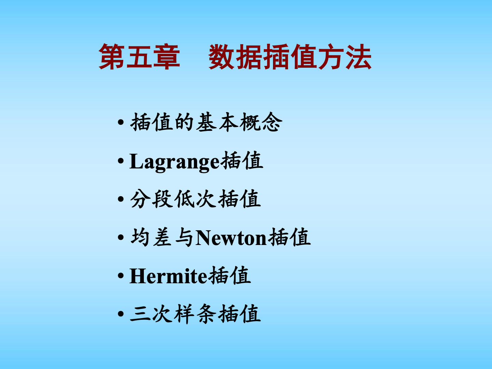
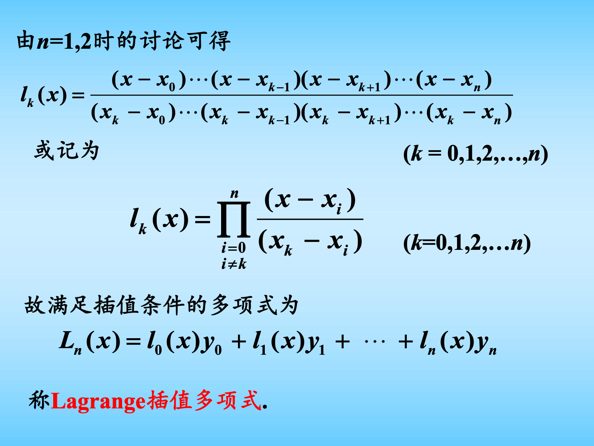
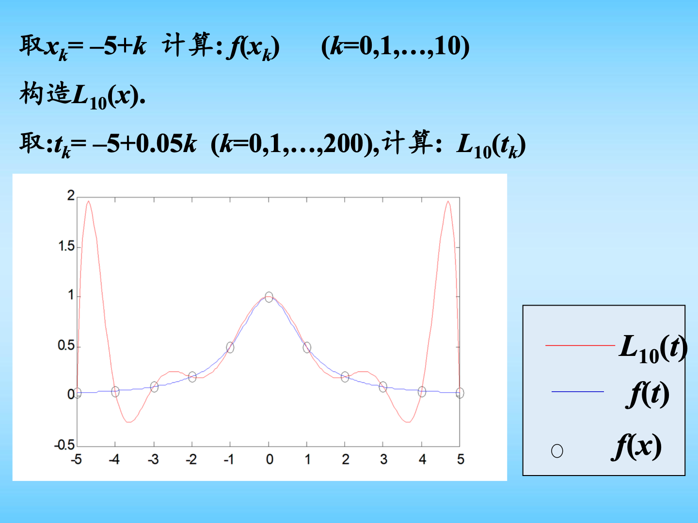
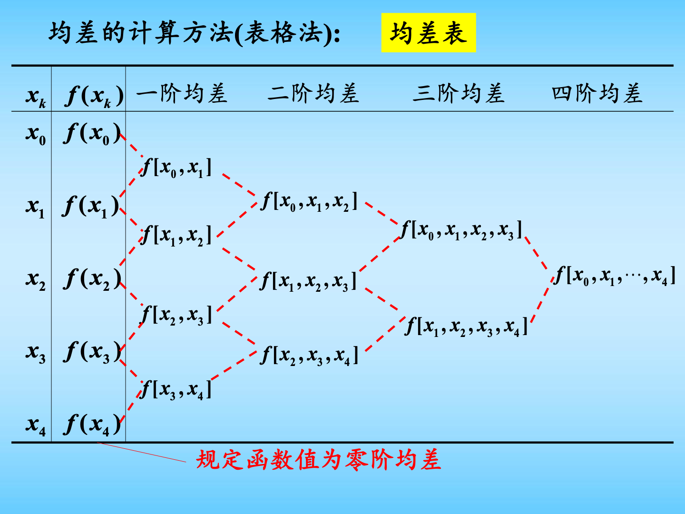
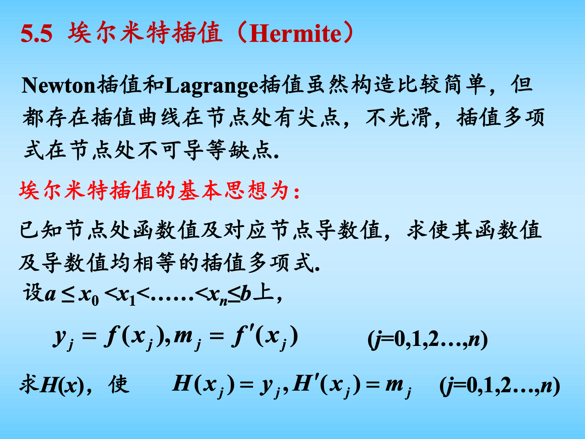

# 第五章 数据插值方法图文复习笔记

对应课件：`第5章 数据插值方法.pdf`

说明：这一章的核心不是把所有插值公式都背成一团，而是弄清楚一件事：

`已知若干离散点，怎样构造一个简单函数去近似原函数，并估计误差。`

课件实际主线包括：插值基本概念、Lagrange 插值、插值余项与误差估计、反插值、Runge 现象、分段低次插值、均差与 Newton 插值、Hermite 插值、三次样条插值。

如果你只有两天复习，这一章建议抓住四类题：

1. 给数据点，构造 Lagrange 插值多项式并求近似值。
2. 给数据点，列均差表，用 Newton 插值公式求近似值。
3. 给函数导数界，估计插值误差。
4. 判断为什么要用分段插值、Hermite 插值或三次样条。

## 0. 课件图示导读

图示说明：第 5 章所有方法都围绕一个目标：用简单函数通过已知数据点。先从普通插值多项式开始，再讲高次插值的问题，最后引出分段低次插值、Hermite 插值和三次样条插值。

图示说明：Lagrange 插值最重要的是插值基函数 $l_k(x)$。每个 $l_k(x)$ 在自己的节点上等于 1，在其他节点上等于 0，所以把它们乘上对应函数值 $y_k$ 再相加，就能构造出通过所有节点的多项式。

图示说明：节点越来越多、插值多项式次数越来越高，不一定越来越好。Runge 反例说明，高次插值可能在区间两端剧烈振荡，所以实际计算中常用分段低次插值。

图示说明：Newton 插值的系数来自均差表。均差表的好处是层层递推，新增节点时不用完全重算，非常适合手算和程序计算。

图示说明：Hermite 插值不仅要求函数值相等，还要求导数值相等。它比普通 Lagrange / Newton 插值更光滑，但如果一次性用太高次数，仍可能带来稳定性问题。

图示说明：三次样条的思想是每一小段用三次多项式，并要求拼接处函数值、一阶导数、二阶导数都连续。它兼顾低次、光滑、稳定，是本章最后的重点思想。

## 0.5 两天冲刺复习路线

如果你上课基本没听，建议不要一开始就硬啃证明。按下面顺序学：

第一轮：先会做题。

1. 看懂插值节点、插值多项式、插值余项是什么意思。
2. 熟记 Lagrange 插值公式。
3. 会列一阶、二阶、三阶均差表。
4. 会写 Newton 插值公式。
5. 会用误差公式估计上界。

第二轮：再理解为什么要换方法。

1. 高次插值可能有 Runge 现象。
2. 分段线性、分段二次牺牲整体高次，但更稳定。
3. Hermite 多加了导数信息，所以节点处更光滑。
4. 三次样条用分段三次多项式，并让拼接处足够光滑。

考试中这一章最容易出的不是大段证明，而是：

- 给表格数据，让你算插值值；
- 给函数和节点，让你估误差；
- 问某种插值方法的构造条件；
- 比较 Lagrange、Newton、Hermite、样条的特点。

## 1. 插值的基本概念

### 1.1 插值要解决什么问题

很多时候我们不知道函数 $f(x)$ 的完整表达式，只知道它在一些点上的值：

$$
(x_0,y_0), (x_1,y_1), \dots, (x_n,y_n),
$$

其中

$$
y_i=f(x_i).
$$

插值的目标是构造一个简单函数 $P(x)$，使它满足

$$
P(x_i)=y_i,\qquad i=0,1,\dots,n.
$$

也就是说，$P(x)$ 必须穿过所有已知数据点。

这里的关键词：

- $x_0,x_1,\dots,x_n$：插值节点；
- $[a,b]$：插值区间；
- $f(x)$：被插值函数；
- $P(x)$：插值函数或插值多项式；
- 在区间内部求值叫内插；
- 在区间外部求值叫外插。

外插通常比内插危险，因为你是在已知数据范围外推测函数。

### 1.2 n 次插值多项式

如果存在一个次数不超过 $n$ 的多项式

$$
P_n(x)=a_0+a_1x+a_2x^2+\cdots+a_nx^n,
$$

满足

$$
P_n(x_k)=y_k,\qquad k=0,1,\dots,n,
$$

则称 $P_n(x)$ 为 $f(x)$ 的 $n$ 次插值多项式。

直观理解：

- 2 个点确定一条直线；
- 3 个点确定一个二次多项式；
- $n+1$ 个互异点确定一个不超过 $n$ 次的多项式。

### 1.3 存在唯一性

若节点互异：

$$
x_i\ne x_j,\qquad i\ne j,
$$

则 $n$ 次插值多项式存在且唯一。

为什么唯一？因为把条件

$$
P_n(x_i)=y_i
$$

代入后，会得到关于系数 $a_0,a_1,\dots,a_n$ 的线性方程组，其系数矩阵是 Vandermonde 矩阵。它的行列式为

$$
V(x_0,x_1,\dots,x_n)
=
\prod_{0\le j<i\le n}(x_i-x_j).
$$

节点互异时，每个 $x_i-x_j$ 都不为零，所以行列式不为零，方程组有唯一解。

考试要点：  
看到“$n+1$ 个互异节点”，就要想到“存在唯一的不超过 $n$ 次插值多项式”。

## 2. Lagrange 插值

Lagrange 插值是本章最基础、最容易直接套公式的方法。

### 2.1 线性插值

两个节点：

$$
(x_0,y_0),\qquad (x_1,y_1)
$$

对应的一次插值多项式就是过这两点的直线：

$$
L_1(x)
=
y_0\frac{x-x_1}{x_0-x_1}
+
y_1\frac{x-x_0}{x_1-x_0}.
$$

也可写成点斜式：

$$
L_1(x)
=
y_0+\frac{y_1-y_0}{x_1-x_0}(x-x_0).
$$

做题时，两种写法都可以。要快速算数值，点斜式通常更方便。

### 2.2 二次插值

三个节点：

$$
(x_0,y_0),\qquad (x_1,y_1),\qquad (x_2,y_2)
$$

对应二次 Lagrange 插值：

$$
L_2(x)
=
y_0
\frac{(x-x_1)(x-x_2)}{(x_0-x_1)(x_0-x_2)}
+
y_1
\frac{(x-x_0)(x-x_2)}{(x_1-x_0)(x_1-x_2)}
+
y_2
\frac{(x-x_0)(x-x_1)}{(x_2-x_0)(x_2-x_1)}.
$$

上面式子更标准地写为：

$$
L_2(x)=l_0(x)y_0+l_1(x)y_1+l_2(x)y_2,
$$

其中

$$
l_0(x)=\frac{(x-x_1)(x-x_2)}{(x_0-x_1)(x_0-x_2)},
$$

$$
l_1(x)=\frac{(x-x_0)(x-x_2)}{(x_1-x_0)(x_1-x_2)},
$$

$$
l_2(x)=\frac{(x-x_0)(x-x_1)}{(x_2-x_0)(x_2-x_1)}.
$$

### 2.3 一般 n 次 Lagrange 插值

设有 $n+1$ 个互异节点：

$$
x_0<x_1<\cdots<x_n,
$$

且

$$
y_i=f(x_i),\qquad i=0,1,\dots,n.
$$

定义第 $k$ 个 Lagrange 插值基函数：

$$
l_k(x)=
\prod_{\substack{i=0\\i\ne k}}^n
\frac{x-x_i}{x_k-x_i},
\qquad k=0,1,\dots,n.
$$

它的关键性质是：

$$
l_k(x_j)=
\begin{cases}
1, & j=k,\\
0, & j\ne k.
\end{cases}
$$

所以插值多项式为：

$$
L_n(x)=\sum_{k=0}^n y_k l_k(x).
$$

这就是 Lagrange 插值公式。

### 2.4 怎么记 Lagrange 公式

记住一句话：

`每一项负责一个节点。`

第 $k$ 项：

- 分子：把其他节点都写成 $(x-x_i)$；
- 分母：把分子里的 $x$ 换成本节点 $x_k$；
- 再乘上该节点函数值 $y_k$。

例如三个点时，$y_1$ 前面的基函数一定是：

$$
l_1(x)=
\frac{(x-x_0)(x-x_2)}
{(x_1-x_0)(x_1-x_2)}.
$$

因为它要在 $x_1$ 处等于 1，在 $x_0,x_2$ 处等于 0。

### 2.5 经典例题：用插值求 $\sqrt{7}$

已知：

$$
\sqrt{4}=2,\qquad \sqrt{9}=3,\qquad \sqrt{16}=4.
$$

求 $\sqrt{7}$ 的近似值。

#### 线性插值

取节点 $4,9$，因为 7 离它们最近。

$$
L_1(x)=2\frac{x-9}{4-9}+3\frac{x-4}{9-4}.
$$

代入 $x=7$：

$$
\sqrt{7}\approx L_1(7)
=
2\frac{7-9}{4-9}
+
3\frac{7-4}{9-4}
=2.6.
$$

#### 二次插值

取节点 $4,9,16$：

$$
L_2(x)
=
2\frac{(x-9)(x-16)}{(4-9)(4-16)}
+
3\frac{(x-4)(x-16)}{(9-4)(9-16)}
+
4\frac{(x-4)(x-9)}{(16-4)(16-9)}.
$$

代入 $x=7$：

$$
\sqrt{7}\approx L_2(7)=2.6286.
$$

真实值约为 $2.6458$，所以二次插值比线性插值更接近。

但注意：这只是在这个例子里更好，不代表次数越高永远越好。

## 3. 插值余项与误差估计

### 3.1 插值余项

用 $L_n(x)$ 近似 $f(x)$ 时，误差为：

$$
R_n(x)=f(x)-L_n(x).
$$

若 $f(x)$ 在 $[a,b]$ 上有 $n+1$ 阶连续导数，则：

$$
R_n(x)
=
\frac{f^{(n+1)}(\xi)}{(n+1)!}
\omega_{n+1}(x),
$$

其中

$$
\omega_{n+1}(x)
=
(x-x_0)(x-x_1)\cdots(x-x_n),
$$

且 $\xi$ 是区间内某个点。

这条公式非常重要，但考试中通常不会让你真的找出 $\xi$，而是让你估计误差上界。

### 3.2 误差上界

如果已知

$$
\max_{a\le x\le b}|f^{(n+1)}(x)|=M_{n+1},
$$

则

$$
|R_n(x)|
\le
\frac{M_{n+1}}{(n+1)!}
|\omega_{n+1}(x)|.
$$

做题步骤：

1. 判断是几次插值，确定 $n$。
2. 求 $f^{(n+1)}(x)$。
3. 在相关区间上找上界 $M_{n+1}$。
4. 计算 $|\omega_{n+1}(x)|$。
5. 代入误差上界公式。

### 3.3 低次情形要熟

线性插值误差：

$$
R_1(x)
=
\frac{f''(\xi)}{2}
(x-x_0)(x-x_1).
$$

二次插值误差：

$$
R_2(x)
=
\frac{f'''(\xi)}{6}
(x-x_0)(x-x_1)(x-x_2).
$$

记忆方法：

- 一次插值看二阶导；
- 二次插值看三阶导；
- $n$ 次插值看 $n+1$ 阶导。

### 3.4 误差估计例题思路

若题目说：用节点 $144,169,225$ 对

$$
f(x)=\sqrt{x}
$$

估计 $f(175)$，并比较线性和二次插值误差。

你不一定要把插值值完全算完，误差估计思路是：

1. 线性插值如果取 $169,225$，则
   $$
   \omega_2(175)=(175-169)(175-225).
   $$
2. 二次插值如果取 $144,169,225$，则
   $$
   \omega_3(175)=(175-144)(175-169)(175-225).
   $$
3. 分别求 $f''(x)$ 和 $f'''(x)$ 的最大绝对值上界。
4. 代入
   $$
   |R_1(x)|\le \frac{M_2}{2!}|\omega_2(x)|,
   $$
   $$
   |R_2(x)|\le \frac{M_3}{3!}|\omega_3(x)|.
   $$

课件结论：在这个例子中，二次 Lagrange 插值比线性插值误差更小。

## 4. Lagrange 反插值

### 4.1 反插值解决什么问题

普通插值是：

已知 $x$，求 $y=f(x)$。

反插值是：

已知 $y$，反过来求 $x$。

特别地，如果要解方程

$$
f(x)=0,
$$

可以先把 $x$ 看成 $y$ 的函数：

$$
x=f^{-1}(y),
$$

然后对反函数做插值，最后令 $y=0$，得到根的近似值：

$$
x^*\approx L_n(0).
$$

### 4.2 反插值做题套路

如果给出表格：

$$
x_i,\qquad y_i=f(x_i),
$$

要求 $f(x)=0$ 的近似根。

步骤：

1. 把原来的 $y_i$ 当成插值节点；
2. 把原来的 $x_i$ 当成函数值；
3. 构造 $x=L_n(y)$；
4. 令 $y=0$；
5. 得到
   $$
   x^*\approx L_n(0).
   $$

前提：$f(x)$ 最好是单调连续函数，这样反函数存在，反插值才有意义。

## 5. Runge 现象与分段低次插值

### 5.1 高次插值不一定好

直觉上，节点越多，多项式次数越高，好像应该越准。

但 Runge 反例说明：高次插值可能在区间两端剧烈振荡，导致误差越来越大。

典型函数：

$$
f(x)=\frac{1}{1+x^2},\qquad -5\le x\le 5.
$$

在等距节点上构造高次 Lagrange 插值，多项式可能不收敛到 $f(x)$。

这说明：

`不要盲目追求全区间高次插值。`

### 5.2 分段低次插值的思想

分段低次插值就是：

不要在整个区间上用一个很高次的多项式，而是在每个小区间上用低次多项式。

它的优点：

- 稳定；
- 计算简单；
- 增加节点时不会造成全局剧烈振荡；
- 更适合实际数据。

缺点：

- 分段线性插值在节点处可能有尖点；
- 光滑性不如高阶方法；
- 需要进一步引出 Hermite 和样条插值。

### 5.3 分段线性插值

设节点为：

$$
x_0<x_1<\cdots<x_n,
$$

在每个小区间 $[x_k,x_{k+1}]$ 上，用相邻两点做线性插值：

$$
L_1^{(k)}(x)
=
y_k\frac{x-x_{k+1}}{x_k-x_{k+1}}
+
y_{k+1}\frac{x-x_k}{x_{k+1}-x_k},
\qquad x_k\le x\le x_{k+1}.
$$

整个插值函数为：

$$
L_1(x)=
\begin{cases}
L_1^{(0)}(x), & x_0\le x<x_1,\\
L_1^{(1)}(x), & x_1\le x<x_2,\\
\cdots\\
L_1^{(n-1)}(x), & x_{n-1}\le x\le x_n.
\end{cases}
$$

它的图像是一条折线，所以也叫折线插值。

### 5.4 分段线性插值误差

若步长最大值为

$$
h=\max_k(x_{k+1}-x_k),
$$

且

$$
M_2=\max_{a\le x\le b}|f''(x)|,
$$

则分段线性插值误差满足：

$$
|R_1(x)|\le \frac{1}{8}M_2h^2.
$$

重点理解：

- 步长 $h$ 越小，误差越小；
- 误差量级是 $O(h^2)$；
- 所以加密节点确实能改善分段线性插值。

### 5.5 分段二次插值

分段二次插值在每个局部区间取三个相邻节点，构造二次 Lagrange 插值。

如果 $x\in[x_{k-1},x_{k+1}]$，可以用节点

$$
x_{k-1},x_k,x_{k+1}
$$

构造：

$$
L_2^{(k)}(x)
=
y_{k-1}l_{k-1}(x)+y_kl_k(x)+y_{k+1}l_{k+1}(x).
$$

若节点等距，且

$$
M_3=\max_{a\le x\le b}|f'''(x)|,
$$

课件给出的误差估计为：

$$
|R_2(x)|\le \frac{\sqrt{3}}{27}M_3h^3.
$$

重点：

- 分段二次比分段线性更光滑一些；
- 误差量级是 $O(h^3)$；
- 但构造和计算比线性插值更复杂。

## 6. 均差与 Newton 插值

Newton 插值和 Lagrange 插值本质上得到的是同一个插值多项式，只是写法不同。

Lagrange 公式适合理解；Newton 公式适合计算。

### 6.1 一阶均差

给定两个节点 $x_i,x_j$，定义一阶均差：

$$
f[x_i,x_j]
=
\frac{f_j-f_i}{x_j-x_i},
\qquad i\ne j.
$$

它就是两点割线斜率。

### 6.2 高阶均差

二阶均差：

$$
f[x_i,x_j,x_k]
=
\frac{f[x_j,x_k]-f[x_i,x_j]}{x_k-x_i}.
$$

一般地，$n$ 阶均差定义为：

$$
f[x_0,x_1,\dots,x_n]
=
\frac{
f[x_1,x_2,\dots,x_n]
-
f[x_0,x_1,\dots,x_{n-1}]
}
{x_n-x_0}.
$$

### 6.3 均差性质

常用性质：

1. 零阶均差就是函数值：
   $$
   f[x_i]=f(x_i).
   $$
2. 均差具有对称性，节点顺序改变，均差值不变：
   $$
   f[x_0,x_1,x_2]=f[x_2,x_1,x_0].
   $$
3. 如果 $f$ 有 $n$ 阶导数，则：
   $$
   f[x_0,x_1,\dots,x_n]=\frac{f^{(n)}(\xi)}{n!}.
   $$

这第三条常用于误差估计。

### 6.4 均差表怎么列

均差表从左到右：

1. 第一列写 $x_i$；
2. 第二列写 $f(x_i)$；
3. 第三列写一阶均差；
4. 第四列写二阶均差；
5. 继续往右写更高阶均差。

一阶均差用相邻函数值算：

$$
f[x_i,x_{i+1}]
=
\frac{f(x_{i+1})-f(x_i)}{x_{i+1}-x_i}.
$$

二阶均差用相邻一阶均差算：

$$
f[x_i,x_{i+1},x_{i+2}]
=
\frac{
f[x_{i+1},x_{i+2}]
-
f[x_i,x_{i+1}]
}
{x_{i+2}-x_i}.
$$

做题时只要沿着表格斜着算即可。

### 6.5 Newton 插值公式

Newton 插值多项式为：

$$
N_n(x)
=
f(x_0)
+
f[x_0,x_1](x-x_0)
+
f[x_0,x_1,x_2](x-x_0)(x-x_1)
+
\cdots
$$

$$
+
f[x_0,x_1,\dots,x_n]
(x-x_0)(x-x_1)\cdots(x-x_{n-1}).
$$

可以记成：

`Newton 系数 = 均差表第一行的各阶均差。`

也就是：

$$
a_0=f[x_0],
$$

$$
a_1=f[x_0,x_1],
$$

$$
a_2=f[x_0,x_1,x_2],
$$

一直到

$$
a_n=f[x_0,x_1,\dots,x_n].
$$

### 6.6 Newton 公式的优势

Lagrange 插值中，如果增加一个新节点，所有基函数都要变化。

Newton 插值中，如果增加一个新节点，只需要在原公式后面加一项：

$$
f[x_0,x_1,\dots,x_{n+1}]
(x-x_0)(x-x_1)\cdots(x-x_n).
$$

所以 Newton 插值特别适合逐步增加数据点。

### 6.7 Newton 插值误差

Newton 插值余项为：

$$
R_n(x)
=
f[x,x_0,x_1,\dots,x_n]\omega_{n+1}(x),
$$

其中

$$
\omega_{n+1}(x)=(x-x_0)(x-x_1)\cdots(x-x_n).
$$

若 $f$ 有 $n+1$ 阶导数，则：

$$
f[x,x_0,\dots,x_n]
=
\frac{f^{(n+1)}(\xi)}{(n+1)!}.
$$

于是又回到 Lagrange 误差公式：

$$
R_n(x)
=
\frac{f^{(n+1)}(\xi)}{(n+1)!}
\omega_{n+1}(x).
$$

### 6.8 Newton 插值做题套路

给表格数据，求某点近似值：

1. 列出 $x_i$ 和 $f(x_i)$；
2. 计算一阶均差；
3. 计算二阶、三阶均差；
4. 取均差表第一行，写 Newton 多项式；
5. 把目标 $x$ 代入。

如果题目要求“四次 Newton 插值多项式”，就取到四阶均差。

## 7. Hermite 插值

### 7.1 为什么需要 Hermite 插值

普通 Lagrange / Newton 插值只要求：

$$
P(x_i)=f(x_i).
$$

但这样构造出的曲线在节点处可能不够光滑，导数不一定符合真实函数。

Hermite 插值进一步要求：

$$
H(x_i)=f(x_i),
\qquad
H'(x_i)=f'(x_i).
$$

也就是说，Hermite 插值不仅要过点，还要在节点处方向也对。

### 7.2 Hermite 插值的一般思想

设

$$
y_j=f(x_j),\qquad m_j=f'(x_j).
$$

要求构造 $H(x)$，使得：

$$
H(x_j)=y_j,
\qquad
H'(x_j)=m_j,
\qquad j=0,1,\dots,n.
$$

共有 $2n+2$ 个条件，因此可以唯一确定一个次数不超过 $2n+1$ 的多项式。

但次数太高仍可能影响稳定性，所以课件重点考虑两个节点时的三次 Hermite 插值，以及分段三次 Hermite 插值。

### 7.3 两点三次 Hermite 插值

已知两个节点：

$$
x_0,\qquad x_1,
$$

以及

$$
y_0=f(x_0),\qquad y_1=f(x_1),
$$

$$
y_0'=f'(x_0),\qquad y_1'=f'(x_1).
$$

三次 Hermite 插值多项式 $H_3(x)$ 满足：

$$
H_3(x_0)=y_0,\qquad H_3(x_1)=y_1,
$$

$$
H_3'(x_0)=y_0',\qquad H_3'(x_1)=y_1'.
$$

令

$$
l_0(x)=\frac{x-x_1}{x_0-x_1},
\qquad
l_1(x)=\frac{x-x_0}{x_1-x_0}.
$$

则两点三次 Hermite 插值公式可写为：

$$
H_3(x)
=
y_0\alpha_0(x)+y_1\alpha_1(x)
+
y_0'\beta_0(x)+y_1'\beta_1(x),
$$

其中

$$
\alpha_0(x)=(1+2l_1(x))l_0^2(x),
$$

$$
\alpha_1(x)=(1+2l_0(x))l_1^2(x),
$$

$$
\beta_0(x)=(x-x_0)l_0^2(x),
$$

$$
\beta_1(x)=(x-x_1)l_1^2(x).
$$

这个公式不用死背推导，重点是知道它由四类基函数组成：

- $\alpha_0$ 控制 $x_0$ 处的函数值；
- $\alpha_1$ 控制 $x_1$ 处的函数值；
- $\beta_0$ 控制 $x_0$ 处的导数值；
- $\beta_1$ 控制 $x_1$ 处的导数值。

### 7.4 两点三次 Hermite 余项

若 $f$ 有四阶导数，则：

$$
R_3(x)=f(x)-H_3(x)
=
\frac{f^{(4)}(\xi)}{4!}
(x-x_0)^2(x-x_1)^2.
$$

为什么是平方？因为 Hermite 插值在 $x_0,x_1$ 处不仅函数值相等，导数也相等，所以误差函数在每个节点处有二重零点。

### 7.5 Hermite 例题套路

若题目给：

$$
f(1)=2,\qquad f(2)=3,
$$

$$
f'(1)=0,\qquad f'(2)=-1,
$$

求两点三次 Hermite 插值多项式。

步骤：

1. 写出 $x_0=1,x_1=2$；
2. 写出 $y_0=2,y_1=3,y_0'=0,y_1'=-1$；
3. 写出 $l_0(x),l_1(x)$；
4. 代入 Hermite 公式；
5. 化简即可。

课件中的结果为：

$$
H_3(x)=-3x^3+13x^2-17x+9.
$$

所以：

$$
f(1.5)\approx H_3(1.5)=2.625,
$$

$$
f(1.7)\approx H_3(1.7)=2.931.
$$

### 7.6 分段三次 Hermite 插值

如果节点很多，不建议一次性构造很高次 Hermite 多项式。

更实用的方法是：在每个小区间 $[x_j,x_{j+1}]$ 上，用两个端点的函数值和导数值构造一个三次 Hermite 多项式。

它满足：

$$
H(x_j)=y_j,\qquad H(x_{j+1})=y_{j+1},
$$

$$
H'(x_j)=m_j,\qquad H'(x_{j+1})=m_{j+1}.
$$

优点：

- 每一段都是三次多项式；
- 节点处函数值连续；
- 节点处一阶导数连续；
- 比折线插值更光滑。

缺点：

- 需要知道或估计节点导数值 $m_j$。

这就引出三次样条插值：不直接给导数，而是通过整体光滑条件来确定。

## 8. 三次样条插值

### 8.1 为什么需要三次样条

分段线性插值简单，但节点处可能有尖点，一阶导数不连续。

Hermite 插值更光滑，但需要知道节点处导数。

三次样条插值折中处理：

- 每一小段用三次多项式；
- 整条曲线在节点处拼接得很光滑；
- 不需要直接给出所有节点导数；
- 通过边界条件和连续性条件确定。

### 8.2 三次样条函数定义

设区间 $[a,b]$ 有划分：

$$
a=x_0<x_1<\cdots<x_n=b.
$$

如果函数 $S(x)$ 满足：

1. 在每个小区间 $[x_{j-1},x_j]$ 上，$S(x)$ 是三次多项式；
2. 在内节点 $x_1,x_2,\dots,x_{n-1}$ 上，$S(x),S'(x),S''(x)$ 连续；

则称 $S(x)$ 为三次样条函数。

如果还满足插值条件：

$$
S(x_j)=y_j,\qquad j=0,1,\dots,n,
$$

则称 $S(x)$ 为三次样条插值函数。

### 8.3 三次样条的未知数和条件

每一段三次多项式可写为：

$$
S_j(x)=a_jx^3+b_jx^2+c_jx+d_j.
$$

如果有 $n$ 个小区间，就有 $4n$ 个未知数。

由插值条件和拼接连续条件可得到：

- 每段两端插值条件，共 $2n$ 个；
- 内节点一阶导数连续，共 $n-1$ 个；
- 内节点二阶导数连续，共 $n-1$ 个。

合计：

$$
2n+(n-1)+(n-1)=4n-2.
$$

还差 2 个条件，所以需要边界条件。

### 8.4 常见三类边界条件

第一类：给定端点一阶导数，称为转角边界条件：

$$
S'(x_0+0)=f'(x_0),
\qquad
S'(x_n-0)=f'(x_n).
$$

第二类：给定端点二阶导数，常见特例是自然样条：

$$
S''(x_0)=0,\qquad S''(x_n)=0.
$$

第三类：周期边界条件。若函数周期为 $b-a$，则要求：

$$
S'(x_0)=S'(x_n),
\qquad
S''(x_0)=S''(x_n).
$$

考试判断题常考：

`三次样条不是只要求函数值连续，而是要求函数值、一阶导数、二阶导数都连续。`

### 8.5 三次样条做题套路

如果题目让你直接求三次样条，步骤是：

1. 按区间写出每段三次多项式；
2. 代入所有节点函数值条件；
3. 写内节点处一阶导连续；
4. 写内节点处二阶导连续；
5. 加上两个边界条件；
6. 解线性方程组。

如果是自然样条，就把最后两个条件写成：

$$
S''(x_0)=0,\qquad S''(x_n)=0.
$$

课件例题中，若给

$$
f(-1)=1,\qquad f(0)=0,\qquad f(1)=1,
$$

求 $[-1,1]$ 上的三次自然样条插值函数，则设：

$$
S(x)=
\begin{cases}
a_1x^3+b_1x^2+c_1x+d_1, & x\in[-1,0],\\
a_2x^3+b_2x^2+c_2x+d_2, & x\in[0,1].
\end{cases}
$$

再用：

- $S(-1)=1$；
- $S(0)=0$；
- $S(1)=1$；
- $S'(0-)=S'(0+)$；
- $S''(0-)=S''(0+)$；
- $S''(-1)=0$；
- $S''(1)=0$；

联立求出系数。

课件结果为：

$$
S(x)=
\begin{cases}
\frac12x^3+\frac32x^2, & x\in[-1,0],\\
-\frac12x^3+\frac32x^2, & x\in[0,1].
\end{cases}
$$

## 9. 几种插值方法怎么区分

### 9.1 Lagrange 插值

特点：

- 公式直观；
- 适合少量节点；
- 手算小题方便；
- 增加节点时所有基函数都要变。

关键词：

$$
L_n(x)=\sum_{k=0}^n y_kl_k(x).
$$

### 9.2 Newton 插值

特点：

- 系数来自均差表；
- 新增节点方便；
- 和 Lagrange 本质上是同一个插值多项式；
- 计算题常用。

关键词：

$$
N_n(x)
=
f[x_0]+f[x_0,x_1](x-x_0)+\cdots.
$$

### 9.3 分段低次插值

特点：

- 每段只用少量节点；
- 避免整体高次插值的振荡；
- 稳定、实用；
- 分段线性不够光滑。

关键词：

$$
x\in[x_k,x_{k+1}]
$$

时只用附近节点。

### 9.4 Hermite 插值

特点：

- 不只匹配函数值，还匹配导数值；
- 节点处更光滑；
- 需要导数信息；
- 常考两点三次 Hermite。

关键词：

$$
H(x_i)=y_i,\qquad H'(x_i)=m_i.
$$

### 9.5 三次样条插值

特点：

- 分段三次；
- 整体二阶光滑；
- 需要边界条件；
- 实际应用很广。

关键词：

$$
S,S',S'' \text{ 在内节点连续}.
$$

## 10. 考前必须掌握的公式

### 10.1 Lagrange 基函数

$$
l_k(x)=
\prod_{\substack{i=0\\i\ne k}}^n
\frac{x-x_i}{x_k-x_i}.
$$

### 10.2 Lagrange 插值多项式

$$
L_n(x)=\sum_{k=0}^n y_kl_k(x).
$$

### 10.3 插值误差

$$
R_n(x)
=
f(x)-L_n(x)
=
\frac{f^{(n+1)}(\xi)}{(n+1)!}
\prod_{i=0}^n(x-x_i).
$$

### 10.4 误差上界

$$
|R_n(x)|
\le
\frac{M_{n+1}}{(n+1)!}
\left|
\prod_{i=0}^n(x-x_i)
\right|.
$$

### 10.5 一阶均差

$$
f[x_i,x_j]
=
\frac{f_j-f_i}{x_j-x_i}.
$$

### 10.6 高阶均差

$$
f[x_0,x_1,\dots,x_n]
=
\frac{
f[x_1,\dots,x_n]
-
f[x_0,\dots,x_{n-1}]
}
{x_n-x_0}.
$$

### 10.7 Newton 插值

$$
N_n(x)
=
f[x_0]
+
f[x_0,x_1](x-x_0)
+
f[x_0,x_1,x_2](x-x_0)(x-x_1)
+
\cdots.
$$

### 10.8 两点三次 Hermite 插值

令

$$
l_0(x)=\frac{x-x_1}{x_0-x_1},
\qquad
l_1(x)=\frac{x-x_0}{x_1-x_0}.
$$

则

$$
H_3(x)
=
y_0(1+2l_1)l_0^2
+
y_1(1+2l_0)l_1^2
+
y_0'(x-x_0)l_0^2
+
y_1'(x-x_1)l_1^2.
$$

### 10.9 两点三次 Hermite 误差

$$
R_3(x)
=
\frac{f^{(4)}(\xi)}{4!}
(x-x_0)^2(x-x_1)^2.
$$

### 10.10 三次样条条件

在每个小区间上：

$$
S_j(x)=a_jx^3+b_jx^2+c_jx+d_j.
$$

内节点处：

$$
S(x_j-0)=S(x_j+0),
$$

$$
S'(x_j-0)=S'(x_j+0),
$$

$$
S''(x_j-0)=S''(x_j+0).
$$

还需要两个边界条件。

## 11. 考试题型速查

### 11.1 给数据点，求插值值

优先判断：

- 数据点少：直接用 Lagrange；
- 数据点多：列均差表，用 Newton；
- 只需要局部值：用附近节点，不要全用。

### 11.2 给函数和节点，估计误差

固定套路：

1. 确定插值次数 $n$；
2. 写
   $$
   \omega_{n+1}(x)=\prod_{i=0}^n(x-x_i);
   $$
3. 求 $f^{(n+1)}(x)$；
4. 找上界 $M_{n+1}$；
5. 套
   $$
   |R_n(x)|\le \frac{M_{n+1}}{(n+1)!}|\omega_{n+1}(x)|.
   $$

### 11.3 问为什么不用高次插值

回答关键词：

- 高次插值可能振荡；
- 等距节点上可能出现 Runge 现象；
- 分段低次插值更稳定；
- 三次样条能兼顾低次和光滑。

### 11.4 问 Lagrange 和 Newton 的区别

回答：

- 它们构造的是同一个插值多项式；
- Lagrange 公式对称、直观；
- Newton 用均差表，新增节点方便；
- 实际计算 Newton 更灵活。

### 11.5 问 Hermite 和普通插值区别

回答：

- 普通插值只要求函数值相等；
- Hermite 还要求导数值相等；
- 因此 Hermite 插值在节点处更光滑；
- 两点三次 Hermite 是重点。

### 11.6 问三次样条为什么还要边界条件

回答：

三次样条有 $4n$ 个未知系数。由插值条件和内节点连续条件只能得到 $4n-2$ 个方程，所以还差两个条件，需要在端点补充边界条件。

常见边界条件：

- 给端点一阶导数；
- 给端点二阶导数；
- 自然样条 $S''(x_0)=S''(x_n)=0$；
- 周期样条。

## 12. 最后冲刺建议

这章公式多，但考试复习可以压缩成一张图：

1. 普通插值：先会 Lagrange。
2. 计算优化：再会 Newton 均差表。
3. 误差估计：盯住 $f^{(n+1)}$ 和 $\omega_{n+1}(x)$。
4. 高次不稳：记住 Runge 现象。
5. 稳定改进：用分段低次。
6. 要导数也匹配：用 Hermite。
7. 要整体光滑：用三次样条。

如果时间真的很紧，优先背并练：

- Lagrange 插值公式；
- Newton 均差表；
- 插值误差公式；
- 两点三次 Hermite 公式；
- 三次样条的三个连续条件和两类常见边界条件。

