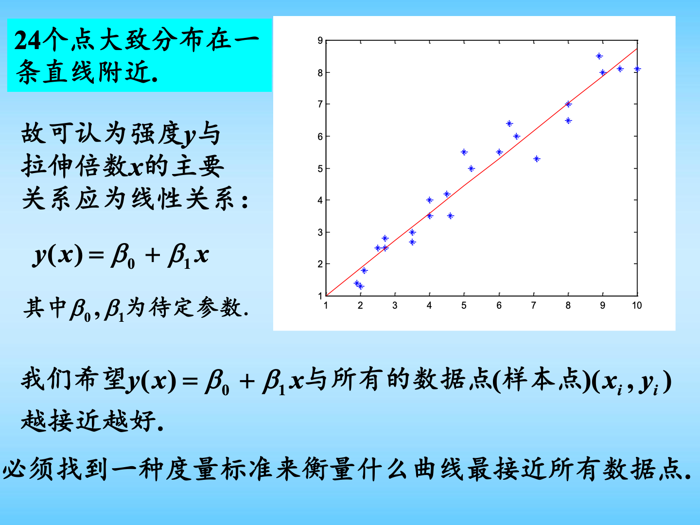
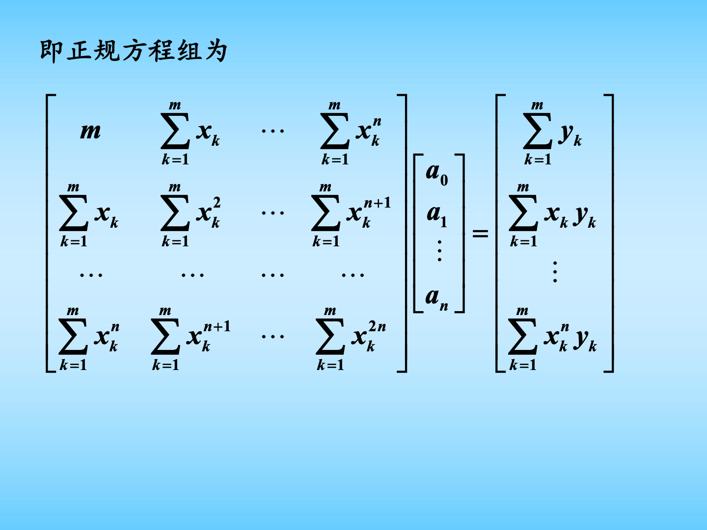
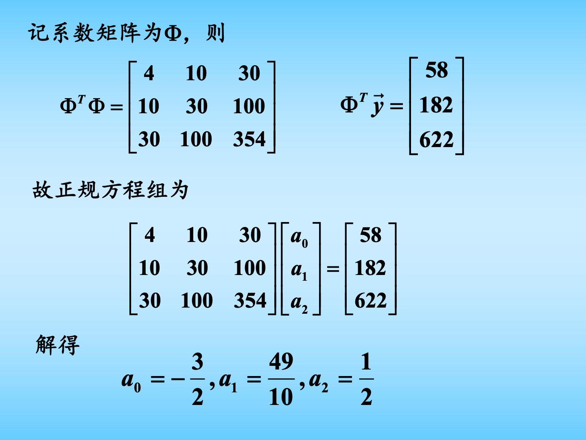
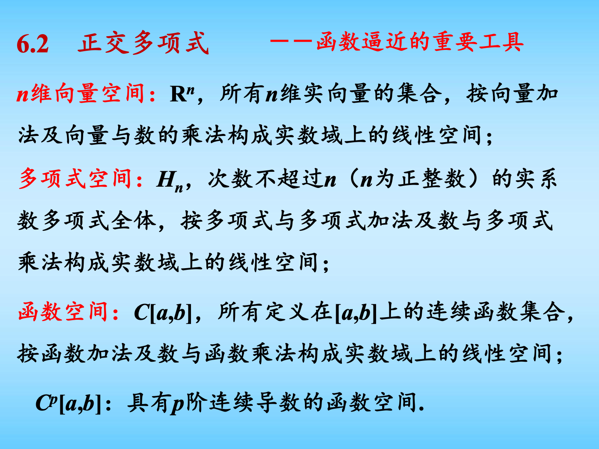
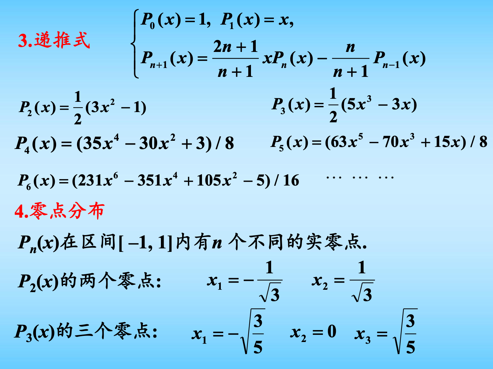
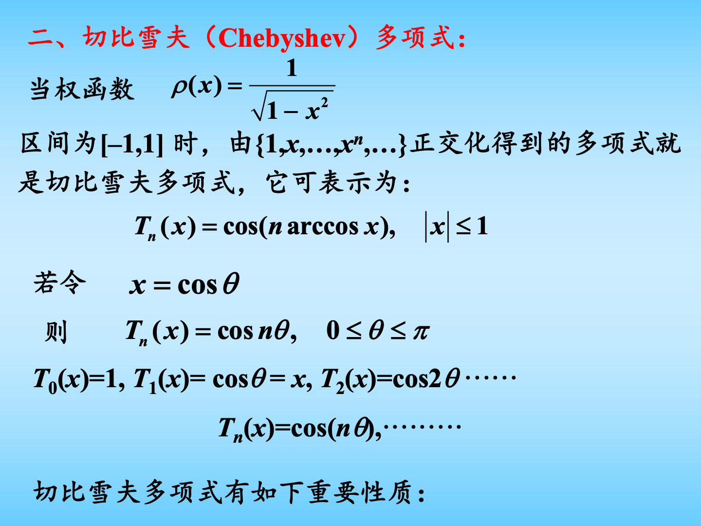
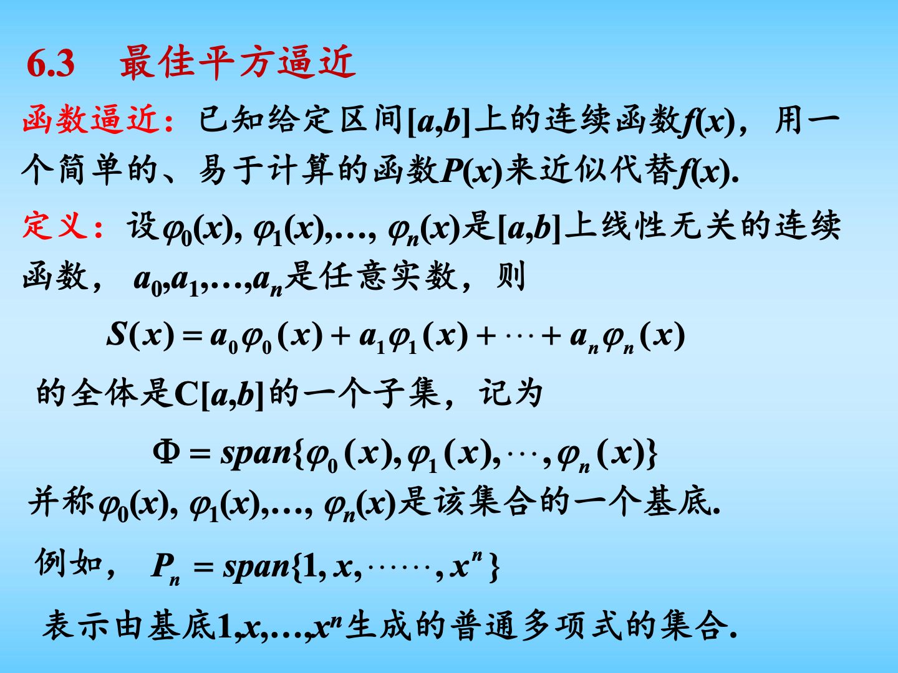
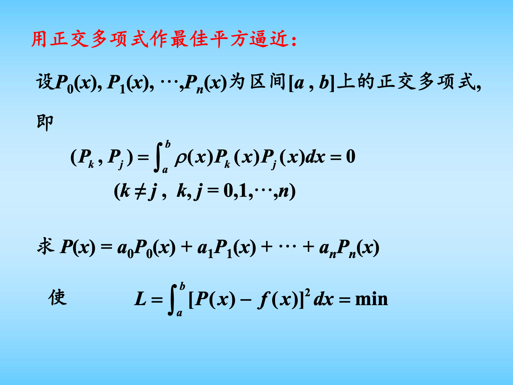
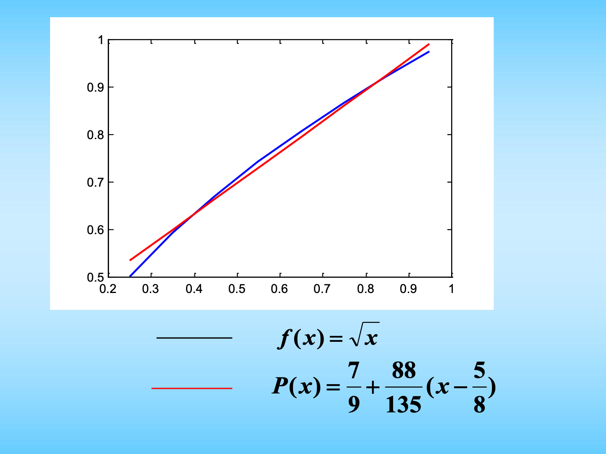

# 第六章 数据拟合与函数逼近图文复习笔记

对应课件：`第6章 数据拟合和函数逼近.pdf`

说明：这一章和第 5 章“插值”很像，但目标不一样。

第 5 章插值要求：

$$
P(x_i)=y_i
$$

也就是曲线必须穿过所有点。

第 6 章拟合和逼近要求：

$$
\text{整体误差尽量小}
$$

也就是曲线不一定穿过每个点，但要从整体上最接近数据或函数。

如果你只有两天复习，这一章先抓三件事：

1. 离散数据的最小二乘拟合：给一组点，列正规方程组。
2. 连续函数的最佳平方逼近：把“求和”换成“积分”，仍然列正规方程组。
3. 正交多项式：如果基函数正交，系数可以直接算，不用解大方程组。

## 0. 课件图示导读

图示说明：第 6 章主要包括三块：数据拟合的最小二乘法、正交多项式、最佳平方逼近。考试最常考的是“最小二乘正规方程组”和“用正交多项式做平方逼近”。

图示说明：数据点大致呈线性趋势时，不必让直线穿过每个点，而是找一条“总体误差最小”的直线。这就是最小二乘法的直觉来源。

图示说明：用多项式 $P_n(x)=a_0+a_1x+\cdots+a_nx^n$ 拟合数据时，核心就是把若干求和量填进正规方程组，然后解出系数 $a_0,\dots,a_n$。

图示说明：最小二乘题最常见流程：先写系数矩阵 $\Phi$，再计算 $\Phi^T\Phi$ 和 $\Phi^T y$，最后解正规方程组。

图示说明：正交多项式是函数逼近的重要工具。它的作用是让正规方程组变成对角形式，计算系数会简单很多。

图示说明：Legendre 多项式是在区间 $[-1,1]$、权函数 $\rho(x)=1$ 下的常见正交多项式。前几个公式经常直接用于计算题。

图示说明：Chebyshev 多项式和节点分布有关，常用于减少高次多项式逼近的振荡问题。考试中常考定义、零点和递推式。

图示说明：最佳平方逼近研究的是连续函数 $f(x)$。目标是让积分意义下的平方误差最小。

图示说明：如果 $P_0,P_1,\dots,P_n$ 已经正交，则最佳平方逼近的系数可以逐个算：
$$
a_k=\frac{(P_k,f)}{(P_k,P_k)}.
$$

图示说明：这类题一般会先选一个正交基，比如 $P_0(x)=1,\ P_1(x)=x-\frac58$，再用内积公式算系数。

## 0.5 两天冲刺复习路线

先说重点：这一章不要从证明开始学。你上课没听也没关系，先会做下面三种题。

第一轮：最小二乘法。

1. 看懂“拟合”和“插值”的区别。
2. 会写拟合函数 $\varphi(x)=a_0\varphi_0(x)+\cdots+a_n\varphi_n(x)$。
3. 会写误差平方和 $S=\sum(\varphi(x_i)-y_i)^2$。
4. 会列正规方程组。
5. 会做一次直线拟合和二次多项式拟合。

第二轮：正交多项式。

1. 理解内积 $(f,g)=\int_a^b \rho(x)f(x)g(x)\,dx$。
2. 理解正交就是 $(\varphi_i,\varphi_j)=0,\ i\ne j$。
3. 记住 Legendre 多项式前几个。
4. 记住 Chebyshev 多项式定义和零点。
5. 知道 Gram-Schmidt 正交化的公式长什么样。

第三轮：最佳平方逼近。

1. 明白它和最小二乘的区别：一个是离散点求和，一个是连续区间积分。
2. 会列连续情形的正规方程组。
3. 会用正交基直接算系数。
4. 会做一次最佳平方逼近。

## 1. 插值、拟合、逼近的区别

### 1.1 插值

插值要求曲线经过所有已知点：

$$
P(x_i)=y_i,\qquad i=1,2,\dots,m.
$$

优点：节点处完全准确。

缺点：数据有误差时，强行穿过所有点反而不合理；点很多时，高次插值可能振荡。

### 1.2 数据拟合

拟合面对的是一组离散数据：

$$
(x_1,y_1),(x_2,y_2),\dots,(x_m,y_m).
$$

我们找一个简单函数 $\varphi(x)$，不要求它穿过每个点，只要求整体误差小。

最常用标准是最小二乘：

$$
\sum_{i=1}^m[\varphi(x_i)-y_i]^2
$$

越小越好。

### 1.3 函数逼近

函数逼近面对的是一个连续函数 $f(x)$，比如在 $[a,b]$ 上用简单函数 $P(x)$ 近似它。

最佳平方逼近的误差标准是：

$$
\int_a^b \rho(x)[f(x)-P(x)]^2\,dx.
$$

一句话区分：

- 插值：点点都要过。
- 拟合：一堆离散点，整体误差最小。
- 逼近：一个连续函数，积分意义下整体误差最小。

## 2. 数据拟合的最小二乘法

### 2.1 问题形式

给定数据：

$$
(x_i,y_i),\qquad i=1,2,\dots,m.
$$

选择一组函数：

$$
\varphi_0(x),\varphi_1(x),\dots,\varphi_n(x).
$$

构造拟合函数：

$$
\varphi(x)
=a_0\varphi_0(x)+a_1\varphi_1(x)+\cdots+a_n\varphi_n(x)
=\sum_{j=0}^n a_j\varphi_j(x).
$$

这里 $a_0,a_1,\dots,a_n$ 是待求系数。

通常 $m>n+1$，也就是数据点个数多于未知系数个数，所以一般不能让所有点都精确满足。

### 2.2 残差与误差平方和

第 $i$ 个点的残差是：

$$
\delta_i=\varphi(x_i)-y_i.
$$

最小二乘法就是让残差平方和最小：

$$
S(a_0,\dots,a_n)
=\sum_{i=1}^m[\varphi(x_i)-y_i]^2.
$$

代入拟合函数：

$$
S(a_0,\dots,a_n)
=
\sum_{i=1}^m
\left[
\sum_{j=0}^n a_j\varphi_j(x_i)-y_i
\right]^2.
$$

### 2.3 正规方程组

因为 $S$ 是关于 $a_0,\dots,a_n$ 的多元函数，最小值满足：

$$
\frac{\partial S}{\partial a_k}=0,\qquad k=0,1,\dots,n.
$$

整理后得到正规方程组：

$$
\sum_{j=0}^n
\left[
\sum_{i=1}^m \varphi_k(x_i)\varphi_j(x_i)
\right]a_j
=
\sum_{i=1}^m \varphi_k(x_i)y_i,
\qquad k=0,1,\dots,n.
$$

这个公式是本章最核心公式之一。

做题时可以按下面理解：

- 左边系数：基函数之间相乘再对所有数据点求和；
- 右边常数：基函数乘 $y_i$ 再对所有数据点求和。

### 2.4 向量内积写法

定义离散内积：

$$
(u,v)=\sum_{i=1}^m u_i v_i.
$$

把

$$
\varphi_j=(\varphi_j(x_1),\varphi_j(x_2),\dots,\varphi_j(x_m)),
$$

$$
f=(y_1,y_2,\dots,y_m).
$$

则正规方程组可写为：

$$
a_0(\varphi_k,\varphi_0)+a_1(\varphi_k,\varphi_1)+\cdots+a_n(\varphi_k,\varphi_n)
=(\varphi_k,f),
$$

其中 $k=0,1,\dots,n$。

这个写法后面会和连续函数的最佳平方逼近对应起来。

### 2.5 矩阵写法

令设计矩阵为：

$$
\Phi=
\begin{bmatrix}
\varphi_0(x_1)&\varphi_1(x_1)&\cdots&\varphi_n(x_1)\\
\varphi_0(x_2)&\varphi_1(x_2)&\cdots&\varphi_n(x_2)\\
\vdots&\vdots&&\vdots\\
\varphi_0(x_m)&\varphi_1(x_m)&\cdots&\varphi_n(x_m)
\end{bmatrix},
$$

$$
a=
\begin{bmatrix}
a_0\\a_1\\\vdots\\a_n
\end{bmatrix},
\qquad
y=
\begin{bmatrix}
y_1\\y_2\\\vdots\\y_m
\end{bmatrix}.
$$

拟合关系是：

$$
\Phi a\approx y.
$$

最小二乘解满足：

$$
\Phi^T\Phi a=\Phi^T y.
$$

这就是矩阵形式的正规方程组。

考试里如果看到“超定方程组的最小二乘解”，就写：

$$
A^TAx=A^Tb.
$$

## 3. 多项式拟合

### 3.1 一般 n 次多项式拟合

最常见的拟合函数是多项式：

$$
P_n(x)=a_0+a_1x+\cdots+a_nx^n.
$$

这对应基函数：

$$
\varphi_0(x)=1,\quad
\varphi_1(x)=x,\quad
\dots,\quad
\varphi_n(x)=x^n.
$$

此时正规方程组中的内积为：

$$
(\varphi_k,\varphi_j)=\sum_{i=1}^m x_i^{k+j},
$$

$$
(\varphi_k,f)=\sum_{i=1}^m x_i^k y_i.
$$

所以正规方程组是：

$$
\begin{bmatrix}
m & \sum x_i & \sum x_i^2 & \cdots & \sum x_i^n\\
\sum x_i & \sum x_i^2 & \sum x_i^3 & \cdots & \sum x_i^{n+1}\\
\sum x_i^2 & \sum x_i^3 & \sum x_i^4 & \cdots & \sum x_i^{n+2}\\
\vdots & \vdots & \vdots & & \vdots\\
\sum x_i^n & \sum x_i^{n+1} & \sum x_i^{n+2} & \cdots & \sum x_i^{2n}
\end{bmatrix}
\begin{bmatrix}
a_0\\a_1\\a_2\\\vdots\\a_n
\end{bmatrix}
=
\begin{bmatrix}
\sum y_i\\
\sum x_i y_i\\
\sum x_i^2 y_i\\
\vdots\\
\sum x_i^n y_i
\end{bmatrix}.
$$

### 3.2 一次线性拟合

如果拟合直线：

$$
P_1(x)=a_0+a_1x,
$$

正规方程组为：

$$
\begin{cases}
ma_0+\left(\sum x_i\right)a_1=\sum y_i,\\
\left(\sum x_i\right)a_0+\left(\sum x_i^2\right)a_1=\sum x_i y_i.
\end{cases}
$$

这是最容易考的手算题。

做题步骤：

1. 列表算 $\sum x_i,\sum y_i,\sum x_i^2,\sum x_iy_i$。
2. 代入上面的二元一次方程组。
3. 解出 $a_0,a_1$。
4. 写出 $P_1(x)=a_0+a_1x$。

### 3.3 二次多项式拟合

如果拟合：

$$
P_2(x)=a_0+a_1x+a_2x^2,
$$

正规方程组为：

$$
\begin{cases}
ma_0+\left(\sum x_i\right)a_1+\left(\sum x_i^2\right)a_2=\sum y_i,\\
\left(\sum x_i\right)a_0+\left(\sum x_i^2\right)a_1+\left(\sum x_i^3\right)a_2=\sum x_i y_i,\\
\left(\sum x_i^2\right)a_0+\left(\sum x_i^3\right)a_1+\left(\sum x_i^4\right)a_2=\sum x_i^2 y_i.
\end{cases}
$$

二次拟合就是多算几列：

$$
x_i^2,\quad x_i^3,\quad x_i^4,\quad x_i y_i,\quad x_i^2y_i.
$$

### 3.4 课件例题：二次拟合的典型结构

课件中有一个二次拟合例子，最后算出：

$$
\Phi^T\Phi=
\begin{bmatrix}
4&10&30\\
10&30&100\\
30&100&354
\end{bmatrix},
\qquad
\Phi^Ty=
\begin{bmatrix}
58\\182\\622
\end{bmatrix}.
$$

所以正规方程组为：

$$
\begin{bmatrix}
4&10&30\\
10&30&100\\
30&100&354
\end{bmatrix}
\begin{bmatrix}
a_0\\a_1\\a_2
\end{bmatrix}
=
\begin{bmatrix}
58\\182\\622
\end{bmatrix}.
$$

解得：

$$
a_0=-\frac32,\qquad a_1=\frac{49}{10},\qquad a_2=\frac12.
$$

所以拟合多项式是：

$$
P_2(x)=-\frac32+\frac{49}{10}x+\frac12x^2.
$$

考试提示：如果题目已经给了 $\Phi$，就不要再从求和公式绕远路，直接算 $\Phi^T\Phi$ 和 $\Phi^T y$。

## 4. 可线性化的非线性拟合

有些模型看起来不是线性的，但可以通过变换变成线性最小二乘。

### 4.1 指数模型

例如人口增长常用指数模型：

$$
N=e^{a+bt}.
$$

两边取对数：

$$
\ln N=a+bt.
$$

令

$$
Y=\ln N,
$$

就变成直线拟合：

$$
Y=a+bt.
$$

算出 $a,b$ 后，再回到原模型：

$$
N=e^{a+bt}.
$$

课件例子中得到：

$$
a=-12.3390,\qquad b=0.0074,
$$

所以：

$$
N=e^{-12.3390+0.0074t}.
$$

当 $t=2022$ 时：

$$
N\approx 14.6787.
$$

### 4.2 常见变换

考试可能不只给指数模型，也可能给其他可变换模型。

| 原模型 | 变换方法 | 变成的线性关系 |
| --- | --- | --- |
| $y=ae^{bx}$ | 取对数 | $\ln y=\ln a+bx$ |
| $y=ab^x$ | 取对数 | $\ln y=\ln a+x\ln b$ |
| $y=ax^b$ | 两边取对数 | $\ln y=\ln a+b\ln x$ |
| $y=\frac{1}{a+bx}$ | 取倒数 | $\frac1y=a+bx$ |

注意：变换后拟合的是变换变量的误差，不一定等价于原变量上的最小误差。但考试一般重点是会把模型转成线性形式。

## 5. 权函数与连续内积

后面的最佳平方逼近需要“函数内积”。

### 5.1 权函数

在区间 $(a,b)$ 上，若非负函数 $\rho(x)$ 满足：

1. 对一切整数 $n\ge 0$，积分 $\int_a^b x^n\rho(x)\,dx$ 存在；
2. 对非负连续函数 $f(x)$，若

$$
\int_a^b \rho(x)f(x)\,dx=0,
$$

则在 $(a,b)$ 上 $f(x)\equiv 0$；

则称 $\rho(x)$ 是区间 $(a,b)$ 上的权函数。

通俗理解：权函数决定“哪里更重要”。$\rho(x)$ 越大，该位置的误差在总误差中占比越大。

### 5.2 函数内积

定义：

$$
(f,g)=\int_a^b \rho(x)f(x)g(x)\,dx.
$$

特别地：

$$
\|f\|_2^2=(f,f)=\int_a^b \rho(x)f^2(x)\,dx.
$$

这和向量内积很像：

- 离散最小二乘：$(u,v)=\sum u_iv_i$；
- 连续平方逼近：$(f,g)=\int \rho(x)f(x)g(x)\,dx$。

这就是本章前后两部分能统一起来的原因。

## 6. 正交函数系与正交多项式

### 6.1 正交的定义

若函数系

$$
\varphi_0(x),\varphi_1(x),\dots,\varphi_n(x)
$$

满足：

$$
(\varphi_i,\varphi_j)=0,\qquad i\ne j,
$$

则称它们是正交函数系。

如果每个 $\varphi_k(x)$ 都是 $k$ 次多项式，则称为正交多项式系。

### 6.2 正交为什么有用

普通基函数下，最佳逼近要解方程组：

$$
\sum_{j=0}^n a_j(\varphi_k,\varphi_j)=(\varphi_k,f).
$$

如果 $\varphi_0,\dots,\varphi_n$ 正交，则当 $j\ne k$ 时：

$$
(\varphi_k,\varphi_j)=0.
$$

方程组变成：
	
$$
a_k(\varphi_k,\varphi_k)=(\varphi_k,f).
$$

所以：

$$
a_k=\frac{(\varphi_k,f)}{(\varphi_k,\varphi_k)}.
$$

这就是正交多项式最重要的作用：不用解联立方程，逐个算系数。

### 6.3 Gram-Schmidt 正交化

如果从普通多项式

$$
1,x,x^2,\dots
$$

出发，可以用 Gram-Schmidt 方法构造正交多项式：

$$
\varphi_0(x)=1,
$$

$$
\varphi_{k+1}(x)
=x^{k+1}
-\sum_{j=0}^k
\frac{(x^{k+1},\varphi_j)}{(\varphi_j,\varphi_j)}
\varphi_j(x),
\qquad k=0,1,2,\dots
$$

这条公式看着长，其实意思很简单：

新多项式 = 原来的 $x^{k+1}$ 减去它在旧正交基上的投影。

这样得到的新多项式就和之前所有 $\varphi_j$ 正交。

### 6.4 课件例子：权函数 $\rho(x)=x^2$

课件中在 $[-1,1]$ 上、权函数 $\rho(x)=x^2$ 的正交化结果为：

$$
\varphi_0(x)=1,
$$

$$
\varphi_1(x)=x,
$$

$$
\varphi_2(x)=x^2-\frac35,
$$

$$
\varphi_3(x)=x^3-\frac57x.
$$

做这种题时，只要记住：内积里必须带权函数。

例如：

$$
(f,g)=\int_{-1}^1 x^2f(x)g(x)\,dx.
$$

不要漏掉 $\rho(x)=x^2$。

## 7. 常见正交多项式

### 7.1 Legendre 多项式

Legendre 多项式对应：

$$
\text{区间 }[-1,1],\qquad \rho(x)=1.
$$

前几个常用公式：

$$
P_0(x)=1,
$$

$$
P_1(x)=x,
$$

$$
P_2(x)=\frac12(3x^2-1),
$$

$$
P_3(x)=\frac12(5x^3-3x),
$$

$$
P_4(x)=\frac18(35x^4-30x^2+3).
$$

递推式：

$$
P_{n+1}(x)=\frac{2n+1}{n+1}xP_n(x)-\frac{n}{n+1}P_{n-1}(x).
$$

零点例子：

$$
P_2(x)=0
\quad\Rightarrow\quad
x=\pm\frac1{\sqrt3}.
$$

$$
P_3(x)=0
\quad\Rightarrow\quad
x=0,\ \pm\sqrt{\frac35}.
$$

考试常见问法：

- 写出 $P_0,P_1,P_2,P_3$；
- 验证两个 Legendre 多项式正交；
- 用 Legendre 多项式展开并求最佳平方逼近。

### 7.2 Chebyshev 多项式

第一类 Chebyshev 多项式对应：

$$
\text{区间 }[-1,1],\qquad \rho(x)=\frac1{\sqrt{1-x^2}}.
$$

定义：

$$
T_n(x)=\cos(n\arccos x),\qquad |x|\le 1.
$$

令 $x=\cos\theta$，则：

$$
T_n(x)=\cos(n\theta).
$$

前几个：

$$
T_0(x)=1,
$$

$$
T_1(x)=x,
$$

$$
T_2(x)=2x^2-1,
$$

$$
T_3(x)=4x^3-3x.
$$

递推式：

$$
T_{n+1}(x)=2xT_n(x)-T_{n-1}(x).
$$

零点：

$$
x_k=\cos\frac{(2k+1)\pi}{2n},
\qquad k=0,1,\dots,n-1.
$$

这个零点公式很重要。第 5 章的 Runge 现象说明等距高次插值可能振荡，而 Chebyshev 节点常用来改善这种问题。

### 7.3 第二类 Chebyshev 多项式

第二类 Chebyshev 多项式对应：

$$
\rho(x)=\sqrt{1-x^2}.
$$

表达式：

$$
U_n(x)=
\frac{\sin[(n+1)\arccos x]}{\sqrt{1-x^2}}.
$$

令 $x=\cos\theta$，则：

$$
U_n(x)=\frac{\sin((n+1)\theta)}{\sin\theta}.
$$

递推式：

$$
U_0(x)=1,\qquad U_1(x)=2x,
$$

$$
U_{n+1}(x)=2xU_n(x)-U_{n-1}(x).
$$

### 7.4 Hermite 多项式

Hermite 多项式对应：

$$
\text{区间 }(-\infty,+\infty),\qquad \rho(x)=e^{-x^2}.
$$

表达式：

$$
H_n(x)=(-1)^ne^{x^2}\frac{d^n}{dx^n}(e^{-x^2}).
$$

递推式：

$$
H_0(x)=1,\qquad H_1(x)=2x,
$$

$$
H_{n+1}(x)=2xH_n(x)-2nH_{n-1}(x).
$$

考试如果时间紧，Hermite 多项式知道区间、权函数、递推式即可。

## 8. 最佳平方逼近

### 8.1 问题形式

给定连续函数 $f(x)$，希望用

$$
S(x)=a_0\varphi_0(x)+a_1\varphi_1(x)+\cdots+a_n\varphi_n(x)
$$

去近似它。

所有这种函数组成集合：

$$
\Phi=\operatorname{span}\{\varphi_0,\varphi_1,\dots,\varphi_n\}.
$$

最佳平方逼近就是找 $S^*(x)\in\Phi$，使：

$$
\int_a^b \rho(x)[f(x)-S^*(x)]^2\,dx
=
\min_{S(x)\in\Phi}
\int_a^b \rho(x)[f(x)-S(x)]^2\,dx.
$$

若

$$
\Phi=P_n=\operatorname{span}\{1,x,x^2,\dots,x^n\},
$$

则 $S^*(x)$ 称为 $f(x)$ 的 $n$ 次最佳平方逼近多项式。

### 8.2 连续情形的正规方程组

定义内积：

$$
(u,v)=\int_a^b \rho(x)u(x)v(x)\,dx.
$$

最佳平方逼近的系数满足：

$$
\sum_{j=0}^n a_j(\varphi_k,\varphi_j)=(\varphi_k,f),
\qquad k=0,1,\dots,n.
$$

矩阵形式：

$$
\begin{bmatrix}
(\varphi_0,\varphi_0)&(\varphi_0,\varphi_1)&\cdots&(\varphi_0,\varphi_n)\\
(\varphi_1,\varphi_0)&(\varphi_1,\varphi_1)&\cdots&(\varphi_1,\varphi_n)\\
\vdots&\vdots&&\vdots\\
(\varphi_n,\varphi_0)&(\varphi_n,\varphi_1)&\cdots&(\varphi_n,\varphi_n)
\end{bmatrix}
\begin{bmatrix}
a_0\\a_1\\\vdots\\a_n
\end{bmatrix}
=
\begin{bmatrix}
(\varphi_0,f)\\
(\varphi_1,f)\\
\vdots\\
(\varphi_n,f)
\end{bmatrix}.
$$

这和离散最小二乘完全同形，只是：

$$
\sum \quad\longrightarrow\quad \int.
$$

### 8.3 用普通幂基时的 Hilbert 矩阵

若在 $[0,1]$ 上，用普通多项式：

$$
P_n(x)=a_0+a_1x+\cdots+a_nx^n,
$$

并取 $\rho(x)=1$，则：

$$
(x^j,x^k)=\int_0^1 x^{j+k}\,dx=\frac1{j+k+1}.
$$

所以系数矩阵是 Hilbert 矩阵：

$$
\begin{bmatrix}
1&\frac12&\cdots&\frac1{n+1}\\
\frac12&\frac13&\cdots&\frac1{n+2}\\
\vdots&\vdots&&\vdots\\
\frac1{n+1}&\frac1{n+2}&\cdots&\frac1{2n+1}
\end{bmatrix}.
$$

课件强调：Hilbert 矩阵严重病态，所以实际计算中更喜欢用正交多项式。

### 8.4 用正交多项式作最佳平方逼近

若 $P_0(x),P_1(x),\dots,P_n(x)$ 是正交多项式，则设：

$$
P(x)=a_0P_0(x)+a_1P_1(x)+\cdots+a_nP_n(x).
$$

由于正交：

$$
(P_k,P_j)=0,\qquad k\ne j.
$$

所以系数直接为：

$$
a_k=\frac{(P_k,f)}{(P_k,P_k)},
\qquad k=0,1,\dots,n.
$$

于是：

$$
P(x)=
\frac{(P_0,f)}{(P_0,P_0)}P_0(x)
+\frac{(P_1,f)}{(P_1,P_1)}P_1(x)
+\cdots+
\frac{(P_n,f)}{(P_n,P_n)}P_n(x).
$$

这是本章另一个最核心公式。

## 9. 典型例题：求一次最佳平方逼近

题型：在区间 $[1/4,1]$ 上，求

$$
f(x)=\sqrt{x}
$$

的一次最佳平方逼近多项式。

课件给出一个已经正交的基：

$$
P_0(x)=1,\qquad P_1(x)=x-\frac58.
$$

因为 $P_0$ 和 $P_1$ 正交，所以设：

$$
P(x)=a_0P_0(x)+a_1P_1(x)
=a_0+a_1\left(x-\frac58\right).
$$

系数用公式：

$$
a_k=\frac{(P_k,f)}{(P_k,P_k)}.
$$

课件计算：

$$
(P_0,P_0)=\int_{1/4}^{1}1^2\,dx=\frac34,
$$

$$
(P_1,P_1)=\int_{1/4}^{1}\left(x-\frac58\right)^2dx=\frac{9}{256}.
$$

再算：

$$
(P_0,f)=\int_{1/4}^{1}\sqrt{x}\,dx=\frac7{12},
$$

$$
(P_1,f)=\int_{1/4}^{1}\left(x-\frac58\right)\sqrt{x}\,dx=\frac{11}{480}.
$$

所以：

$$
a_0=\frac{(P_0,f)}{(P_0,P_0)}
=\frac{7/12}{3/4}
=\frac79,
$$

$$
a_1=\frac{(P_1,f)}{(P_1,P_1)}
=\frac{11/480}{9/256}
=\frac{88}{135}.
$$

因此一次最佳平方逼近多项式为：

$$
P(x)=\frac79+\frac{88}{135}\left(x-\frac58\right).
$$

注意：课件截图最后图例里也展示了类似形式的近似直线。复习时最重要的是掌握“正交基下逐个求系数”的流程。

## 10. 本章做题模板

### 10.1 离散数据最小二乘模板

题目给数据点：

$$
(x_i,y_i),\qquad i=1,\dots,m.
$$

要求用：

$$
\varphi(x)=a_0\varphi_0(x)+\cdots+a_n\varphi_n(x)
$$

拟合。

步骤：

1. 写出设计矩阵 $\Phi$。
2. 计算 $\Phi^T\Phi$。
3. 计算 $\Phi^Ty$。
4. 解正规方程组：

$$
\Phi^T\Phi a=\Phi^Ty.
$$

5. 写出拟合函数。

如果是多项式拟合，也可以直接列求和表，再代入多项式正规方程组。

### 10.2 连续最佳平方逼近模板

题目给函数 $f(x)$ 和区间 $[a,b]$，要求在

$$
\Phi=\operatorname{span}\{\varphi_0,\dots,\varphi_n\}
$$

中求最佳平方逼近。

步骤：

1. 写内积：

$$
(u,v)=\int_a^b \rho(x)u(x)v(x)\,dx.
$$

2. 计算所有 $(\varphi_i,\varphi_j)$。
3. 计算所有 $(\varphi_i,f)$。
4. 列正规方程组：

$$
\sum_{j=0}^n a_j(\varphi_k,\varphi_j)=(\varphi_k,f).
$$

5. 解出 $a_0,\dots,a_n$。
6. 写出 $S(x)=\sum a_j\varphi_j(x)$。

### 10.3 正交基模板

如果题目明确告诉你基函数正交，步骤直接简化：

1. 写：

$$
P(x)=a_0P_0(x)+a_1P_1(x)+\cdots+a_nP_n(x).
$$

2. 对每个 $k$ 算：

$$
a_k=\frac{(P_k,f)}{(P_k,P_k)}.
$$

3. 代回得到 $P(x)$。

不要再列完整矩阵，因为正交已经把矩阵化成对角矩阵了。

## 11. 高频易错点

### 11.1 把拟合当插值

最小二乘拟合不要求：

$$
\varphi(x_i)=y_i.
$$

它要求：

$$
\sum_{i=1}^m[\varphi(x_i)-y_i]^2
$$

最小。

所以拟合曲线可以不经过任何一个数据点。

### 11.2 忘记平方误差

最小二乘不是最小化：

$$
\sum |\varphi(x_i)-y_i|
$$

而是最小化：

$$
\sum [\varphi(x_i)-y_i]^2.
$$

平方的好处是可导，能推出正规方程组。

### 11.3 漏掉权函数

连续内积是：

$$
(f,g)=\int_a^b \rho(x)f(x)g(x)\,dx.
$$

如果题目给了 $\rho(x)$，积分里一定要乘进去。

### 11.4 混淆离散和连续

离散数据最小二乘：

$$
(u,v)=\sum_{i=1}^m u_iv_i.
$$

连续最佳平方逼近：

$$
(f,g)=\int_a^b \rho(x)f(x)g(x)\,dx.
$$

它们形式很像，但计算方式不同。

### 11.5 用正交基却还解大方程组

如果基函数正交：

$$
(P_i,P_j)=0,\quad i\ne j,
$$

就直接用：

$$
a_k=\frac{(P_k,f)}{(P_k,P_k)}.
$$

这是最快做法。

## 12. 必须掌握的公式

### 12.1 离散最小二乘

$$
S(a_0,\dots,a_n)=
\sum_{i=1}^m
\left[
\sum_{j=0}^n a_j\varphi_j(x_i)-y_i
\right]^2.
$$

正规方程组：

$$
\sum_{j=0}^n
\left[
\sum_{i=1}^m\varphi_k(x_i)\varphi_j(x_i)
\right]a_j
=
\sum_{i=1}^m\varphi_k(x_i)y_i.
$$

矩阵形式：

$$
\Phi^T\Phi a=\Phi^Ty.
$$

### 12.2 一次线性拟合

$$
\begin{cases}
ma_0+\left(\sum x_i\right)a_1=\sum y_i,\\
\left(\sum x_i\right)a_0+\left(\sum x_i^2\right)a_1=\sum x_iy_i.
\end{cases}
$$

### 12.3 函数内积

$$
(f,g)=\int_a^b \rho(x)f(x)g(x)\,dx.
$$

### 12.4 连续最佳平方逼近

$$
\sum_{j=0}^n a_j(\varphi_k,\varphi_j)=(\varphi_k,f),
\qquad k=0,1,\dots,n.
$$

### 12.5 正交基下的逼近系数

$$
a_k=\frac{(P_k,f)}{(P_k,P_k)}.
$$

### 12.6 Legendre 多项式

$$
P_0(x)=1,\qquad P_1(x)=x,
$$

$$
P_2(x)=\frac12(3x^2-1),
$$

$$
P_3(x)=\frac12(5x^3-3x).
$$

递推式：

$$
P_{n+1}(x)=\frac{2n+1}{n+1}xP_n(x)-\frac{n}{n+1}P_{n-1}(x).
$$

### 12.7 Chebyshev 多项式

$$
T_n(x)=\cos(n\arccos x).
$$

递推式：

$$
T_{n+1}(x)=2xT_n(x)-T_{n-1}(x).
$$

零点：

$$
x_k=\cos\frac{(2k+1)\pi}{2n},
\qquad k=0,1,\dots,n-1.
$$

## 13. 考试题型速查

### 题型 1：给数据点，求最小二乘直线

必写：

$$
P_1(x)=a_0+a_1x.
$$

然后列：

$$
\begin{cases}
ma_0+(\sum x_i)a_1=\sum y_i,\\
(\sum x_i)a_0+(\sum x_i^2)a_1=\sum x_iy_i.
\end{cases}
$$

### 题型 2：给数据点，求二次最小二乘多项式

必写：

$$
P_2(x)=a_0+a_1x+a_2x^2.
$$

然后列三元正规方程组。

### 题型 3：给超定方程组，求最小二乘解

必写：

$$
A^TAx=A^Tb.
$$

### 题型 4：给非线性模型，先变换再拟合

例如：

$$
y=ae^{bx}
$$

取对数：

$$
\ln y=\ln a+bx.
$$

再按直线拟合处理。

### 题型 5：验证函数系正交

算内积：

$$
(\varphi_i,\varphi_j)=\int_a^b \rho(x)\varphi_i(x)\varphi_j(x)\,dx.
$$

若 $i\ne j$ 时结果为 0，则正交。

### 题型 6：求最佳平方逼近

普通基函数：列正规方程组。

正交基函数：直接用：

$$
a_k=\frac{(P_k,f)}{(P_k,P_k)}.
$$

### 题型 7：写常见正交多项式性质

重点背：

- Legendre：$[-1,1]$，$\rho(x)=1$；
- Chebyshev 第一类：$[-1,1]$，$\rho(x)=1/\sqrt{1-x^2}$；
- Chebyshev 零点：$x_k=\cos\frac{(2k+1)\pi}{2n}$；
- Hermite：$(-\infty,+\infty)$，$\rho(x)=e^{-x^2}$。

## 14. 最后冲刺建议

如果时间只剩两天，优先顺序如下：

第一优先级：会列最小二乘正规方程组。

这一块最容易出计算题，分值也稳。至少要熟练一次拟合和二次拟合。

第二优先级：会用正交基算最佳平方逼近。

记住：

$$
a_k=\frac{(P_k,f)}{(P_k,P_k)}.
$$

然后练一遍区间积分。

第三优先级：背常见正交多项式。

Legendre 和 Chebyshev 最重要，Hermite 了解即可。

第四优先级：理解概念题。

能说清楚：

- 拟合不要求过点；
- 最小二乘最小化残差平方和；
- 权函数表示不同位置的重要程度；
- 正交多项式能简化计算；
- 普通幂基会导致 Hilbert 矩阵病态。

本章一句话总结：

`第 6 章的主线就是：用简单函数近似复杂数据或函数，并用最小平方误差来确定最优系数。`
