# 第七章 数值积分与数值微分图文复习笔记

对应课件：`第7章 数值积分与数值微分.pdf`

说明：这一章可以分成两半：

1. 数值积分：不会或不方便求原函数时，怎样近似算 $\int_a^b f(x)\,dx$。
2. 数值微分：只知道若干函数值时，怎样近似算 $f'(x)$。

如果你只有两天复习，本章不要先抠复杂推导，先把下面几类题拿下：

1. 会用梯形公式、Simpson 公式、Cotes 公式。
2. 会用复合梯形公式、复合 Simpson 公式。
3. 会用 Romberg 外推表。
4. 会用两点、三点、五点差分公式求导数。
5. 知道 Gauss 求积为什么精度高，能套两点、三点 Gauss-Legendre 公式。

## 0. 课件图示导读

图示说明：第 7 章主线包括数值积分概述、Newton-Cotes 求积、Romberg 求积、Gauss 求积和数值微分。考试最容易出计算题的是复合求积公式、Romberg 表和差分求导。

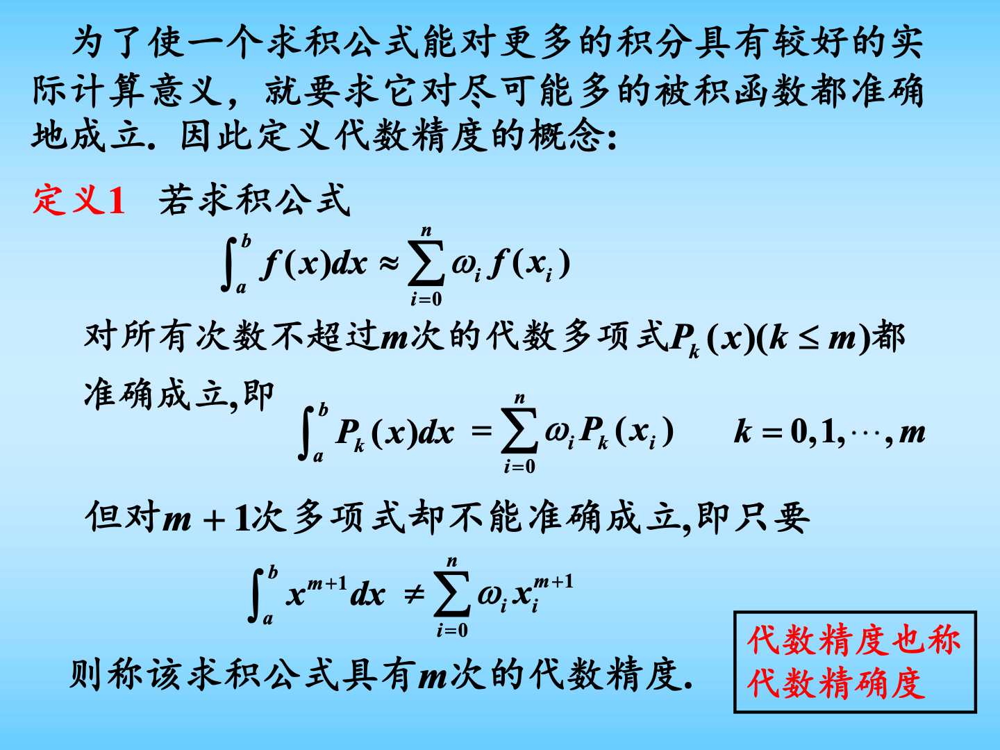

图示说明：代数精度是衡量求积公式好坏的重要概念。如果公式对所有不超过 $m$ 次的多项式都精确成立，但对 $m+1$ 次多项式不精确，则称公式具有 $m$ 次代数精度。

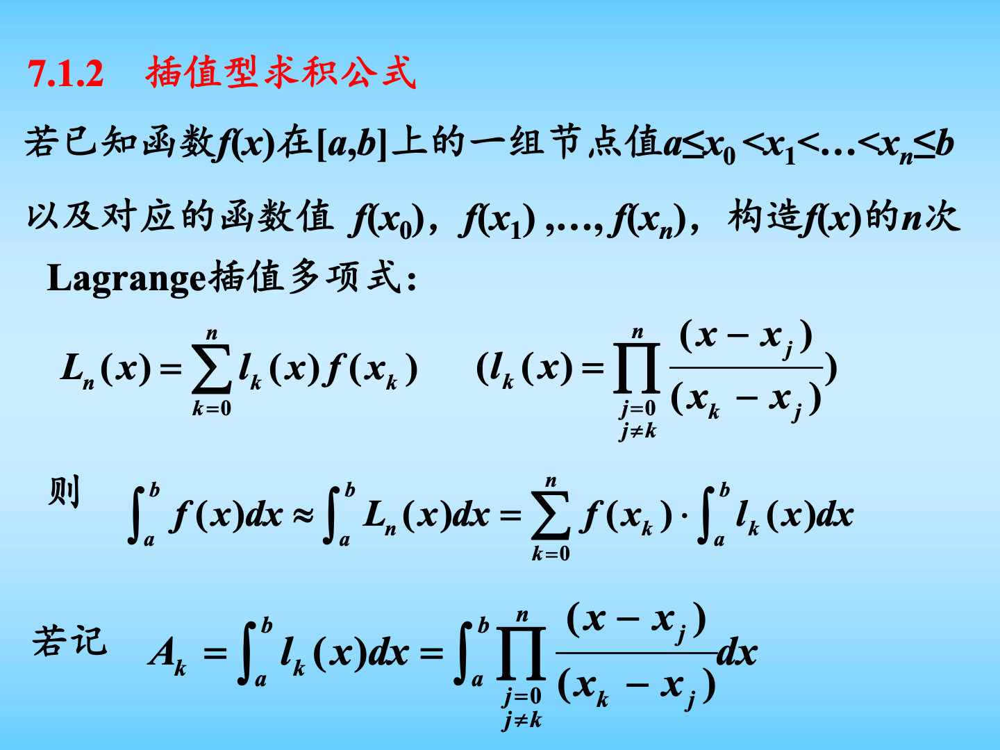

图示说明：插值型求积公式的思想是先用 Lagrange 插值多项式 $L_n(x)$ 代替 $f(x)$，再对 $L_n(x)$ 积分。Newton-Cotes 公式就是等距节点下的插值型求积公式。

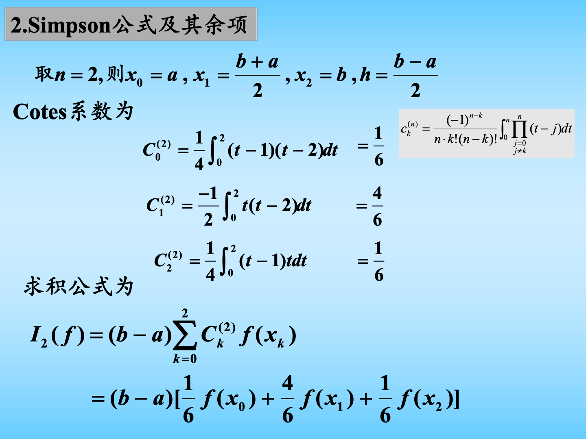

图示说明：Simpson 公式又叫三点公式或抛物线公式，使用端点和中点三个值。它的代数精度是 3，比梯形公式更高，是本章最重要公式之一。

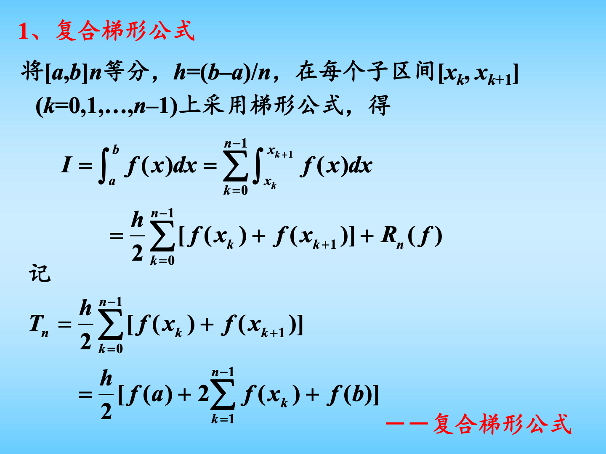

图示说明：把大区间分成很多小区间，每段用梯形公式，再把结果相加，就是复合梯形公式。它比单个大梯形稳定得多。

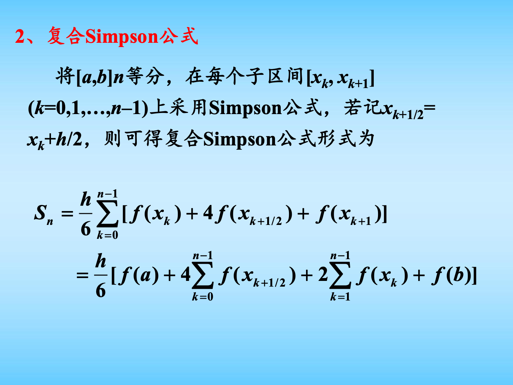

图示说明：复合 Simpson 公式在每个小区间上使用中点，因此会出现 $4f(x_{k+1/2})$ 这一项。记忆时抓住权重模式：端点 1，中点 4，内部整节点 2。

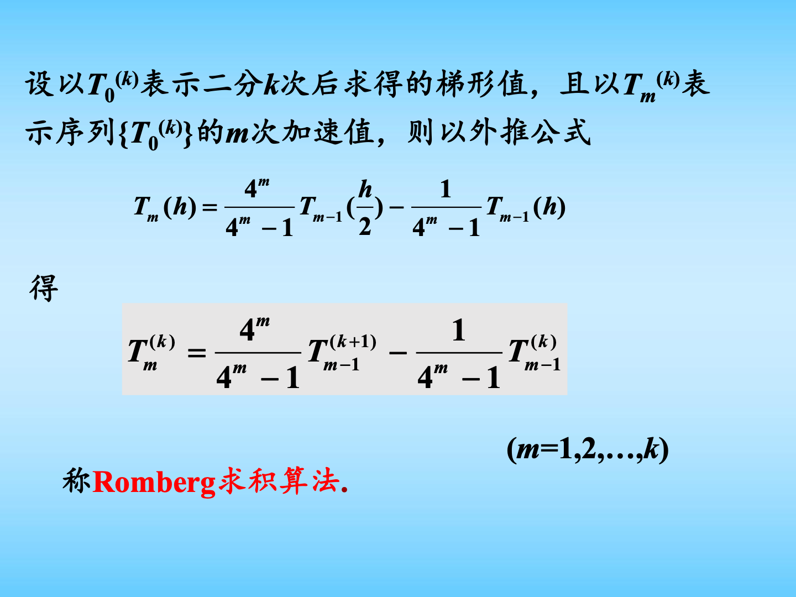

图示说明：Romberg 求积通过“步长减半 + Richardson 外推”提高精度。核心递推式是：
$$
T_m^{(k)}
=
\frac{4^m}{4^m-1}T_{m-1}^{(k+1)}
-
\frac{1}{4^m-1}T_{m-1}^{(k)}.
$$

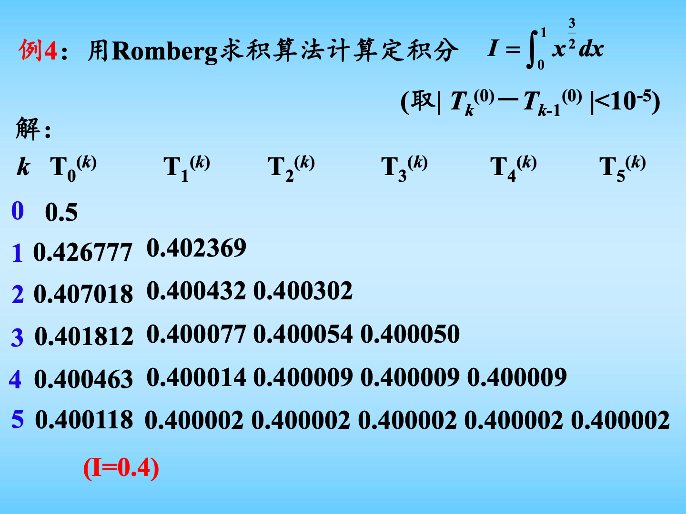

图示说明：Romberg 题通常让你填三角表。第一列是复合梯形值，后面每一列由前一列相邻两项外推得到。

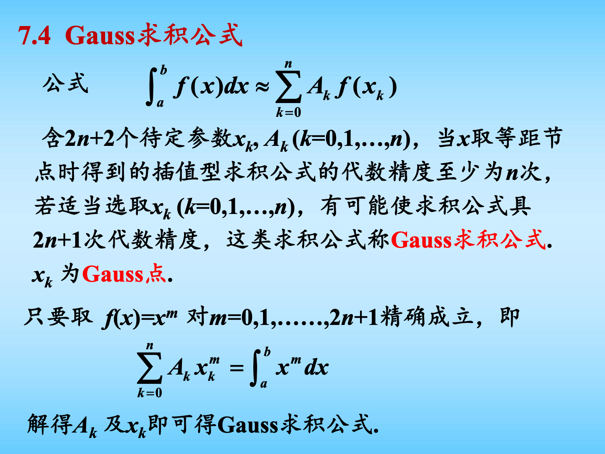

图示说明：Gauss 求积的特点是节点也可以选。选得好时，$n+1$ 个节点的公式可以达到 $2n+1$ 次代数精度。

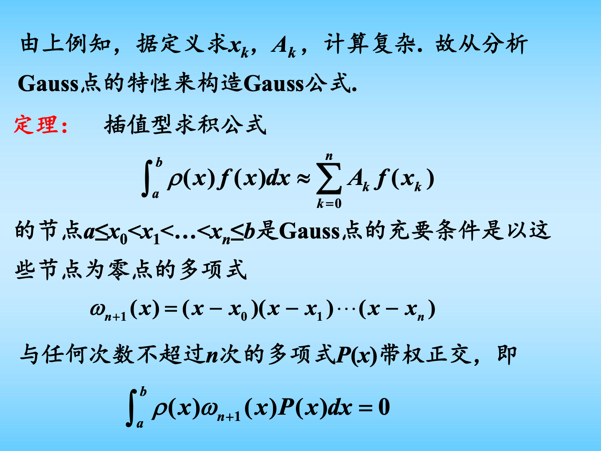

图示说明：在 $[-1,1]$ 上，Gauss-Legendre 节点是 Legendre 多项式的零点。两点公式和三点公式最常用。

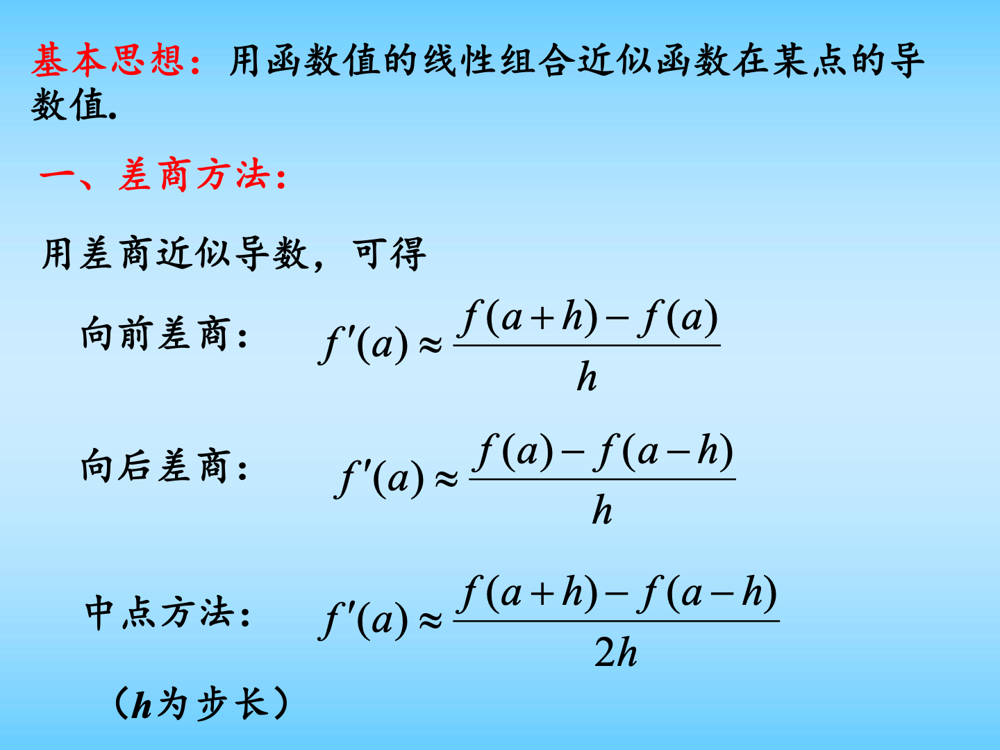

图示说明：数值微分的基本思想是用函数值的线性组合近似导数。向前差商、向后差商、一阶中心差商是最基础的公式。

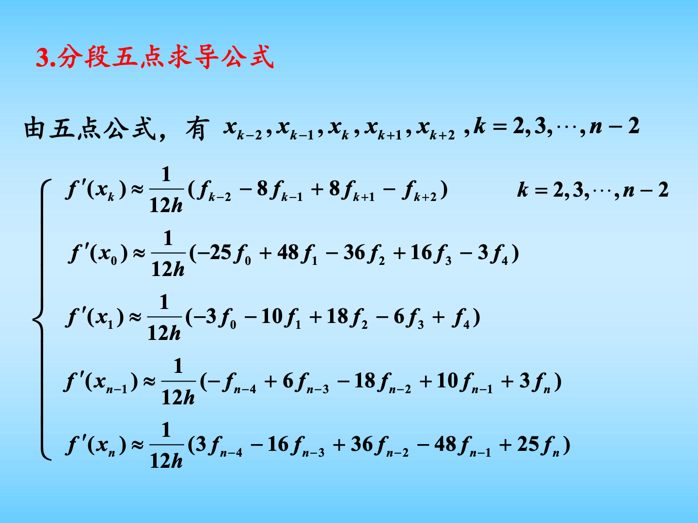

图示说明：五点公式精度更高，但公式更长。冲刺复习时至少要能识别中心五点公式和端点五点公式的使用场景。

## 0.5 两天冲刺复习路线

第一轮：先背最常用公式。

1. 梯形公式。
2. Simpson 公式。
3. 复合梯形公式。
4. 复合 Simpson 公式。
5. 两点、三点 Gauss-Legendre 公式。
6. 向前、向后、中心差商公式。

第二轮：再会判断精度和误差。

1. 梯形公式代数精度 1。
2. Simpson 公式代数精度 3。
3. Cotes 五点公式代数精度 5。
4. $n$ 为偶数时，Newton-Cotes 公式至少有 $n+1$ 次代数精度。
5. 中心差商通常比单边差商精度高。

第三轮：练计算题。

1. 给函数值表，用复合梯形公式算积分。
2. 给函数值表，用复合 Simpson 公式算积分。
3. 给一列梯形值，填 Romberg 表。
4. 给区间 $[a,b]$，先变换到 $[-1,1]$，再用 Gauss 公式。
5. 给等距节点函数值，用两点、三点或五点公式求导。

## 1. 为什么要数值积分

要求定积分：

$$
I(f)=\int_a^b f(x)\,dx.
$$

如果知道原函数 $F(x)$，可以用 Newton-Leibniz 公式：

$$
\int_a^b f(x)\,dx=F(b)-F(a).
$$

但实际中经常遇到：

- $f(x)$ 的解析式很复杂；
- $f(x)$ 的原函数求不出来；
- 只知道若干实验数据点；
- 需要在程序中快速近似计算。

所以要构造数值求积公式：

$$
\int_a^b f(x)\,dx
\approx
\sum_{i=0}^n \omega_i f(x_i).
$$

其中：

- $x_i$ 是求积节点；
- $\omega_i$ 是求积系数或权重；
- $\sum \omega_i f(x_i)$ 是积分的近似值。

## 2. 代数精度

### 2.1 定义

如果某个求积公式

$$
\int_a^b f(x)\,dx
\approx
\sum_{i=0}^n \omega_i f(x_i)
$$

对所有次数不超过 $m$ 的多项式都精确成立，即：

$$
\int_a^b P_k(x)\,dx
=
\sum_{i=0}^n \omega_iP_k(x_i),
\qquad k=0,1,\dots,m,
$$

但对某个 $m+1$ 次多项式不精确，则称该求积公式具有 $m$ 次代数精度。

简单理解：

`代数精度越高，公式能精确积分的多项式次数越高。`

### 2.2 如何验证代数精度

考试中若让你验证某公式的代数精度，一般按下面做：

1. 令 $f(x)=1$，看是否精确。
2. 令 $f(x)=x$，看是否精确。
3. 令 $f(x)=x^2$，看是否精确。
4. 一直试到第一个不精确为止。

例如某公式对 $1,x,x^2,x^3$ 都精确，但对 $x^4$ 不精确，则它有 3 次代数精度。

## 3. 插值型求积公式

### 3.1 基本思想

设已知节点：

$$
a\le x_0<x_1<\cdots<x_n\le b.
$$

用这些节点构造 Lagrange 插值多项式：

$$
L_n(x)=\sum_{k=0}^n l_k(x)f(x_k),
$$

其中

$$
l_k(x)=
\prod_{\substack{j=0\\j\ne k}}^n
\frac{x-x_j}{x_k-x_j}.
$$

用 $L_n(x)$ 近似 $f(x)$，得到：

$$
\int_a^b f(x)\,dx
\approx
\int_a^b L_n(x)\,dx
=
\sum_{k=0}^n f(x_k)\int_a^b l_k(x)\,dx.
$$

记：

$$
A_k=\int_a^b l_k(x)\,dx,
$$

则：

$$
\int_a^b f(x)\,dx
\approx
\sum_{k=0}^n A_k f(x_k).
$$

这就是插值型求积公式。

### 3.2 Newton-Cotes 公式

如果节点等距：

$$
x_k=a+kh,\qquad h=\frac{b-a}{n},
$$

则由 Lagrange 插值得到的求积公式称为 Newton-Cotes 公式。

它的一般形式是：

$$
I_n(f)=(b-a)\sum_{k=0}^n C_k^{(n)}f(x_k).
$$

其中 $C_k^{(n)}$ 是 Cotes 系数。

考试通常不要求你从头推导所有 Cotes 系数，但必须会用常见公式。

## 4. 常见 Newton-Cotes 公式

### 4.1 梯形公式

取两个节点：

$$
x_0=a,\qquad x_1=b.
$$

梯形公式为：

$$
T=\frac{b-a}{2}[f(a)+f(b)].
$$

余项：

$$
R(T)=I-T
=-\frac{(b-a)^3}{12}f''(\eta),
\qquad \eta\in(a,b).
$$

误差估计：

$$
|R(T)|\le \frac{(b-a)^3}{12}M_2,
\qquad
M_2=\max_{a\le x\le b}|f''(x)|.
$$

代数精度：1。

### 4.2 Simpson 公式

取三个节点：

$$
x_0=a,\qquad x_1=\frac{a+b}{2},\qquad x_2=b.
$$

Simpson 公式为：

$$
S=\frac{b-a}{6}
\left[
f(a)+4f\left(\frac{a+b}{2}\right)+f(b)
\right].
$$

它也叫三点公式或抛物线公式。

余项：

$$
R(S)=I-S
=
-\frac{b-a}{180}\left(\frac{b-a}{2}\right)^4 f^{(4)}(\eta).
$$

代数精度：3。

记忆方法：

`Simpson = 端点 1，中点 4，再除以 6。`

### 4.3 Cotes 五点公式

取五个等距节点：

$$
x_0=a,\quad x_1=a+h,\quad x_2=a+2h,\quad x_3=a+3h,\quad x_4=b,
$$

其中

$$
h=\frac{b-a}{4}.
$$

Cotes 五点公式为：

$$
C=\frac{b-a}{90}
\left[
7f(x_0)+32f(x_1)+12f(x_2)+32f(x_3)+7f(x_4)
\right].
$$

余项：

$$
R(C)
=-\frac{2(b-a)}{945}
\left(\frac{b-a}{4}\right)^6
f^{(6)}(\eta).
$$

代数精度：5。

记忆权重：

$$
7,\ 32,\ 12,\ 32,\ 7.
$$

## 5. 复合求积公式

### 5.1 为什么要复合

如果区间 $[a,b]$ 很长，直接用一个 Newton-Cotes 公式误差可能很大。

复合方法的思想：

1. 把 $[a,b]$ 分成很多小区间；
2. 每个小区间上用低阶求积公式；
3. 把各小区间结果相加。

这样通常比在大区间上用高阶公式更稳定。

### 5.2 复合梯形公式

将 $[a,b]$ 等分为 $n$ 份：

$$
h=\frac{b-a}{n},\qquad x_k=a+kh.
$$

复合梯形公式：

$$
T_n=
\frac{h}{2}
\left[
f(a)+2\sum_{k=1}^{n-1}f(x_k)+f(b)
\right].
$$

余项：

$$
I-T_n
=
-\frac{b-a}{12}h^2f''(\eta).
$$

误差阶：

$$
O(h^2).
$$

### 5.3 复合 Simpson 公式

将 $[a,b]$ 分成 $n$ 个小区间，每个小区间取中点：

$$
x_{k+1/2}=x_k+\frac h2.
$$

复合 Simpson 公式：

$$
S_n=
\frac{h}{6}
\sum_{k=0}^{n-1}
\left[
f(x_k)+4f(x_{k+1/2})+f(x_{k+1})
\right].
$$

也可写成：

$$
S_n=
\frac{h}{6}
\left[
f(a)
+4\sum_{k=0}^{n-1}f(x_{k+1/2})
+2\sum_{k=1}^{n-1}f(x_k)
+f(b)
\right].
$$

余项近似阶：

$$
O(h^4).
$$

记忆权重：

- 端点：1；
- 小区间中点：4；
- 内部整节点：2；
- 总系数：$h/6$。

## 6. Romberg 求积算法

### 6.1 Romberg 的思想

Romberg 求积建立在复合梯形公式上。

复合梯形公式的误差可以看成：

$$
T(h)=I+c_1h^2+c_2h^4+c_3h^6+\cdots.
$$

如果把步长减半：

$$
T\left(\frac h2\right)
=I+c_1\frac{h^2}{4}+c_2\frac{h^4}{16}+\cdots.
$$

把两个式子组合，可以消去 $h^2$ 误差项，从而得到更高精度。

### 6.2 外推公式

课件使用的 Romberg 递推式为：

$$
T_m^{(k)}
=
\frac{4^m}{4^m-1}T_{m-1}^{(k+1)}
-
\frac{1}{4^m-1}T_{m-1}^{(k)},
\qquad m=1,2,\dots,k.
$$

第一列：

$$
T_0^{(k)}
$$

表示二分 $k$ 次后得到的复合梯形值。

常见前几列：

$$
T_1^{(k)}=\frac{4T_0^{(k+1)}-T_0^{(k)}}{3},
$$

$$
T_2^{(k)}=\frac{16T_1^{(k+1)}-T_1^{(k)}}{15},
$$

$$
T_3^{(k)}=\frac{64T_2^{(k+1)}-T_2^{(k)}}{63}.
$$

### 6.3 Romberg 做题步骤

1. 先算 $T_0^{(0)}$，即整个区间一个梯形。
2. 步长减半，算 $T_0^{(1)},T_0^{(2)},\dots$。
3. 用外推公式填第二列、第三列、第四列。
4. 若题目给停止条件，例如：

$$
|T_k^{(0)}-T_{k-1}^{(0)}|<\varepsilon,
$$

达到条件就停止。

考试中最容易给你一个表格，让你补空。记住：Romberg 表是三角形，右边的数由左下和左上的数外推得到。

## 7. Gauss 求积公式

### 7.1 Gauss 求积为什么更强

普通 Newton-Cotes 公式的节点通常固定为等距点。

Gauss 求积的关键是：

`节点 x_k 和权重 A_k 都可以选择。`

公式形式：

$$
\int_a^b f(x)\,dx
\approx
\sum_{k=0}^n A_k f(x_k).
$$

一共有 $2n+2$ 个待定参数：

$$
x_0,\dots,x_n,\qquad A_0,\dots,A_n.
$$

如果选得好，可以让公式具有：

$$
2n+1
$$

次代数精度。

这就是 Gauss 求积比同节点数 Newton-Cotes 公式更高效的原因。

### 7.2 Gauss 点的充要条件

带权求积公式：

$$
\int_a^b \rho(x)f(x)\,dx
\approx
\sum_{k=0}^n A_k f(x_k).
$$

节点 $x_0,\dots,x_n$ 是 Gauss 点的充要条件是：

$$
\omega_{n+1}(x)
=(x-x_0)(x-x_1)\cdots(x-x_n)
$$

与任何次数不超过 $n$ 的多项式 $P(x)$ 带权正交，即：

$$
\int_a^b \rho(x)\omega_{n+1}(x)P(x)\,dx=0.
$$

所以在 $[-1,1]$、$\rho(x)=1$ 时，Gauss-Legendre 节点就是 Legendre 多项式的零点。

### 7.3 两点 Gauss-Legendre 公式

在 $[-1,1]$ 上：

$$
\int_{-1}^{1}f(x)\,dx
\approx
f\left(-\frac1{\sqrt3}\right)
+
f\left(\frac1{\sqrt3}\right).
$$

节点：

$$
x_0=-\frac1{\sqrt3},\qquad x_1=\frac1{\sqrt3}.
$$

权重：

$$
A_0=A_1=1.
$$

代数精度：3。

### 7.4 三点 Gauss-Legendre 公式

在 $[-1,1]$ 上：

$$
\int_{-1}^{1}f(x)\,dx
\approx
\frac59 f\left(-\frac{\sqrt{15}}5\right)
+\frac89 f(0)
+\frac59 f\left(\frac{\sqrt{15}}5\right).
$$

代数精度：5。

### 7.5 区间变换

如果积分区间不是 $[-1,1]$，先作变换：

$$
x=\frac{b-a}{2}t+\frac{a+b}{2}.
$$

则：

$$
\int_a^b f(x)\,dx
=
\frac{b-a}{2}
\int_{-1}^{1}
f\left(\frac{b-a}{2}t+\frac{a+b}{2}\right)\,dt.
$$

两点 Gauss 公式变成：

$$
\int_a^b f(x)\,dx
\approx
\frac{b-a}{2}
\left[
f\left(\frac{a+b}{2}-\frac{b-a}{2\sqrt3}\right)
+
f\left(\frac{a+b}{2}+\frac{b-a}{2\sqrt3}\right)
\right].
$$

考试提醒：Gauss 公式最常见错误就是忘记乘外面的 $\frac{b-a}{2}$。

## 8. 数值微分

### 8.1 基本思想

数值微分的目标是用函数值近似导数值。

如果只知道节点函数值：

$$
f(x_k)=f_k,\qquad k=0,1,\dots,n,
$$

可以先构造插值多项式 $L_n(x)$，再用：

$$
f'(x)\approx L_n'(x).
$$

这就是插值型求导公式。

## 9. 常见差商求导公式

### 9.1 向前差商

$$
f'(a)\approx \frac{f(a+h)-f(a)}{h}.
$$

误差阶：

$$
O(h).
$$

适用：左端点附近，因为只有右边的数据。

### 9.2 向后差商

$$
f'(a)\approx \frac{f(a)-f(a-h)}{h}.
$$

误差阶：

$$
O(h).
$$

适用：右端点附近，因为只有左边的数据。

### 9.3 中心差商

$$
f'(a)\approx \frac{f(a+h)-f(a-h)}{2h}.
$$

误差阶：

$$
O(h^2).
$$

中心差商比向前、向后差商更准，因为它利用了左右两边的信息，抵消了一部分误差。

## 10. 分段低阶求导公式

### 10.1 分段两点公式

相邻两点：

$$
x_k,\quad x_{k+1},
\qquad h=x_{k+1}-x_k.
$$

两点求导公式：

$$
f'(x_k)\approx \frac{f_{k+1}-f_k}{h},
$$

$$
f'(x_{k+1})\approx \frac{f_{k+1}-f_k}{h}.
$$

这是最粗略的分段线性求导。

### 10.2 三点公式

对等距节点 $x_0,x_1,x_2$，步长为 $h$：

$$
f'(x_0)\approx \frac{-3f_0+4f_1-f_2}{2h},
$$

$$
f'(x_1)\approx \frac{f_2-f_0}{2h},
$$

$$
f'(x_2)\approx \frac{f_0-4f_1+3f_2}{2h}.
$$

其中中间点公式就是中心差商。

考试中如果要求端点导数，用第一式或第三式；如果要求中点导数，用第二式。

### 10.3 五点公式

对等距节点 $x_0,x_1,x_2,x_3,x_4$，步长为 $h$，课件给出：

$$
f'(x_0)\approx
\frac{-25f_0+48f_1-36f_2+16f_3-3f_4}{12h},
$$

$$
f'(x_1)\approx
\frac{-3f_0-10f_1+18f_2-6f_3+f_4}{12h},
$$

$$
f'(x_2)\approx
\frac{f_0-8f_1+8f_3-f_4}{12h},
$$

$$
f'(x_3)\approx
\frac{-f_0+6f_1-18f_2+10f_3+3f_4}{12h},
$$

$$
f'(x_4)\approx
\frac{3f_0-16f_1+36f_2-48f_3+25f_4}{12h}.
$$

最常用的是中心五点公式：

$$
f'(x_2)\approx
\frac{f_0-8f_1+8f_3-f_4}{12h}.
$$

它的误差阶是 $O(h^4)$，比三点公式更高。

## 11. 外推法求导

中心差商：

$$
G(h)=\frac{f(x+h)-f(x-h)}{2h}
$$

通常有展开：

$$
G(h)=f'(x)+\alpha_1h^2+\alpha_2h^4+\cdots.
$$

把步长减半：

$$
G\left(\frac h2\right)
=f'(x)+\alpha_1\frac{h^2}{4}+\alpha_2\frac{h^4}{16}+\cdots.
$$

消去 $h^2$ 项，得到：

$$
G_1(h)=
\frac{4G(h/2)-G(h)}{3}.
$$

更一般地：

$$
G_m(h)=
\frac{4^mG_{m-1}(h/2)-G_{m-1}(h)}{4^m-1}.
$$

这和 Romberg 求积的递推形式非常像。

## 12. 本章做题模板

### 12.1 复合梯形公式做题模板

给定 $[a,b]$ 和 $n$：

1. 算步长：

$$
h=\frac{b-a}{n}.
$$

2. 列节点：

$$
x_k=a+kh.
$$

3. 代入：

$$
T_n=
\frac{h}{2}
\left[
f(a)+2\sum_{k=1}^{n-1}f(x_k)+f(b)
\right].
$$

### 12.2 复合 Simpson 公式做题模板

1. 先确定 $h=(b-a)/n$。
2. 列整节点 $x_k$。
3. 列每段中点 $x_{k+1/2}$。
4. 代入：

$$
S_n=
\frac{h}{6}
\left[
f(a)
+4\sum_{k=0}^{n-1}f(x_{k+1/2})
+2\sum_{k=1}^{n-1}f(x_k)
+f(b)
\right].
$$

### 12.3 Romberg 表模板

第一列：

$$
T_0^{(0)},\ T_0^{(1)},\ T_0^{(2)},\dots
$$

后续列：

$$
T_m^{(k)}
=
\frac{4^mT_{m-1}^{(k+1)}-T_{m-1}^{(k)}}{4^m-1}.
$$

填表时：

- $m=1$ 用分母 3；
- $m=2$ 用分母 15；
- $m=3$ 用分母 63；
- $m=4$ 用分母 255。

### 12.4 Gauss-Legendre 模板

若区间是 $[-1,1]$，直接套公式。

若区间是 $[a,b]$，先变换：

$$
x=\frac{b-a}{2}t+\frac{a+b}{2}.
$$

然后：

$$
\int_a^b f(x)\,dx
=
\frac{b-a}{2}\int_{-1}^{1}
f\left(\frac{b-a}{2}t+\frac{a+b}{2}\right)\,dt.
$$

最后把 $t$ 的 Gauss 节点代进去。

### 12.5 数值微分模板

1. 如果求左端点，用向前差商或三点端点公式。
2. 如果求右端点，用向后差商或三点端点公式。
3. 如果求内部点，优先用中心差商。
4. 如果题目给 5 个等距点并要求高精度，用五点公式。

## 13. 高频易错点

### 13.1 Simpson 公式权重写错

Simpson 公式是：

$$
\frac{b-a}{6}[1,\ 4,\ 1].
$$

不是：

$$
\frac{b-a}{3}[1,\ 4,\ 1].
$$

如果写成步长 $h=(b-a)/2$，则：

$$
S=\frac h3[f(a)+4f(a+h)+f(b)].
$$

两种写法等价。

### 13.2 复合 Simpson 的 h 容易混

本课件把每个小区间 $[x_k,x_{k+1}]$ 再取中点，所以：

$$
S_n=\frac h6\sum [f(x_k)+4f(x_{k+1/2})+f(x_{k+1})].
$$

有些教材把大区间分成偶数份，写成 $h/3$ 的形式。考试时按课件符号来写最稳。

### 13.3 Gauss 公式忘记区间变换

Gauss-Legendre 标准公式在 $[-1,1]$ 上。

如果题目给 $[a,b]$，必须先变换，并乘：

$$
\frac{b-a}{2}.
$$

### 13.4 Romberg 外推分母写错

分母是：

$$
4^m-1.
$$

不是 $2^m-1$。

因为梯形公式误差主项是 $h^2$，步长减半后误差变为原来的 $1/4$。

### 13.5 数值微分对误差很敏感

微分会放大数据误差。步长太大，截断误差大；步长太小，舍入误差可能变大。

所以数值微分通常比数值积分更不稳定。

## 14. 必须掌握的公式

### 14.1 梯形公式

$$
T=\frac{b-a}{2}[f(a)+f(b)].
$$

$$
R(T)=-\frac{(b-a)^3}{12}f''(\eta).
$$

### 14.2 Simpson 公式

$$
S=\frac{b-a}{6}
\left[
f(a)+4f\left(\frac{a+b}{2}\right)+f(b)
\right].
$$

$$
R(S)=
-\frac{b-a}{180}\left(\frac{b-a}{2}\right)^4f^{(4)}(\eta).
$$

### 14.3 Cotes 五点公式

$$
C=\frac{b-a}{90}
[7f(x_0)+32f(x_1)+12f(x_2)+32f(x_3)+7f(x_4)].
$$

### 14.4 复合梯形公式

$$
T_n=
\frac{h}{2}
\left[
f(a)+2\sum_{k=1}^{n-1}f(x_k)+f(b)
\right].
$$

### 14.5 复合 Simpson 公式

$$
S_n=
\frac{h}{6}
\left[
f(a)
+4\sum_{k=0}^{n-1}f(x_{k+1/2})
+2\sum_{k=1}^{n-1}f(x_k)
+f(b)
\right].
$$

### 14.6 Romberg 公式

$$
T_m^{(k)}
=
\frac{4^mT_{m-1}^{(k+1)}-T_{m-1}^{(k)}}{4^m-1}.
$$

### 14.7 两点 Gauss-Legendre

$$
\int_{-1}^{1}f(x)\,dx
\approx
f\left(-\frac1{\sqrt3}\right)
+
f\left(\frac1{\sqrt3}\right).
$$

### 14.8 三点 Gauss-Legendre

$$
\int_{-1}^{1}f(x)\,dx
\approx
\frac59 f\left(-\frac{\sqrt{15}}5\right)
+\frac89 f(0)
+\frac59 f\left(\frac{\sqrt{15}}5\right).
$$

### 14.9 差商求导

向前：

$$
f'(a)\approx \frac{f(a+h)-f(a)}{h}.
$$

向后：

$$
f'(a)\approx \frac{f(a)-f(a-h)}{h}.
$$

中心：

$$
f'(a)\approx \frac{f(a+h)-f(a-h)}{2h}.
$$

### 14.10 三点求导

$$
f'(x_0)\approx \frac{-3f_0+4f_1-f_2}{2h},
$$

$$
f'(x_1)\approx \frac{f_2-f_0}{2h},
$$

$$
f'(x_2)\approx \frac{f_0-4f_1+3f_2}{2h}.
$$

### 14.11 五点中心求导

$$
f'(x_2)\approx
\frac{f_0-8f_1+8f_3-f_4}{12h}.
$$

## 15. 考试题型速查

### 题型 1：判断求积公式代数精度

做法：依次代 $1,x,x^2,x^3,\dots$，直到第一个不精确。

### 题型 2：用复合梯形或复合 Simpson 算积分

先列节点，再套公式。注意复合 Simpson 要有中点值。

### 题型 3：填 Romberg 表

第一列是复合梯形值，后面用：

$$
T_m^{(k)}
=
\frac{4^mT_{m-1}^{(k+1)}-T_{m-1}^{(k)}}{4^m-1}.
$$

### 题型 4：用 Gauss 公式算积分

如果不是 $[-1,1]$，先做区间变换：

$$
x=\frac{b-a}{2}t+\frac{a+b}{2}.
$$

### 题型 5：用差分公式求导数

看求导点位置：

- 左端点：向前或三点端点公式；
- 右端点：向后或三点端点公式；
- 中间点：中心差商或五点中心公式。

## 16. 最后冲刺建议

本章复习优先级：

第一优先级：公式会套。

梯形、Simpson、复合梯形、复合 Simpson、Romberg、两点 Gauss、中心差商，这些必须能立刻写出来。

第二优先级：会看题目选方法。

表格数据多，优先复合公式；精度要求高，可能用 Romberg；节点可选，考虑 Gauss；求导时看端点还是中点。

第三优先级：记住精度结论。

- 梯形公式：1 次代数精度；
- Simpson 公式：3 次代数精度；
- Cotes 五点公式：5 次代数精度；
- $n+1$ 个 Gauss 点：最高 $2n+1$ 次代数精度；
- 中心差商：通常 $O(h^2)$；
- 五点中心公式：通常 $O(h^4)$。

本章一句话总结：

`数值积分是用函数值加权求面积，数值微分是用函数值差分求斜率；核心都是用插值和外推提高精度。`
