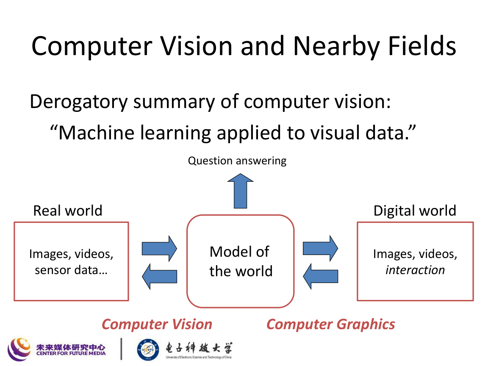
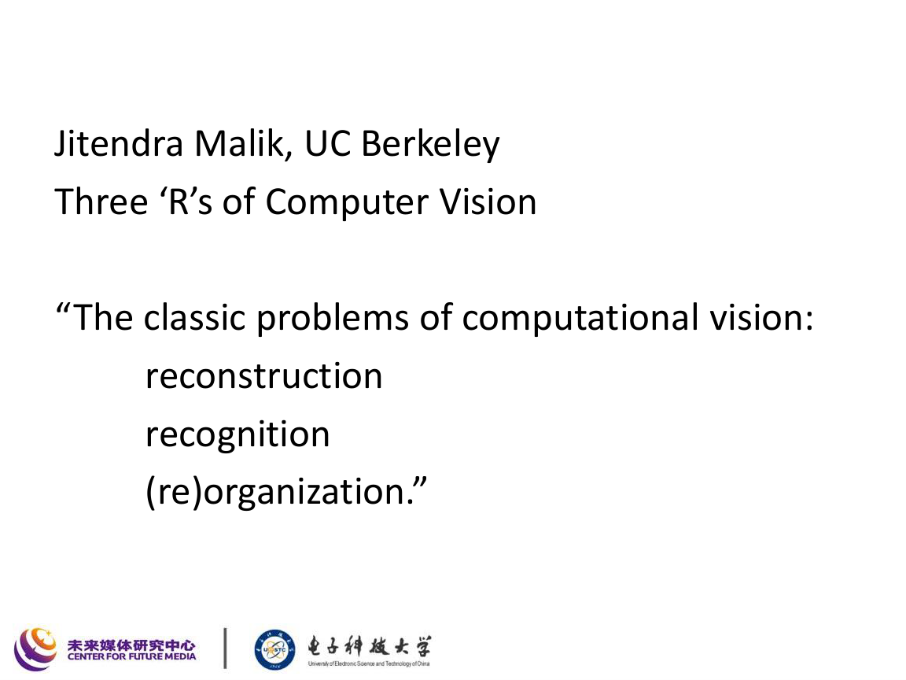
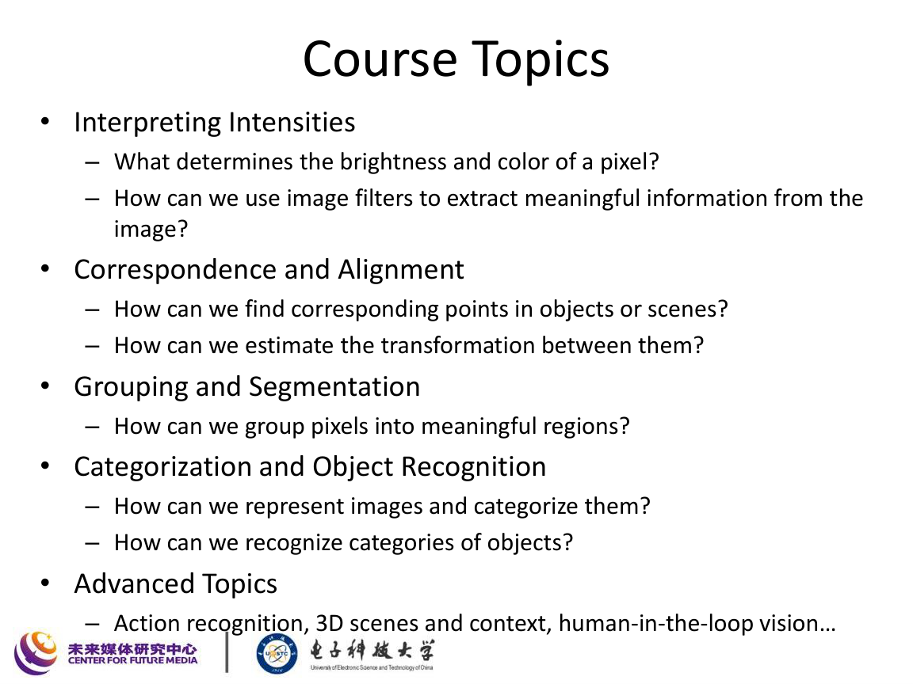
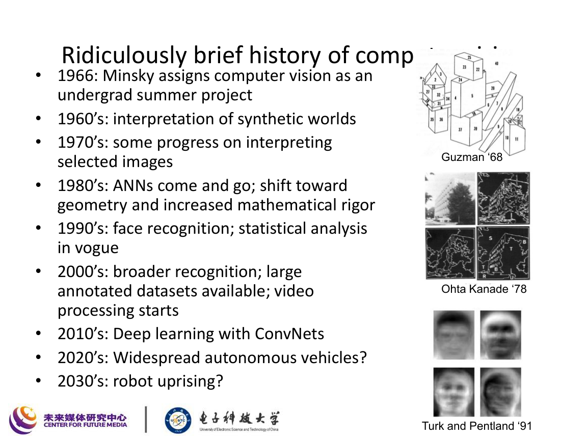
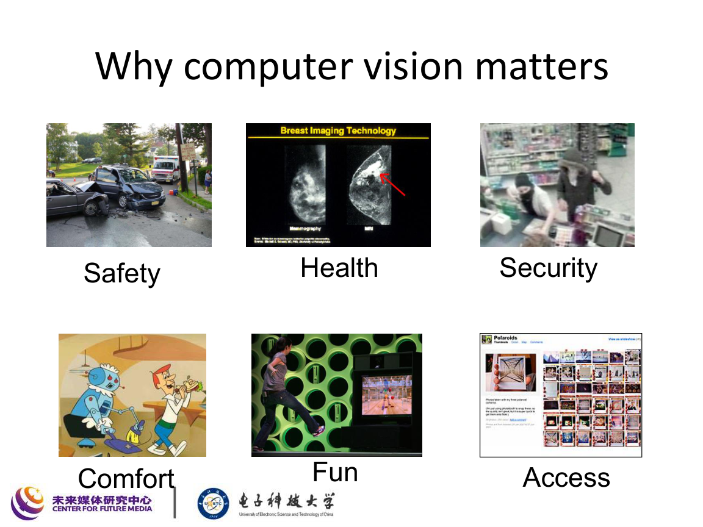
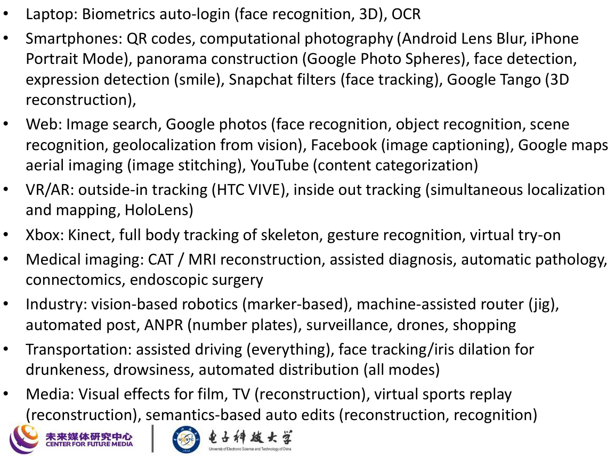

# 课程导论

对应课件：`master-L1_Introduction-Bachelor.pdf`

## 本讲主线

这一讲主要回答 4 个问题：

1. 计算机视觉是什么。
2. 它与图形学、图像处理、机器学习、几何推理之间是什么关系。
3. 它在现实世界中解决哪些问题。
4. 这门课后续会沿着哪些技术主线展开。

## 1. 什么是计算机视觉

课件的核心表述可以概括为：

> 让计算机理解图像、视频以及其他视觉数据。

如果写成更抽象的形式，就是从视觉观测数据出发，估计关于场景、目标、结构、语义和动作的信息：

$$
\text{Visual Data} \longrightarrow \text{Structure / Semantics / Action / Decision}
$$

典型输入包括：

- 图像
- 视频
- 多视角图像
- 深度图、点云、红外等视觉传感数据

典型输出包括：

- 识别结果
- 目标位置
- 场景几何结构
- 相机位姿
- 语义分割结果
- 后续控制或决策信号

## 2. 计算机视觉与周边领域的关系

课件强调了计算机视觉不是孤立学科，而是处在多个方向的交叉点。

### 2.1 与图像处理的关系

- 图像处理更偏向“改图像”，例如增强、去噪、压缩、滤波。
- 计算机视觉更偏向“懂图像”，例如检测、识别、三维重建、场景理解。

可以把两者理解为：

$$
\text{Image Processing}: I \mapsto I'
$$

$$
\text{Computer Vision}: I \mapsto y
$$

其中：

- $I$ 是输入图像；
- $I'$ 是处理后的图像；
- $y$ 是语义、几何或决策结果。

### 2.2 与计算机图形学的关系

图形学和视觉经常被称为“逆问题”和“正问题”的对应：

- 图形学：从场景模型生成图像；
- 计算机视觉：从图像反推出场景模型。

可以写成

$$
\text{Graphics}: \text{World Model} \to \text{Image}
$$

$$
\text{Vision}: \text{Image} \to \text{World Model}
$$

### 2.3 与机器学习、深度学习的关系

课件明确提到深度学习已经深刻改变计算机视觉：

- 传统视觉强调手工特征、几何模型和统计建模；
- 现代视觉大量采用深度网络进行端到端学习；
- 但深度学习不是全部，几何约束、物理成像和任务结构仍然重要。

### 2.4 与几何推理的关系

几何在视觉中非常关键，尤其体现在：

- 三维重建
- 相机位姿估计
- 多视图几何
- SLAM
- 机器人感知

## 3. 计算机视觉的经典任务

课件引用了 Jitendra Malik 的“三个 R”：

即：

- Reconstruction：重建
- Recognition：识别
- Reorganization：组织 / 分组 / 结构化理解

### 3.1 重建 Reconstruction

核心问题是从图像中恢复几何或物理结构，例如：

- 深度估计
- 三维重建
- 法向估计
- 场景布局恢复

### 3.2 识别 Recognition

核心问题是回答“图像里有什么”：

- 图像分类
- 目标检测
- 实例识别
- 人脸识别
- 行为识别

### 3.3 组织 Reorganization

核心问题是回答“哪些像素属于一组，哪些结构是连贯的”：

- 分割
- 边界检测
- 关键点匹配
- 图像区域组织

## 4. 本课程主线

课件把后续内容组织为几条连续的技术路线：

### 4.1 亮度与颜色解释

关键问题：

- 一个像素为什么亮或暗；
- 一个像素为什么是这个颜色；
- 怎样用滤波器从图像中提取有用信息。

这一部分对应后续的：

- 光与颜色
- 图像滤波
- 频域分析

### 4.2 对应与对齐

关键问题：

- 如何找到不同图像中的对应点；
- 如何估计它们之间的变换关系。

这是图像配准、拼接、运动估计和三维视觉的基础。

### 4.3 分组与分割

关键问题：

- 如何把像素组织成区域；
- 如何提取边界和有意义的部分。

### 4.4 类别化与目标识别

关键问题：

- 如何表示图像；
- 如何把图像映射到类别；
- 如何识别对象、场景和行为。

## 5. 计算机视觉的发展简史

课件给出了一条很清晰的时间线：

可以整理成下面的复习框架。

### 5.1 1960s-1970s

- 早期工作偏向人工构造的简单世界；
- 研究目标是“让机器看懂图像”；
- 当时对问题难度估计严重偏低。

### 5.2 1980s

- 神经网络曾短暂兴起又回落；
- 视觉研究开始更重视几何和数学严谨性。

### 5.3 1990s

- 统计学习方法逐渐占主流；
- 人脸识别等任务开始得到更多关注。

### 5.4 2000s

- 数据集扩大；
- 识别任务更丰富；
- 视频理解开始增加。

### 5.5 2010s 以后

- 卷积神经网络推动视觉性能跃升；
- 视觉领域大量任务被“deepified”；
- 自动驾驶、机器人、AR/VR、多模态理解成为热点。

## 6. 为什么计算机视觉重要

课件给出的关键词包括：

- Safety：安全
- Health：健康
- Security：安防
- Comfort：舒适
- Access：无障碍和便利
- Fun：娱乐

这说明视觉不仅是算法竞赛题，而是与社会基础设施、工业自动化、医疗、交通和人机交互直接相关。

## 7. 现实应用场景

课件列举了大量具体应用：

可以按场景分类记忆。

### 7.1 消费电子

- 手机人脸检测
- 自拍美颜与人脸跟踪
- 全景拼接
- 计算摄影
- 自动登录和生物识别

### 7.2 Web 与互联网平台

- 图像搜索
- 图片自动分类
- 图像描述
- 场景识别
- 地理定位

### 7.3 AR / VR / 机器人

- 视觉 SLAM
- 位姿跟踪
- 具身智能感知
- 视觉引导抓取和导航

### 7.4 医疗与工业

- 医学影像辅助诊断
- 缺陷检测
- 视觉引导装配
- 自动化物流

### 7.5 自动驾驶与交通

- 车道线检测
- 障碍物检测
- 行人和车辆识别
- 驾驶员状态监控

## 8. 视觉问题到底难在哪里

虽然“输入是图像，输出是语义”听起来直接，但本质上这是一个高维、病态、信息不完备的问题。

### 8.1 图像是投影结果

同一幅图像往往可能由很多不同场景生成，记成：

$$
I = \Pi(\mathcal{S}, \mathcal{L}, \mathcal{C})
$$

其中：

- $\mathcal{S}$ 表示场景结构；
- $\mathcal{L}$ 表示光照；
- $\mathcal{C}$ 表示相机成像过程；
- $\Pi$ 表示投影与成像过程。

从二维图像恢复三维世界是天然欠定的。

### 8.2 视觉数据变化极大

同一个目标在图像中会受到以下因素影响：

- 视角变化
- 尺度变化
- 光照变化
- 遮挡
- 背景干扰
- 形变

### 8.3 语义与像素之间并非线性关系

语义理解通常不是像素级线性变换能解决的，因此需要：

- 统计建模
- 特征学习
- 深层网络
- 任务结构约束

## 9. 现代视觉的基本范式

课件虽然是导论，但实际上已经隐含了现代视觉的主范式：

### 9.1 表征学习

从原始像素学习中间特征：

$$
x \mapsto \phi(x)
$$

其中 $\phi(x)$ 是更适合分类、匹配、检测或生成的表示。

### 9.2 判别与生成

视觉任务大致可分为两类：

- 判别式任务：预测标签、边界、框、深度等；
- 生成式任务：补全、重建、增强、生成。

### 9.3 多任务与多模态

视觉系统往往不仅要识别，还要：

- 定位
- 理解关系
- 融合语言
- 进行控制

## 10. 这讲应该记住什么

### 10.1 一句话总结

计算机视觉的核心是：从视觉数据中恢复有用的信息表示，使机器能够感知、理解并作用于真实世界。

### 10.2 必记概念

1. 计算机视觉与图形学、图像处理的区别。
2. 计算机视觉的三个 R：重建、识别、组织。
3. 课程后续五条主线：亮度颜色、对应对齐、分组分割、识别分类、进阶任务。
4. 深度学习在视觉中的巨大影响，但并没有替代几何与物理成像。
5. 视觉问题难在高维、投影损失、变化因素多、语义映射复杂。

### 10.3 复习建议

- 这讲不需要死记硬背大量公式；
- 重点是把后续课程的知识地图建立起来；
- 复习时尽量把“任务类型”和“应用场景”一一对应上。
