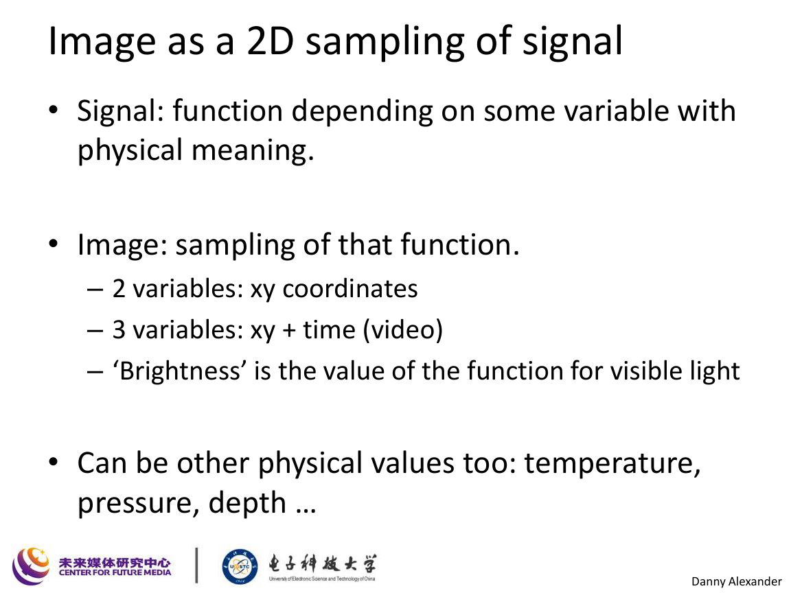
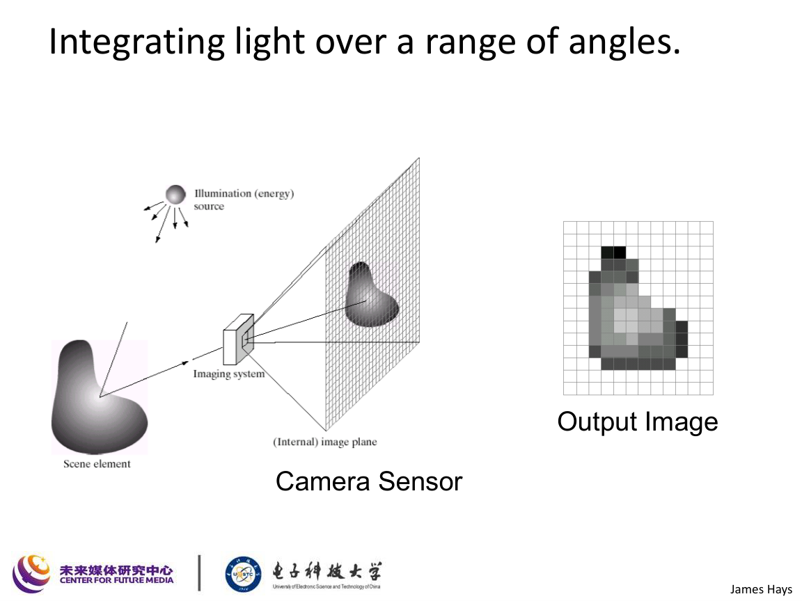
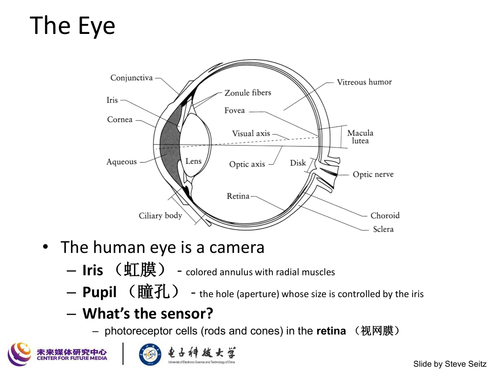
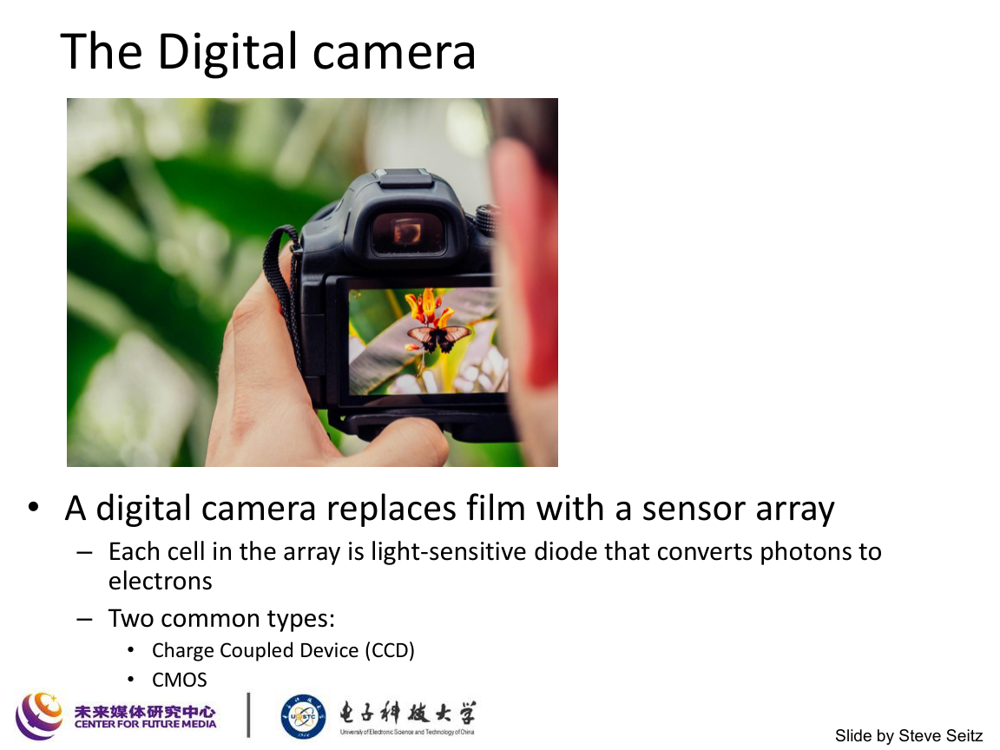
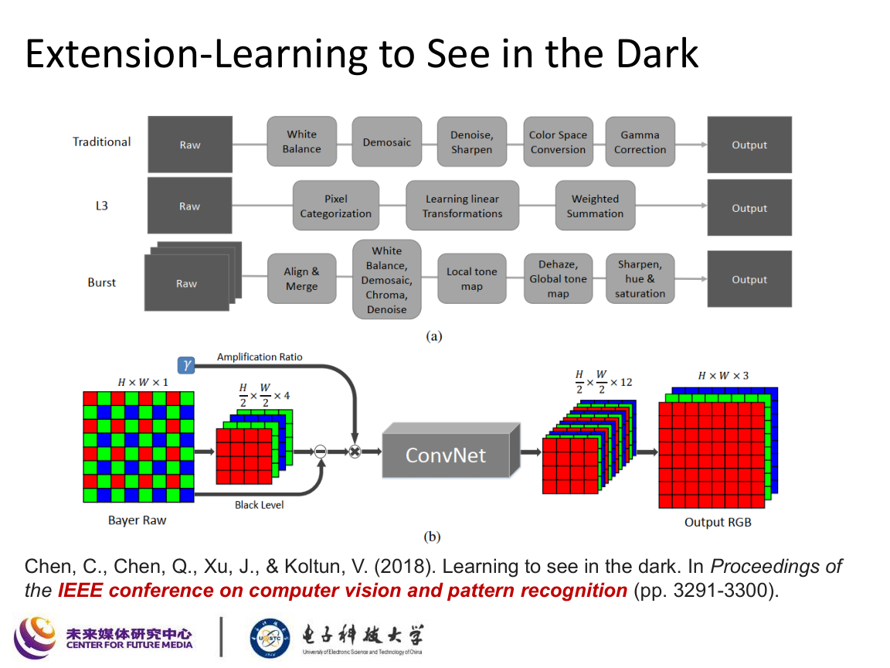
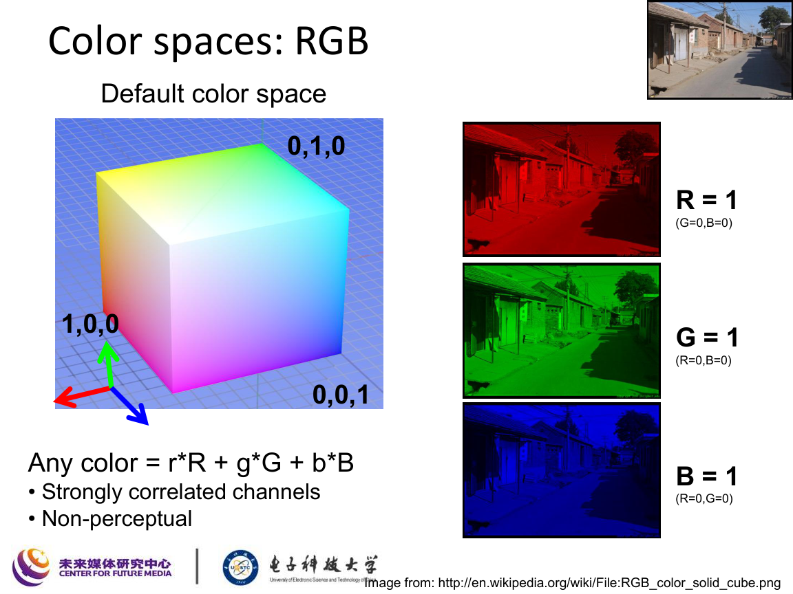
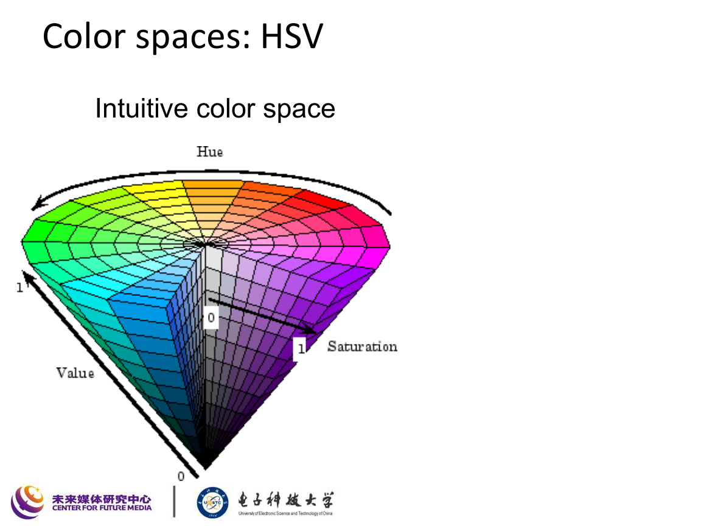
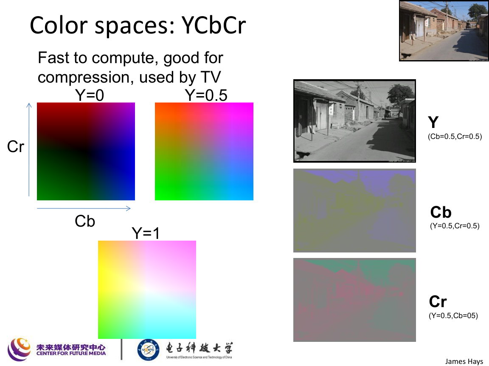

# 光与颜色

对应课件：`L2_LightAndColor.pdf`

## 本讲主线

这一讲围绕两个问题展开：

1. 图像到底是什么，像素值从哪里来；
2. 颜色是怎样被感知、表示和存储的。

课件还穿插了两个应用例子：

- 低照度成像
- 自动上色

## 1. 图像是什么

课件一开始就强调：图像不是“图片文件”，而是对某个连续信号的离散采样。

### 1.1 图像作为信号

灰度图像可以看成一个二维函数：

$$
I(x,y)
$$

其中：

- $x,y$ 表示空间位置；
- $I(x,y)$ 表示该位置的亮度或强度。

视频则可以进一步写成

$$
I(x,y,t),
$$

即把时间也加入变量中。

如果是彩色图像，像素值不再是一个标量，而是一个向量：

$$
I(x,y)=
\begin{bmatrix}
R(x,y)\\
G(x,y)\\
B(x,y)
\end{bmatrix}.
$$

### 1.2 像素的含义

一个像素是连续场景在离散网格上的一个采样值。它不对应一个“绝对点”，而是对应一个小区域在传感器上的积分响应。

从复习角度看，要区分两个层面：

- 连续世界中的真实光照分布；
- 数字图像中的离散采样矩阵。

### 1.3 图像的高维性

课件用随机矩阵举例，说明图像空间维数极高。

如果图像大小为 $M\times N$，灰度图可看成

$$
I\in \mathbb{R}^{M\times N},
$$

展开后相当于

$$
I\in \mathbb{R}^{MN}.
$$

若是 RGB 图像，则

$$
I\in \mathbb{R}^{M\times N\times 3}.
$$

因此视觉任务本质上是在极高维空间中寻找“自然图像”的结构。

## 2. 图像是如何形成的

### 2.1 传感器不是取点，而是做积分

课件强调相机传感器本质上是在一定角度、一定时间和一定波长范围内对光进行积分：

在标准记法下，一个颜色通道的响应可写成

$$
I_c(x,y)=\int_{\lambda} E(x,y,\lambda)\,S_c(\lambda)\,\mathrm{d}\lambda,
$$

其中：

- $E(x,y,\lambda)$ 表示到达像素位置 $(x,y)$ 的光谱能量；
- $S_c(\lambda)$ 表示传感器在通道 $c$ 上的光谱响应函数；
- $c\in\{R,G,B\}$。

这条公式非常重要，因为它说明：

- 颜色不是物体“自带的离散标签”；
- 它是光照、表面反射和传感器响应共同作用的结果。

### 2.2 人眼和相机的类比

课件把人眼视作天然相机：

对应关系可这样理解：

- 虹膜 `iris` 类似光圈调节系统；
- 瞳孔 `pupil` 类似孔径；
- 视网膜 `retina` 类似感光平面；
- 视杆细胞和视锥细胞承担不同类型的感光任务。

### 2.3 可见光与颜色感知

人类之所以看到“可见光”波段，是因为：

- 太阳辐射在这一波段能量充足；
- 人眼感受器对这一区间最敏感。

因此颜色感知与电磁波波长直接相关，但并不等同于“一个波长对应一个颜色”那么简单，因为真实光通常是复合光谱。

## 3. 数字相机与成像管线

### 3.1 数字相机的核心

课件指出数字相机用感光阵列替代传统胶片：

常见传感器类型：

- CCD
- CMOS

每个感光单元会把入射光子转换为电荷，再经放大、采样和量化得到数字值。

### 3.2 基本成像管线

虽然课件主要是概念性介绍，但复习时建议把成像流程记成：

$$
\text{Scene Radiance}
\rightarrow
\text{Lens / Exposure}
\rightarrow
\text{Sensor Response}
\rightarrow
\text{Amplification}
\rightarrow
\text{A/D Conversion}
\rightarrow
\text{Digital Image}
$$

如果进一步细化，常见步骤还包括：

- 去马赛克
- 白平衡
- 色彩校正
- Gamma 校正
- 压缩编码

### 3.3 低照度成像问题

课件用夜间成像和 `Learning to See in the Dark` 作为扩展案例：

低照度问题的本质是信号太弱，导致：

- 信噪比低；
- 量化噪声和读出噪声更明显；
- 直接放大会连同噪声一起放大。

从简单模型看，低照度图像可理解为

$$
I_{\text{obs}} = g \cdot I_{\text{raw}} + n,
$$

其中：

- $g$ 是增益；
- $n$ 是噪声。

这说明“把图调亮”不等于“恢复真实场景”，真正难点在于同时增强信号并抑制噪声。

## 4. 颜色表示

### 4.1 RGB 表示

课件首先从最直接的 RGB 讲起：

RGB 可以写成向量：

$$
\mathbf{c}=
\begin{bmatrix}
r\\g\\b
\end{bmatrix},
\qquad r,g,b\in[0,1].
$$

课件中的表达可以概括为：

$$
\mathbf{c}=r\mathbf{R}+g\mathbf{G}+b\mathbf{B}.
$$

### 4.2 RGB 的特点

优点：

- 直观、实现简单；
- 是显示设备和图像存储的默认空间；
- 与传感器和屏幕工作方式一致。

缺点：

- 三通道通常高度相关；
- 不符合人类感知上的“色调 / 饱和度 / 明度”分解；
- 对某些分析任务不够方便。

## 5. HSV 颜色空间

课件把 HSV 作为“更符合直觉”的颜色表示：

其中：

- $H$：Hue，色调
- $S$：Saturation，饱和度
- $V$：Value，明度

### 5.1 HSV 的优点

- 更接近人类对颜色的语言描述；
- 便于做颜色阈值分割；
- 在交互式调色和简单视觉任务中常用。

### 5.2 强度信息很重要

课件用“只有颜色”和“只有强度”的对比图强调：

- 视觉内容的大量结构信息其实存在亮度通道中；
- 颜色很重要，但在很多任务里，强度结构往往更关键。

因此复习时可以记一句：

> 亮度通常承担更多几何和纹理信息，颜色则提供补充区分能力。

## 6. YCbCr 颜色空间

课件还介绍了 YCbCr：

它的核心思想是把亮度和色度分离：

- $Y$：亮度分量
- $Cb$：蓝色色差
- $Cr$：红色色差

常见的线性变换写法为

$$
\begin{bmatrix}
Y\\
Cb\\
Cr
\end{bmatrix}
=
\begin{bmatrix}
0.299 & 0.587 & 0.114\\
-0.168736 & -0.331264 & 0.5\\
0.5 & -0.418688 & -0.081312
\end{bmatrix}
\begin{bmatrix}
R\\
G\\
B
\end{bmatrix}
+
\begin{bmatrix}
0\\
128\\
128
\end{bmatrix}.
$$

### 6.1 为什么 YCbCr 常用于压缩

因为：

- 人眼对亮度更敏感；
- 对色度变化不那么敏感；
- 因此可以对色度通道做更强压缩或下采样。

这也是视频压缩和电视系统中经常使用该颜色空间的原因。

## 7. Matlab 中图像的数据组织

课件也讲了图像在 Matlab / 数组中的组织形式。

若图像记为 `im`，则：

- `im(y, x, 1)` 是红色通道；
- `im(y, x, 2)` 是绿色通道；
- `im(y, x, 3)` 是蓝色通道。

可形式化写为

$$
\text{im}\in \mathbb{R}^{N\times M\times 3}.
$$

常见注意点：

- `uint8` 图像范围通常是 $[0,255]$；
- 转成 `double` 后常归一化到 $[0,1]$。

## 8. 本讲容易混淆的点

### 8.1 图像不是“点值”，而是积分结果

像素值来自一段波长范围和一定空间区域内的光能响应，不是理想数学点上的值。

### 8.2 颜色不只由物体决定

颜色同时受以下因素影响：

$$
\text{Color Response}
\sim
\text{Illumination} \times \text{Reflectance} \times \text{Sensor Response}.
$$

所以同一物体在不同光照下颜色会变。

### 8.3 RGB 不是唯一颜色表示

- RGB 偏设备表示；
- HSV 偏人类直觉；
- YCbCr 偏传输与压缩。

复习时要清楚“为什么要换颜色空间”，而不是只记名字。

## 9. 这讲应该记住什么

### 9.1 核心概念

1. 图像是对连续信号的离散采样。
2. 灰度图像可写成 $I(x,y)$，彩色图像可写成三通道向量。
3. 传感器记录的是光的积分响应，不是理想点值。
4. 相机成像管线从光到数字图像会经历多个物理和电子过程。
5. 颜色表示至少要会区分 RGB、HSV、YCbCr。

### 9.2 核心公式

建议熟记以下 4 个公式：

1. 灰度图像表示
   $$
   I(x,y)
   $$
2. 彩色图像表示
   $$
   I(x,y)=
   \begin{bmatrix}
   R(x,y)\\G(x,y)\\B(x,y)
   \end{bmatrix}
   $$
3. 传感器通道响应
   $$
   I_c(x,y)=\int_{\lambda} E(x,y,\lambda)S_c(\lambda)\,\mathrm{d}\lambda
   $$
4. RGB 线性组合
   $$
   \mathbf{c}=r\mathbf{R}+g\mathbf{G}+b\mathbf{B}
   $$

### 9.3 复习建议

- 这一讲公式不多，但概念很基础；
- 复习时一定要把“图像形成”和“颜色表示”这两件事分开；
- 后面讲滤波、频域和边缘时，默认你已经接受“图像是信号”的视角。
