# 图像滤波

对应课件：`L3_ImageFiltering.pdf`

## 本讲主线

这一讲分成两大部分：

1. 手工设计滤波器：空域滤波、卷积、Gaussian、Median 等。
2. 学习型滤波器：CNN 中的卷积核、步长、池化和层级结构。

课件本质上想让你形成一个统一认识：

> “滤波器”既是传统图像处理的基本算子，也是现代卷积神经网络的基本构件。

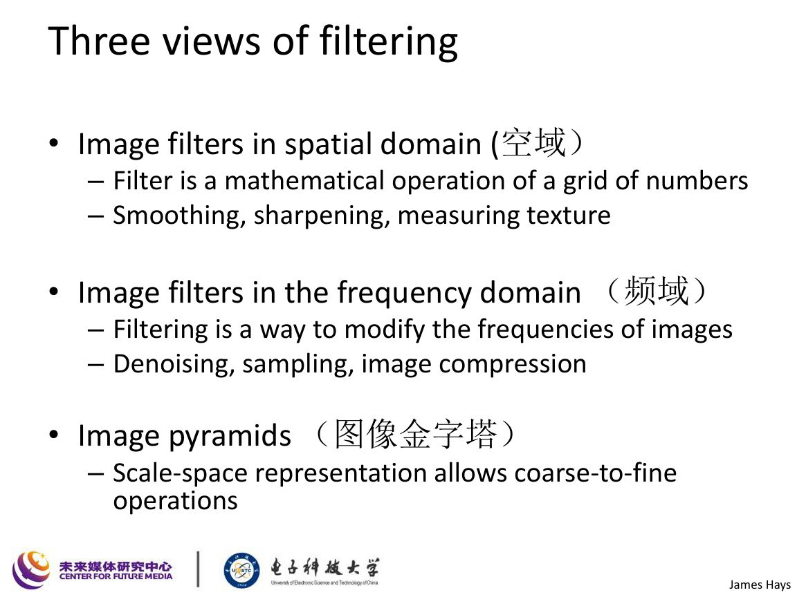

## 1. 图像滤波到底在做什么

课件给出的核心定义是：

> 在每个位置，对局部邻域应用某个函数，得到新的像素值。

若输入图像为 $I$，滤波器为 $K$，输出图像为 $J$，则可抽象写为

$$
J(x,y)=\mathcal{F}\bigl(I,\mathcal{N}(x,y)\bigr),
$$

其中 $\mathcal{N}(x,y)$ 表示 $(x,y)$ 周围的局部邻域。

根据滤波器设计不同，滤波可以实现：

- 平滑 / 去噪
- 锐化
- 边缘检测
- 纹理分析
- 模板匹配
- 特征抽取

## 2. Correlation 与 Convolution

课件专门强调了相关和卷积的区别与联系：

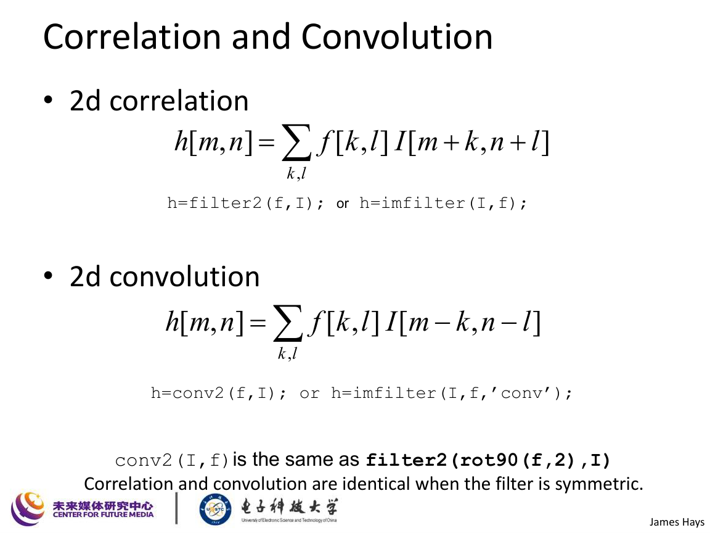

### 2.1 二维相关 Correlation

二维相关定义为

$$
(I \star K)(x,y)=\sum_{u}\sum_{v} I(x+u,y+v)\,K(u,v).
$$

它的直觉是：

- 不翻转滤波核；
- 直接让核在图像上滑动做逐元素乘加。

### 2.2 二维卷积 Convolution

二维卷积定义为

$$
(I * K)(x,y)=\sum_{u}\sum_{v} I(x-u,y-v)\,K(u,v).
$$

等价理解是：

- 先把滤波核旋转 $180^\circ$；
- 再做滑动乘加。

### 2.3 两者什么时候一样

若滤波核是中心对称的，即

$$
K(u,v)=K(-u,-v),
$$

则相关与卷积相同。

这就是为什么在 Gaussian 核这类对称核上，很多教材或代码中两者效果看起来一样。

## 3. 线性滤波的性质

课件列出了线性滤波的几个关键性质。

### 3.1 线性性

对任意图像 $I_1,I_2$ 和常数 $a,b$，有

$$
(aI_1+bI_2) * K = a(I_1*K)+b(I_2*K).
$$

### 3.2 平移不变性

若对图像做平移，输出也只会对应平移，而不会改变滤波规律。

这意味着滤波器在整张图像上执行的是“同一套规则”。

### 3.3 卷积的代数性质

卷积满足：

- 交换律
  $$
  I*K = K*I
  $$
- 结合律
  $$
  I*(K_1*K_2)=(I*K_1)*K_2
  $$
- 分配律
  $$
  I*(K_1+K_2)=I*K_1+I*K_2
  $$

这些性质很重要，因为它们解释了为什么多个滤波步骤可以合成、为什么可分离滤波能提速、为什么频域分析会成立。

## 4. 常见手工滤波器

### 4.1 Box Filter / 均值滤波

典型的 $3\times 3$ 均值核为

$$
K_{\text{box}}=\frac{1}{9}
\begin{bmatrix}
1&1&1\\
1&1&1\\
1&1&1
\end{bmatrix}.
$$

它会把局部邻域做平均，因此具有：

- 降噪作用；
- 平滑作用；
- 但会明显模糊边缘。

### 4.2 Gaussian Filter / 高斯滤波

课件把 Gaussian 作为最重要的平滑滤波器：

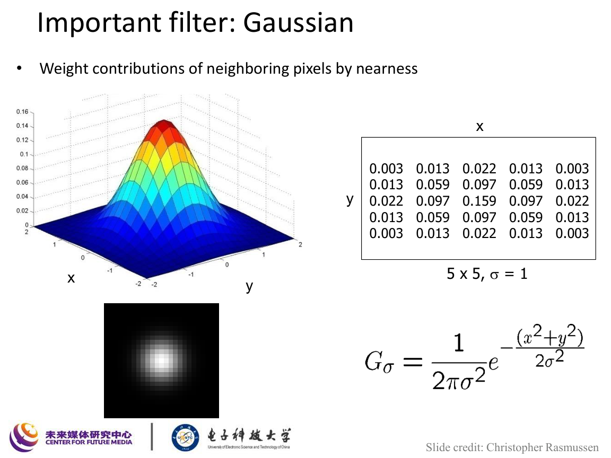

二维高斯函数写成

$$
G_\sigma(x,y)=\frac{1}{2\pi\sigma^2}\exp\!\left(-\frac{x^2+y^2}{2\sigma^2}\right).
$$

离散高斯核就是对这个函数进行采样和归一化得到的。

Gaussian 平滑效果：

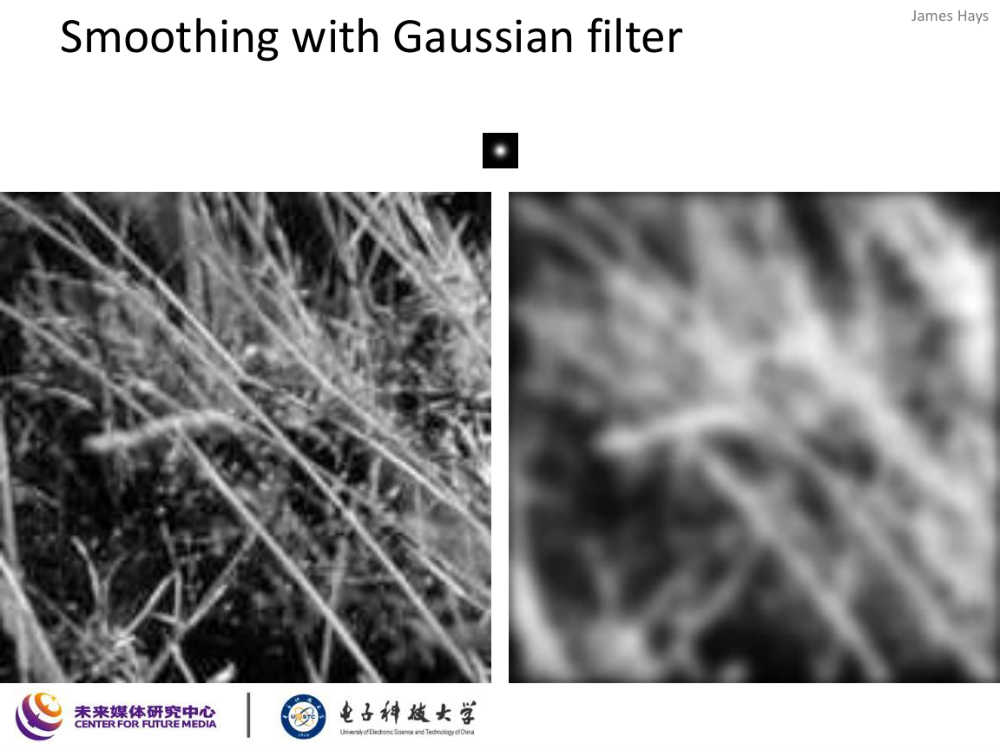

与 Box filter 相比，高斯滤波的权重更符合“离中心越远贡献越小”的直觉，因此视觉上更自然。

### 4.3 Gaussian 为什么重要

课件给了三个核心理由：

1. 它是低通滤波器，会抑制高频细节和噪声。
2. 两个 Gaussian 卷积后仍是 Gaussian。
3. 它是可分离的。

### 4.4 可分离性

高斯核满足

$$
G_\sigma(x,y)=g_\sigma(x)\,g_\sigma(y),
$$

其中

$$
g_\sigma(x)=\frac{1}{\sqrt{2\pi}\sigma}\exp\!\left(-\frac{x^2}{2\sigma^2}\right).
$$

因此二维卷积可以拆成两次一维卷积：

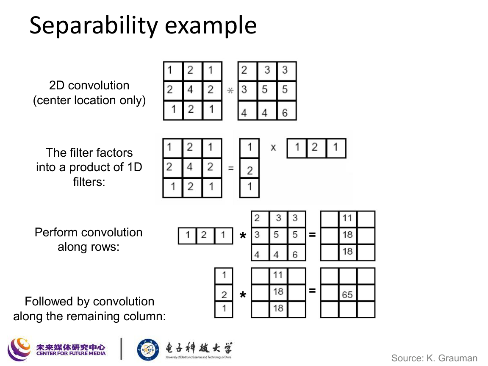

$$
I*G_\sigma = (I*g_\sigma^{(x)})*g_\sigma^{(y)}.
$$

### 4.5 可分离性带来的复杂度下降

课件给出复杂度比较：

若图像大小为 $M\times N$，卷积核大小为 $P\times Q$，则

- 直接二维卷积复杂度约为
  $$
  O(MNPQ)
  $$
- 若核可分离，复杂度约为
  $$
  O\bigl(MN(P+Q)\bigr)
  $$

这就是高斯滤波能被高效实现的重要原因。

## 5. 典型滤波器模板与效果

课件列出了一批应会识别的典型滤波器。

### 5.1 Box Filter

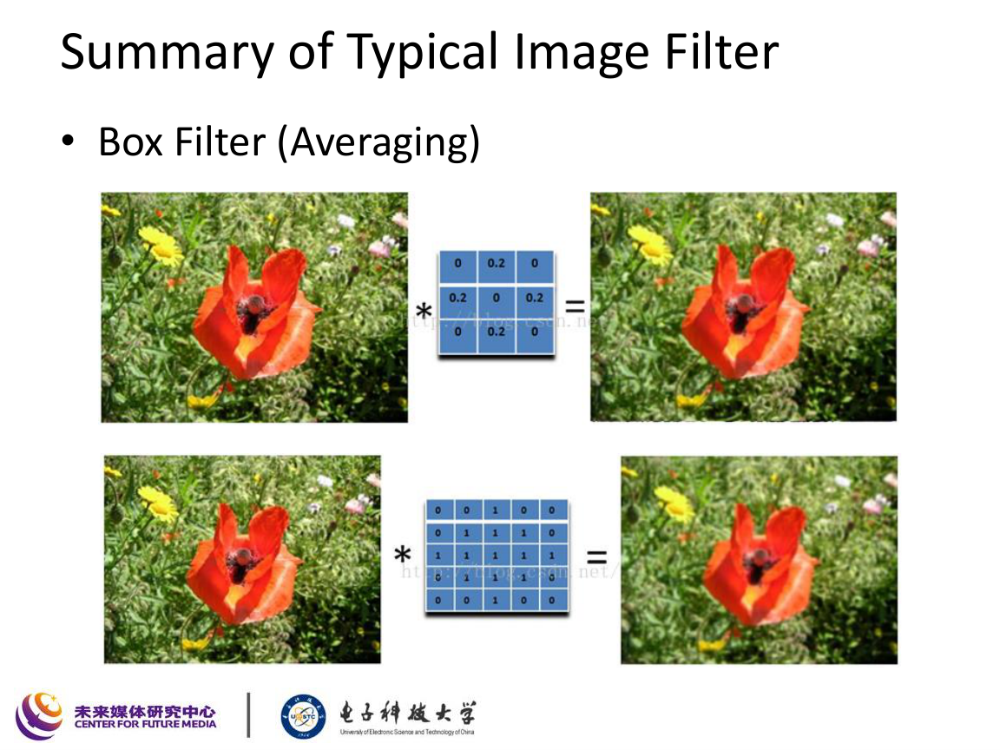

特点：

- 所有权重相同；
- 权重和通常为 $1$；
- 主要用于平滑。

### 5.2 Sharpening Filter

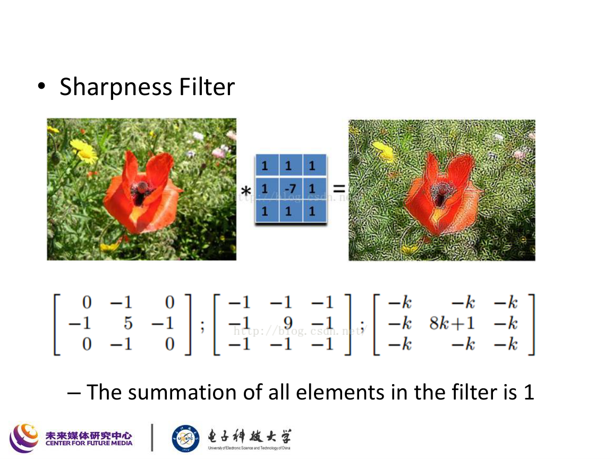

一个常见锐化核是

$$
K_{\text{sharp}}=
\begin{bmatrix}
0&-1&0\\
-1&5&-1\\
0&-1&0
\end{bmatrix}.
$$

锐化的本质是：

- 保留原图低频部分；
- 增强高频变化。

也常写成

$$
I_{\text{sharp}} = I + \alpha(I-I_{\text{blur}}).
$$

### 5.3 Edge Filter

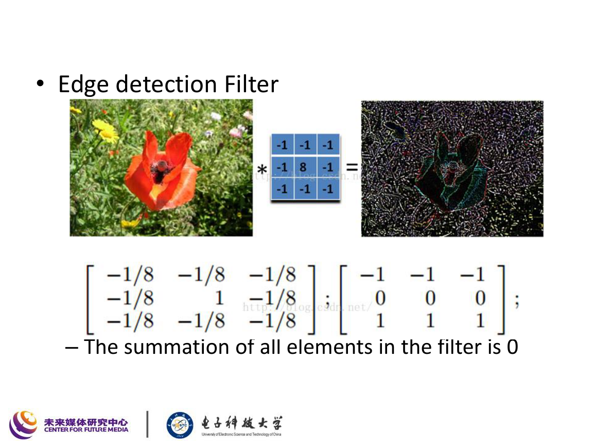

边缘滤波器通常满足：

$$
\sum_{u,v} K(u,v)=0.
$$

这意味着：

- 对常量区域输出接近 $0$；
- 对灰度快速变化区域响应大。

### 5.4 方向性滤波器

某些滤波器不是对称的，而是具有方向性，因此更擅长检测特定方向的边缘或纹理。

例如 Sobel 核：

$$
K_x=
\begin{bmatrix}
-1&0&1\\
-2&0&2\\
-1&0&1
\end{bmatrix},
\qquad
K_y=
\begin{bmatrix}
-1&-2&-1\\
0&0&0\\
1&2&1
\end{bmatrix}.
$$

## 6. 滤波时的工程细节

课件特别提醒了边界问题：

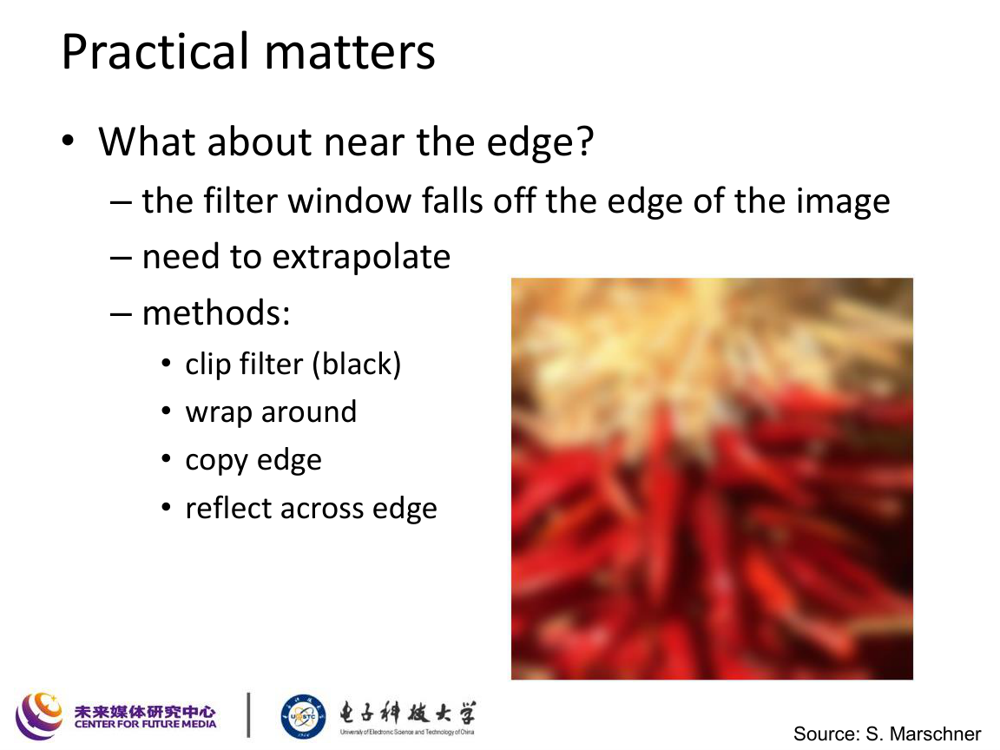

当滤波窗口落到图像边界外时，常见处理方式有：

- Zero padding：补零
- Wrap around：循环
- Copy edge：复制边缘
- Reflect：镜像反射

不同边界策略会影响输出，尤其在大核和边缘检测中更明显。

## 7. 中值滤波与均值滤波的区别

课件用“salt-and-pepper” 噪声的例子说明：

- Mean filter 把噪声也平均进去，容易模糊细节；
- Median filter 用中位数替代中心像素，更能抑制脉冲噪声。

中值滤波定义为

$$
J(x,y)=\operatorname{median}\{I(i,j)\mid (i,j)\in \mathcal{N}(x,y)\}.
$$

它不是线性滤波，但非常实用。

### 7.1 何时优先用 Median

若噪声是孤立的异常亮点 / 暗点，例如椒盐噪声，则中值滤波通常比均值滤波更好。

### 7.2 何时用 Mean / Gaussian

若噪声更像加性高斯噪声，则均值或高斯平滑更自然。

## 8. 课件给出的“图像滤波复习结论”

课件后半段总结了几条非常适合考试的 take-home messages：

1. 滤波核大小通常取奇数，便于定义中心。
2. 若希望滤波后整体亮度大致不变，核元素和通常取 $1$。
3. 若核元素和为 $0$，往往对应边缘或差分型滤波器。
4. 线性和平移不变性是卷积的两个核心特征。
5. 若卷积核可分离，可以显著加速。

## 9. 从手工滤波到 CNN 滤波

课件后半部分转向 CNN，把卷积核理解为“可学习滤波器”。

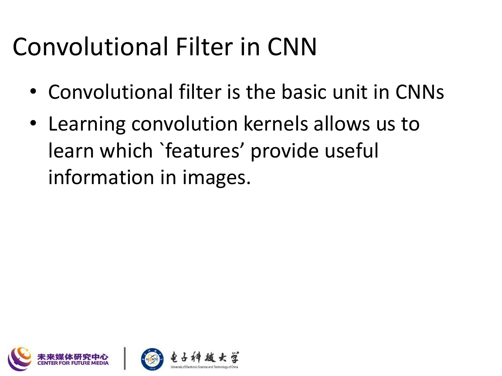

### 9.1 为什么卷积适合图像

课件给出的直觉是：

- 图像中的有用模式往往是局部的；
- 同一种局部模式会出现在不同位置；
- 因此可以用一个小滤波器在整张图上滑动检测同一类模式。

这对应两个关键思想：

#### 局部连接

每个神经元只看一小块区域，而不是连接整张图。

#### 权值共享

同一个卷积核参数在所有空间位置共享。

### 9.2 卷积层的数学表达

设输入特征图为 $X$，卷积核为 $W$，偏置为 $b$，输出特征图为 $Y$，则

$$
Y_{k}(i,j)=\sum_{c}\sum_{u}\sum_{v} W_{k,c}(u,v)\,X_c(i+u,j+v)+b_k.
$$

其中：

- $c$ 是输入通道索引；
- $k$ 是输出通道索引；
- 每个输出通道对应一个学习得到的滤波器组。

### 9.3 Stride 的作用

课件给出 stride=1 和 stride=2 的对比。

若卷积核大小为 $K$，输入宽高为 $H\times W$，padding 为 $P$，stride 为 $S$，则输出大小为

$$
H_{\text{out}}=\left\lfloor\frac{H-K+2P}{S}\right\rfloor+1,
\qquad
W_{\text{out}}=\left\lfloor\frac{W-K+2P}{S}\right\rfloor+1.
$$

stride 越大，输出特征图越小。

### 9.4 卷积层为什么参数更少

课件把卷积和全连接网络作对比，结论是：

- 卷积只连接局部区域；
- 且参数共享；
- 因此参数量远小于全连接层。

这也是 CNN 更适合图像的根本原因之一。

## 10. 池化 Pooling

课件进一步引入 Max Pooling：

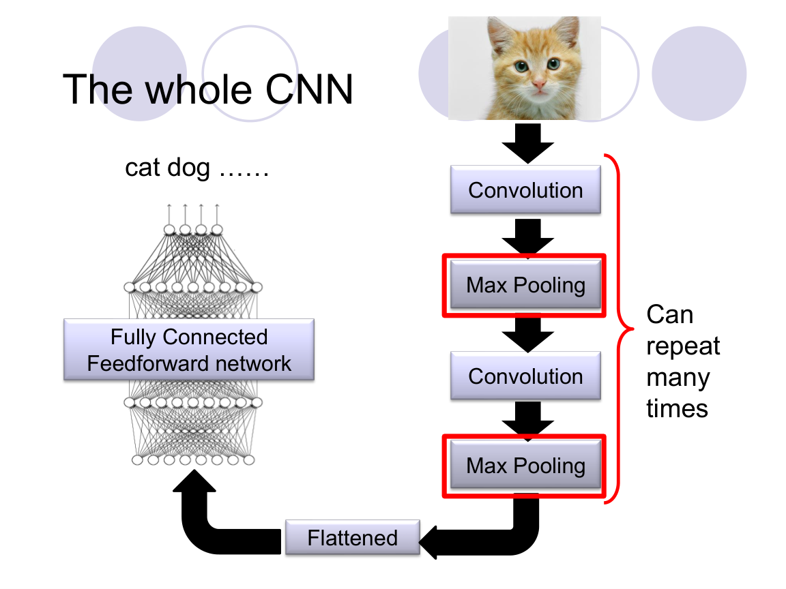

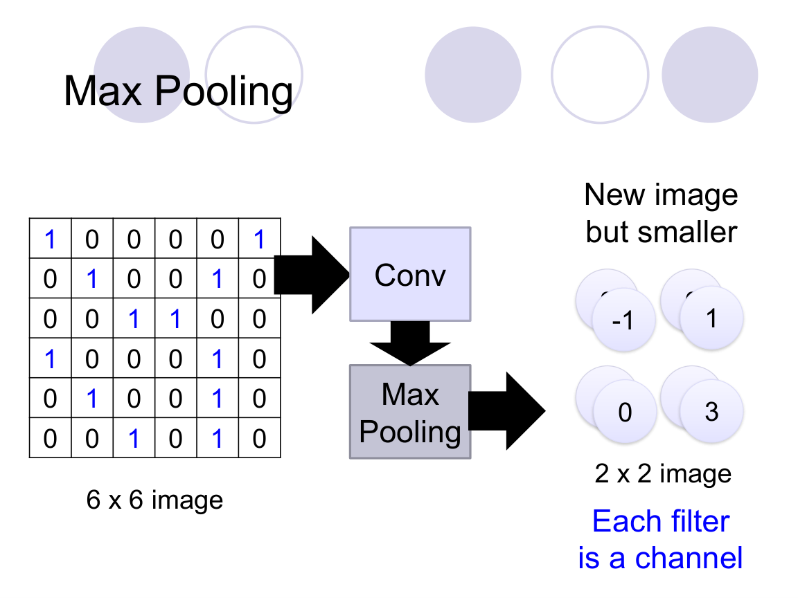

### 10.1 Max Pooling 定义

对每个局部窗口取最大值：

$$
Y(i,j)=\max_{(u,v)\in \mathcal{N}(i,j)} X(u,v).
$$

### 10.2 Pooling 的作用

- 降低分辨率；
- 减少参数和计算量；
- 增强一定的平移鲁棒性；
- 保留最强响应。

### 10.3 CNN 的典型流程

课件中 CNN 主链条可以记成：

$$
\text{Input}
\to
\text{Conv}
\to
\text{Pooling}
\to
\text{Conv}
\to
\text{Pooling}
\to
\text{Flatten}
\to
\text{Fully Connected}
\to
\text{Output}
$$

## 11. CNN 的两类任务

课件最后还区分了两类神经网络任务：

### 11.1 判别式任务

例如：

- 图像分类
- 目标识别
- 判别型理解任务

通常对应

$$
y = F_\theta(x).
$$

### 11.2 生成式任务

例如：

- 图像生成
- 超分辨率
- 图像修复
- 反卷积 / 上采样

对应“把特征重新扩展为图像”的过程。

## 12. 本讲必须掌握的公式

### 12.1 相关

$$
(I \star K)(x,y)=\sum_{u,v} I(x+u,y+v)K(u,v)
$$

### 12.2 卷积

$$
(I * K)(x,y)=\sum_{u,v} I(x-u,y-v)K(u,v)
$$

### 12.3 Gaussian 核

$$
G_\sigma(x,y)=\frac{1}{2\pi\sigma^2}\exp\!\left(-\frac{x^2+y^2}{2\sigma^2}\right)
$$

### 12.4 Gaussian 可分离

$$
G_\sigma(x,y)=g_\sigma(x)\,g_\sigma(y)
$$

### 12.5 中值滤波

$$
J(x,y)=\operatorname{median}\{I(i,j)\mid (i,j)\in\mathcal{N}(x,y)\}
$$

### 12.6 CNN 卷积层

$$
Y_{k}(i,j)=\sum_{c,u,v} W_{k,c}(u,v)\,X_c(i+u,j+v)+b_k
$$

### 12.7 卷积输出尺寸

$$
H_{\text{out}}=\left\lfloor\frac{H-K+2P}{S}\right\rfloor+1
$$

## 13. 这讲应该记住什么

1. 相关和卷积只差一个核翻转。
2. 线性、平移不变、可分离是卷积最重要的结构性质。
3. Gaussian 是最重要的平滑核，既低通又可分离。
4. 边缘核通常元素和为 $0$，平滑核通常元素和为 $1$。
5. Median 对椒盐噪声比 Mean 更稳。
6. CNN 中的卷积核本质上就是“从数据中学出来的滤波器”。
7. 卷积网络的关键压缩机制是局部连接、权值共享和池化。
