# 频域分析与傅里叶思维

对应课件：`L4-5_ThinkingInFrequency.pdf`

## 本讲主线

这一讲的核心不是“背傅里叶公式”，而是建立频域直觉：

1. 为什么图像能从频率角度理解。
2. 为什么下采样前要先低通。
3. 为什么傅里叶变换能帮助我们理解滤波。
4. 为什么相位往往比幅度更重要。
5. 为什么反卷积在噪声存在时很难。

## 1. 为什么要从频域看图像

课件一开始从两个现象切入：

- 分辨率降低后图像为什么仍“能看懂”；
- 混合图像为什么在不同距离下会呈现不同解释。

### 1.1 下采样前为什么要先平滑

课件给出了一个非常重要的结论：

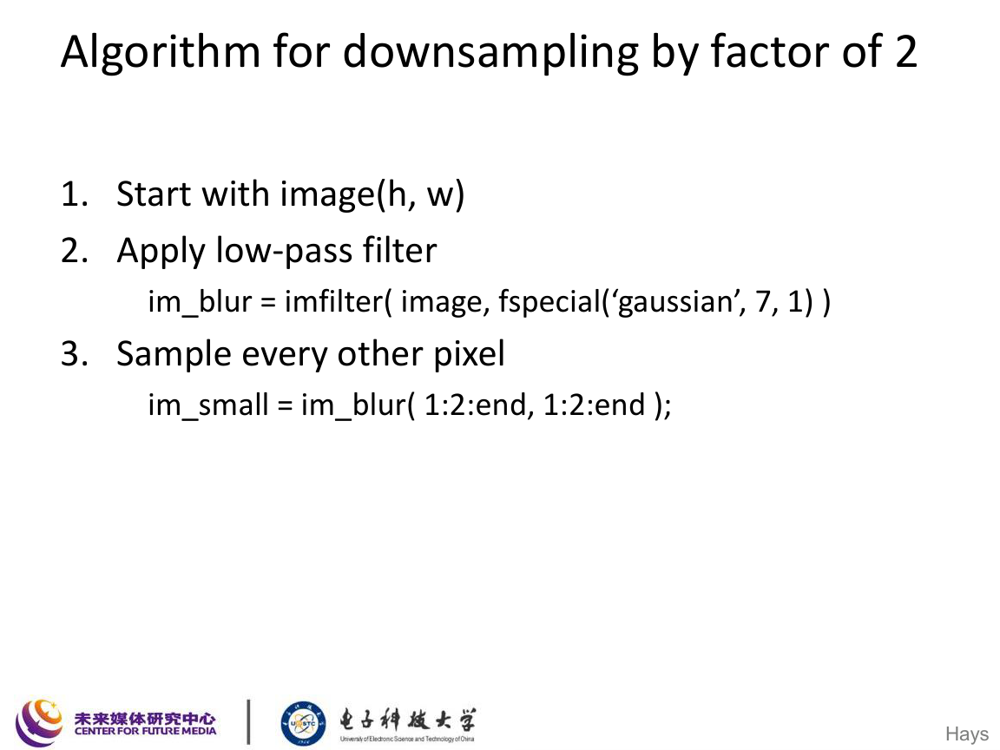

对于降采样操作，正确流程是：

1. 先做低通滤波；
2. 再每隔若干像素采样一次。

其本质原因是防止混叠 aliasing。

### 1.2 Nyquist 直觉

虽然课件没有展开完整采样定理推导，但复习时建议记住：

若信号最高频率为 $f_{\max}$，采样频率 $f_s$ 需要满足

$$
f_s \ge 2f_{\max},
$$

否则高频会折叠到低频，形成混叠。

在图像中，这意味着：

- 纹理过密会出现摩尔纹；
- 直接缩小图像会产生锯齿和伪影；
- 低通滤波相当于先“删掉采不准的高频”。

### 1.3 图像金字塔

课件用图像金字塔说明多尺度表示：

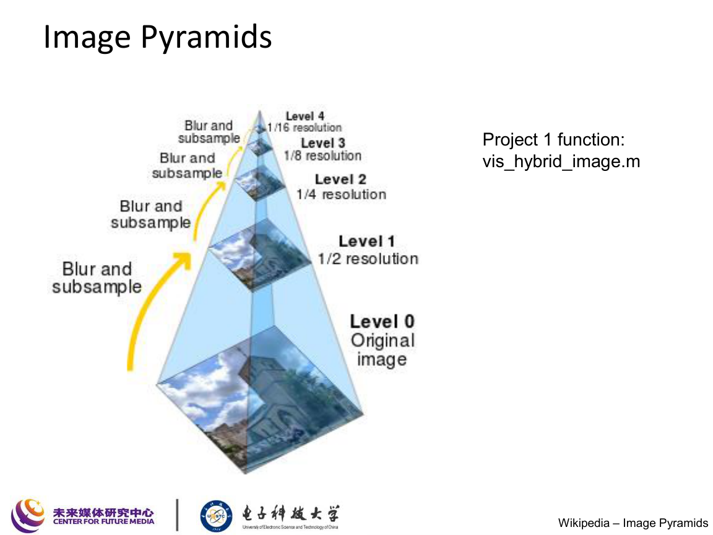

图像金字塔的核心思想是：

$$
I_0 \to I_1 \to I_2 \to \cdots
$$

其中每一层都是先平滑再下采样得到的更粗尺度表示。

金字塔的作用：

- 多尺度搜索
- 粗到细优化
- 混合图像显示
- 视觉感知建模

## 2. 混合图像与人类感知

课件用 hybrid image 说明不同频率分量在人类视觉中的作用：

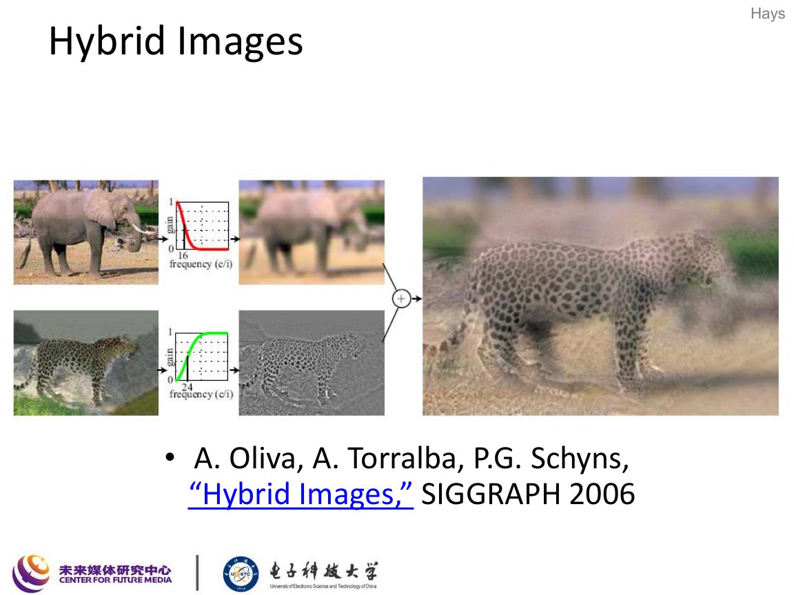

混合图像的基本构造是：

$$
I_{\text{hybrid}} = I_{\text{low}} + I_{\text{high}},
$$

其中

$$
I_{\text{low}} = G_{\sigma_1} * I_1,
$$

$$
I_{\text{high}} = I_2 - G_{\sigma_2} * I_2.
$$

直观上：

- 近看时更容易看到高频细节；
- 远看时高频被视觉系统“忽略”，低频主导感知。

课件还提到人类早期视觉对不同频率和方向敏感：

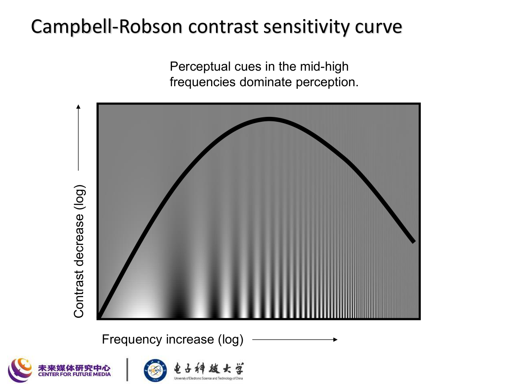

这解释了为什么频域视角不仅是数学工具，也与感知机制相关。

## 3. 傅里叶级数与傅里叶变换

## 3.1 傅里叶基本思想

课件的核心思想是：

> 任意信号都可以表示成不同频率正弦 / 余弦基函数的加权和。

### 3.1.1 一维傅里叶级数

对周期函数 $f(t)$，可以写成

$$
f(t)=a_0+\sum_{n=1}^{\infty}\left(a_n\cos(n\omega_0 t)+b_n\sin(n\omega_0 t)\right),
$$

其中

$$
\omega_0=\frac{2\pi}{T}.
$$

也可以写成复指数形式：

$$
f(t)=\sum_{k=-\infty}^{\infty} c_k e^{j k \omega_0 t}.
$$

### 3.1.2 为什么这套表示有用

因为它把“复杂波形”拆成“简单频率成分”的叠加：

- 高频：变化快
- 低频：变化慢
- 幅度：有多强
- 相位：出现在哪里

## 3.2 二维图像中的频率

课件把二维图像看成二维信号，其频率分量在 $u,v$ 平面中表示。

复习时建议直接记二维离散傅里叶变换 DFT。

### 3.2.1 二维 DFT

设图像为 $f(x,y)$，大小为 $M\times N$，则

$$
F(u,v)=\sum_{x=0}^{M-1}\sum_{y=0}^{N-1}
f(x,y)\,
e^{-j2\pi\left(\frac{ux}{M}+\frac{vy}{N}\right)}.
$$

### 3.2.2 二维逆 DFT

$$
f(x,y)=\frac{1}{MN}\sum_{u=0}^{M-1}\sum_{v=0}^{N-1}
F(u,v)\,
e^{j2\pi\left(\frac{ux}{M}+\frac{vy}{N}\right)}.
$$

### 3.2.3 频谱图如何理解

课件里的直观解释是：

- 离频谱中心越远，频率越高；
- 某点值越大，说明对应频率成分幅度越大；
- 实图像的频谱通常具有共轭对称性。

## 4. 幅度与相位

课件非常强调这一点：

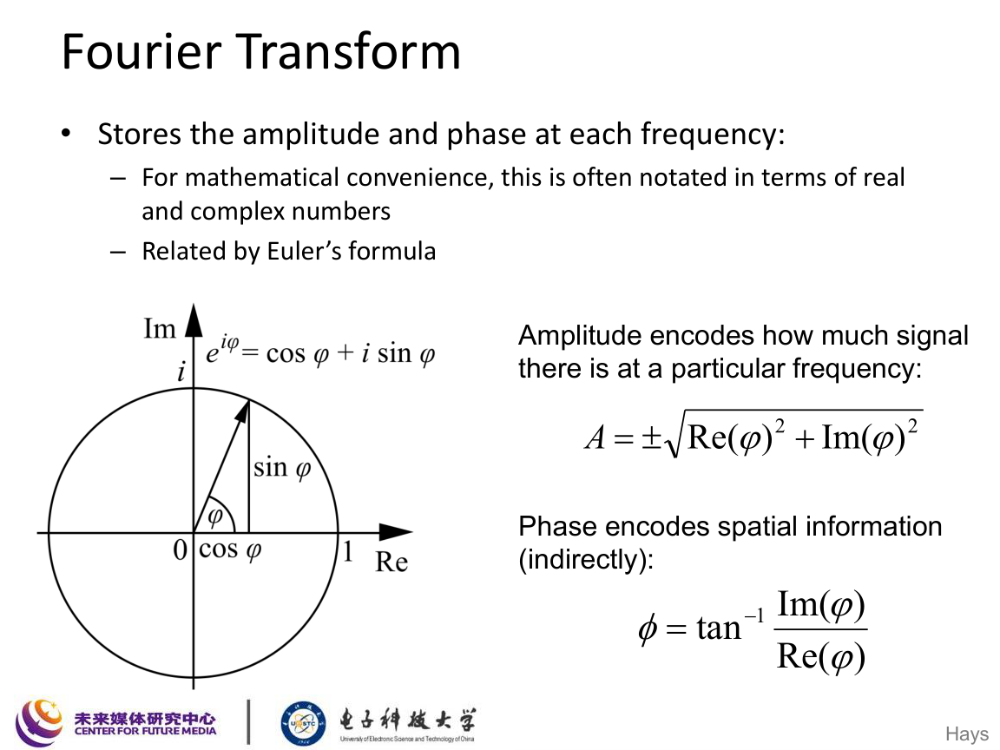

傅里叶系数可写为

$$
F(u,v)=A(u,v)e^{j\phi(u,v)},
$$

其中：

- $A(u,v)=|F(u,v)|$ 是幅度；
- $\phi(u,v)=\arg(F(u,v))$ 是相位。

### 4.1 幅度和相位分别表示什么

课件总结得很清楚：

- Amplitude tells you “how much”
- Phase tells you “where”

也就是：

- 幅度描述某频率成分有多强；
- 相位描述这些结构在空间中如何对齐、如何摆放。

### 4.2 为什么相位更重要

课件用“zebra phase / cheetah amplitude” 的例子说明：

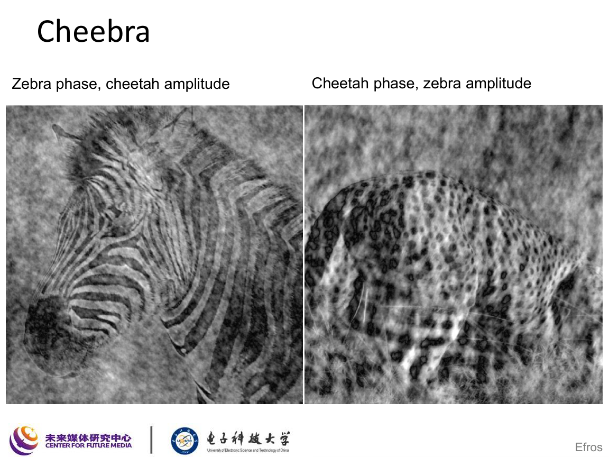

自然图像的感知外观很大程度上由相位决定。很多自然图像的幅度谱形状相似，但相位决定了结构轮廓和空间布局。

复习时建议直接记住：

> 看起来像什么，往往更依赖相位；频率能量分布更依赖幅度。

## 5. 卷积定理

课件的中心公式之一就是卷积定理：

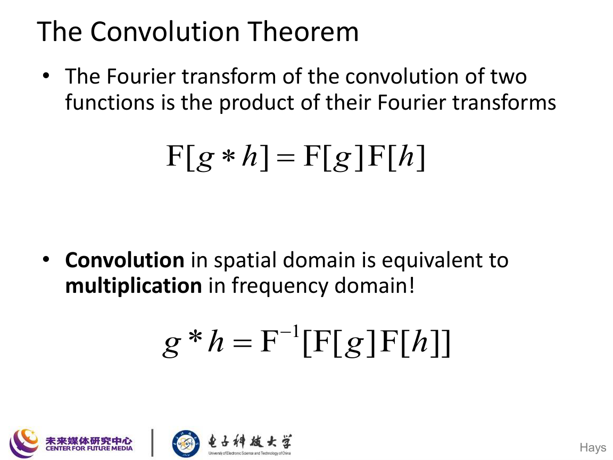

若

$$
h = f * g,
$$

则

$$
\mathcal{F}\{h\} = \mathcal{F}\{f*g\}
=
\mathcal{F}\{f\}\cdot \mathcal{F}\{g\}.
$$

逆向写就是

$$
f*g = \mathcal{F}^{-1}\bigl(\mathcal{F}(f)\cdot \mathcal{F}(g)\bigr).
$$

### 5.1 它意味着什么

空间域里的卷积，对应频域里的逐点乘法。

这使得我们可以：

- 用频域理解滤波器作用；
- 对大核卷积使用 FFT 提速；
- 直接在频域编辑某些频率成分。

### 5.2 频域滤波流程

课件给出的标准流程是：

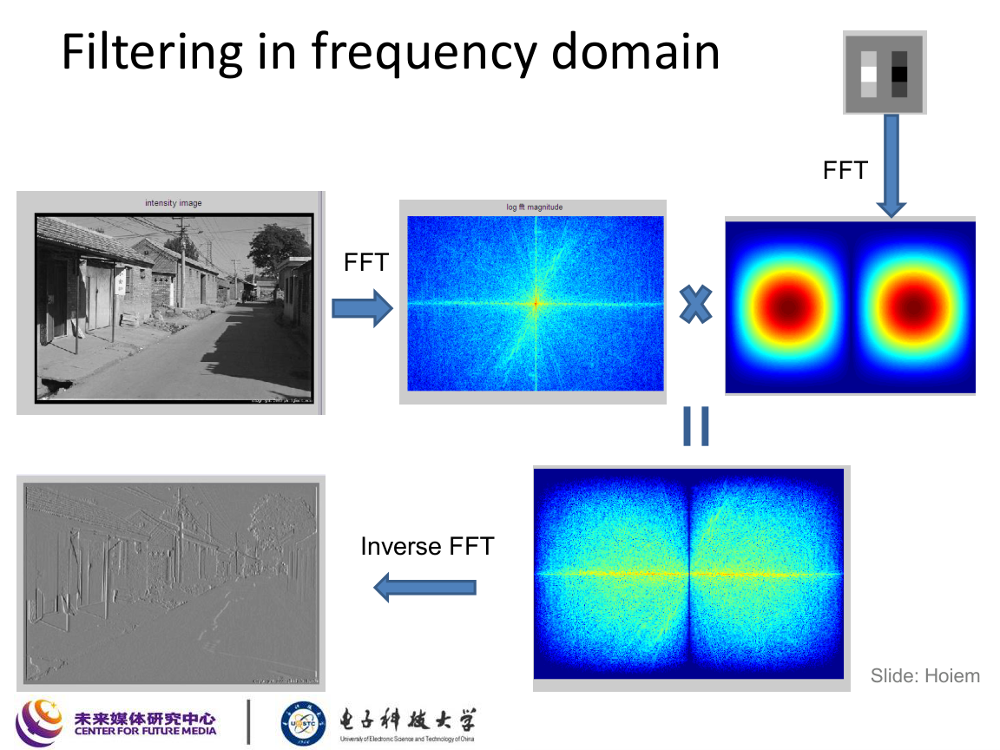

1. 对图像做 FFT；
2. 对滤波器做 FFT；
3. 逐点相乘；
4. 做逆 FFT 回到空间域。

## 6. 低通、高通和频带编辑

### 6.1 低通滤波

保留低频，抑制高频：

- 图像更平滑；
- 细节和噪声会减少。

### 6.2 高通滤波

保留高频，抑制低频：

- 强调边缘、纹理和快速变化；
- 更接近“细节层”。

### 6.3 频带操作

课件展示了：

- 去掉某些频带；
- 只保留某些方向的频率；
- 通过频域裁剪观察图像变化。

这些操作帮助理解：

> 图像的很多视觉特征，其实都可以用频率分布来解释。

## 7. Box / Sinc 对偶

课件给出非常经典的一组对偶关系：

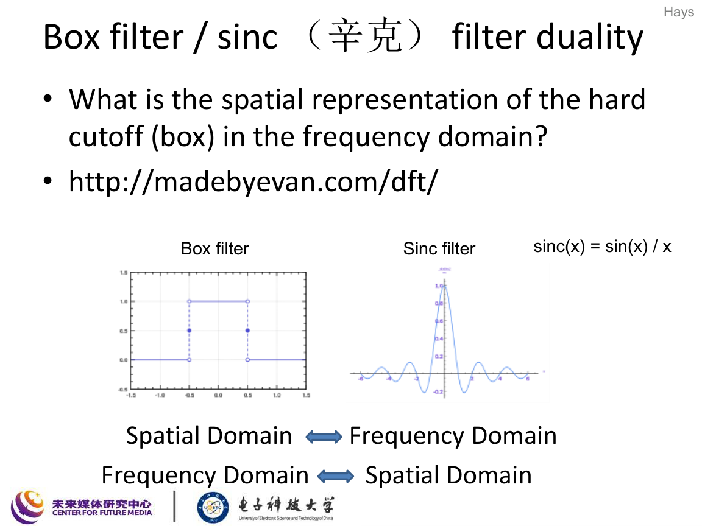

### 7.1 空域 box，对应频域 sinc

矩形函数的傅里叶变换是 sinc 函数：

$$
\operatorname{rect}(x)
\xleftrightarrow{\mathcal{F}}
\operatorname{sinc}(\omega),
$$

其中

$$
\operatorname{sinc}(x)=\frac{\sin x}{x}.
$$

### 7.2 为什么方窗容易带来振铃

由于 sinc 在空间域或频域都有旁瓣，因此“硬切断”会导致振铃和条纹。

这也是为什么：

- 方窗滤波器容易产生伪影；
- 理想硬截止虽然数学上干净，但视觉上不平滑。

## 8. Gaussian 的频域对偶

课件紧接着给出 Gaussian 的优势：

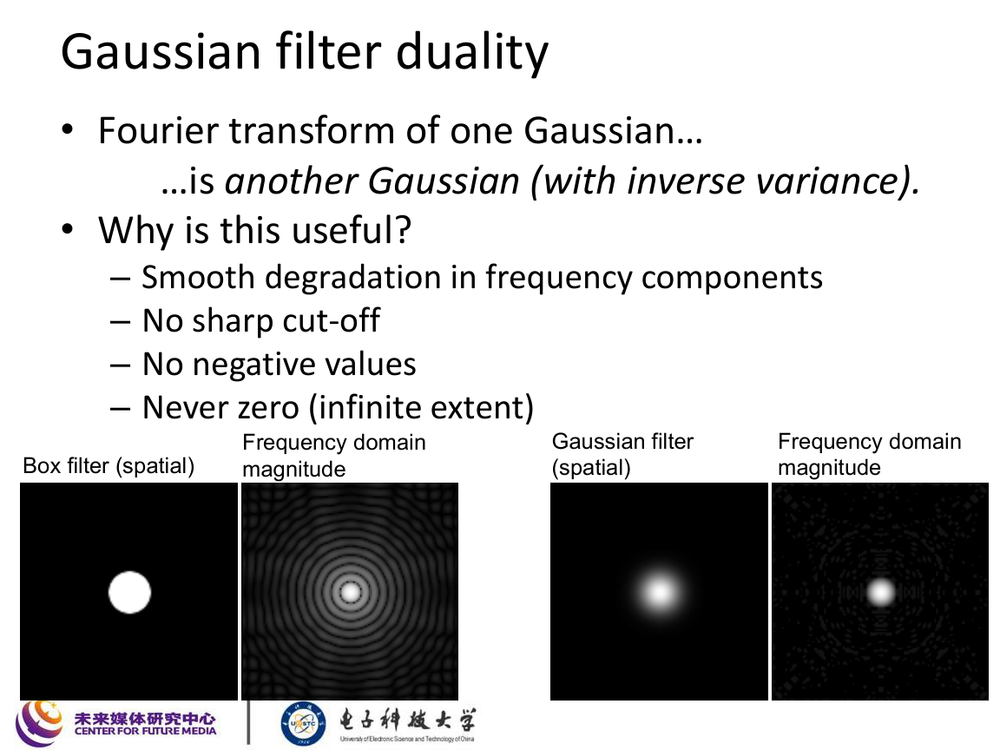

Gaussian 的傅里叶变换仍是 Gaussian：

$$
\mathcal{F}\left\{
\exp\!\left(-\frac{x^2}{2\sigma^2}\right)
\right\}
\propto
\exp\!\left(-\frac{\sigma^2\omega^2}{2}\right).
$$

二维情形同理成立。

### 8.1 为什么 Gaussian 更“顺滑”

因为 Gaussian：

- 不做硬截止；
- 不产生明显旁瓣；
- 在频域中平滑衰减；
- 因而视觉上更自然。

这也解释了为什么高斯模糊通常比均值模糊更少伪影。

## 9. 反卷积为什么难

课件最后讨论了 deconvolution：

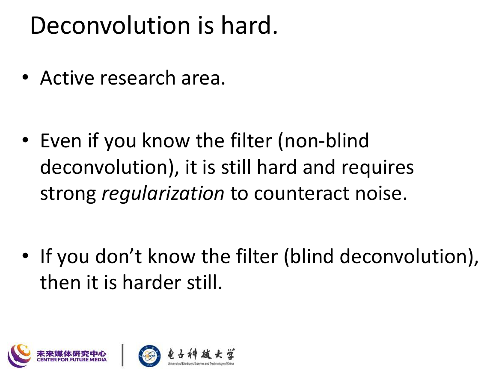

从卷积定理看，若

$$
Y = H \cdot X,
$$

似乎可以直接求

$$
X = \frac{Y}{H}.
$$

但现实中问题在于：

- $H(u,v)$ 某些频率处很小甚至接近 $0$；
- 噪声也会被一起除以很小的数；
- 结果导致噪声被剧烈放大。

若观测模型为

$$
Y = H \cdot X + N,
$$

则直接反卷积得到

$$
\hat{X}=\frac{Y}{H}=X+\frac{N}{H}.
$$

当 $|H|$ 很小时，$\dfrac{N}{H}$ 会非常大，因此结果极不稳定。

### 9.1 结论

所以课件最后的结论是：

- 即使已知模糊核，反卷积仍然困难；
- 若核未知，盲反卷积更难；
- 实际上通常必须加入正则化。

## 10. 本讲必须掌握的公式

### 10.1 一维傅里叶级数

$$
f(t)=a_0+\sum_{n=1}^{\infty}\left(a_n\cos(n\omega_0 t)+b_n\sin(n\omega_0 t)\right)
$$

### 10.2 二维 DFT

$$
F(u,v)=\sum_{x=0}^{M-1}\sum_{y=0}^{N-1}
f(x,y)e^{-j2\pi\left(\frac{ux}{M}+\frac{vy}{N}\right)}
$$

### 10.3 逆 DFT

$$
f(x,y)=\frac{1}{MN}\sum_{u=0}^{M-1}\sum_{v=0}^{N-1}
F(u,v)e^{j2\pi\left(\frac{ux}{M}+\frac{vy}{N}\right)}
$$

### 10.4 幅度相位表示

$$
F(u,v)=A(u,v)e^{j\phi(u,v)}
$$

### 10.5 卷积定理

$$
\mathcal{F}\{f*g\}=\mathcal{F}\{f\}\cdot\mathcal{F}\{g\}
$$

### 10.6 Hybrid image

$$
I_{\text{hybrid}} = G_{\sigma_1} * I_1 + \bigl(I_2 - G_{\sigma_2} * I_2\bigr)
$$

### 10.7 Sinc 定义

$$
\operatorname{sinc}(x)=\frac{\sin x}{x}
$$

## 11. 这讲应该记住什么

1. 降采样前要先低通，否则会混叠。
2. 图像金字塔是多尺度分析的基础。
3. 傅里叶变换把图像分解成不同频率成分。
4. 幅度表示“多少”，相位表示“在哪里”。
5. 自然图像的视觉结构很大程度上由相位决定。
6. 空域卷积等于频域乘法。
7. Box 对偶 sinc，Gaussian 对偶 Gaussian。
8. 反卷积在噪声下非常不稳定，因此是困难问题。
