# 边缘检测

对应课件：`L7_EdgeDetection.pdf`

## 本讲主线

这一讲的目标是建立完整的“从图像灰度变化到 Canny 边缘”的链条：

1. 什么是边缘；
2. 边缘由哪些物理因素产生；
3. 为什么导数能检测边缘；
4. 为什么必须先平滑再求导；
5. Canny 边缘检测器具体分几步；
6. 如何理解参数 $\sigma$ 与阈值的作用。

## 1. 什么是边缘

课件对边缘的定义非常标准：

> 边缘是图像强度函数发生快速变化的位置。

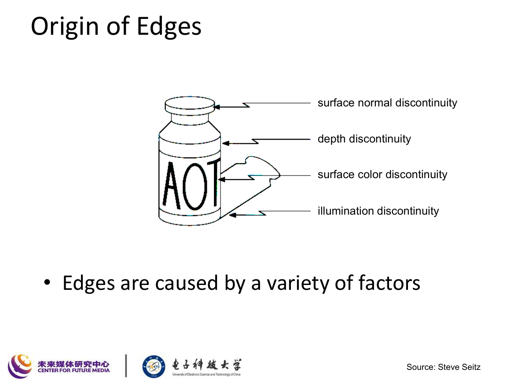

### 1.1 边缘的物理来源

课件列出几类典型来源：

- 深度不连续
- 表面颜色不连续
- 光照不连续
- 表面法向不连续

这说明边缘不一定都是“物体轮廓”，也可能是：

- 阴影边界；
- 纹理边界；
- 遮挡边界；
- 几何折角。

### 1.2 为什么边缘重要

边缘能压缩图像中的关键信息，常用于：

- 目标识别
- 区域分割
- 场景结构恢复
- 几何推断
- 匹配与跟踪

## 2. 边缘与导数的关系

课件通过灰度剖面说明：

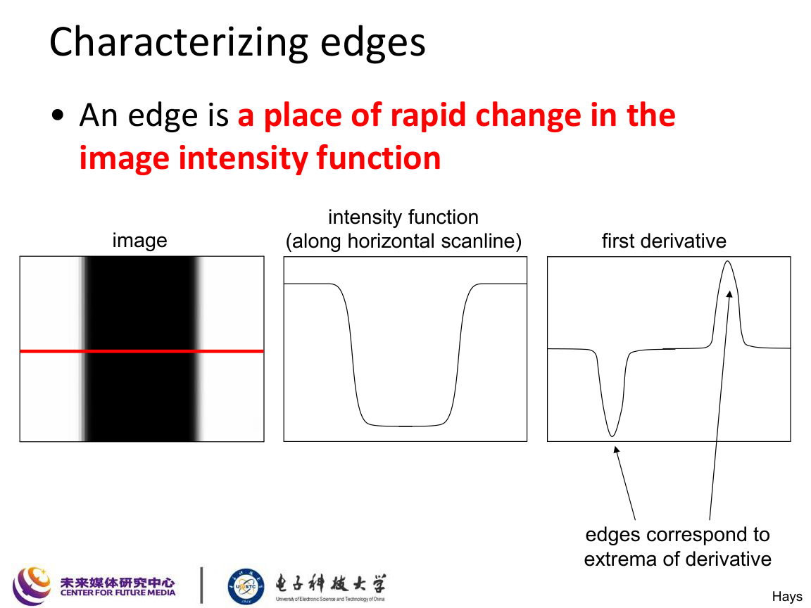

若沿某个方向看图像亮度 $I(x)$，则：

- 灰度快速变化的位置对应导数较大；
- 理想阶跃边缘的一阶导数在边缘附近取极值。

### 2.1 一维情形

若一维信号为 $I(x)$，则边缘可由导数大小表征：

$$
\left|\frac{\mathrm{d}I}{\mathrm{d}x}\right|.
$$

当该值较大时，通常说明存在边缘。

### 2.2 二维情形

二维图像中使用梯度：

$$
\nabla I=
\begin{bmatrix}
I_x\\
I_y
\end{bmatrix}
=
\begin{bmatrix}
\frac{\partial I}{\partial x}\\[4pt]
\frac{\partial I}{\partial y}
\end{bmatrix}.
$$

梯度幅值为

$$
\|\nabla I\|=\sqrt{I_x^2+I_y^2},
$$

梯度方向为

$$
\theta=\operatorname{atan2}(I_y,I_x).
$$

其中：

- 梯度方向垂直于边缘方向；
- 梯度幅值越大，边缘通常越明显。

## 3. 噪声为什么会破坏边缘检测

课件专门强调：直接求导会放大噪声。

在离散图像中，简单差分如

$$
[-1,\,1]
$$

本质上就是高通操作，因此对噪声非常敏感。

若图像中存在小幅高频扰动，那么求导后响应会被明显放大。

## 4. 为什么要“先平滑，再求导”

课件给出的解决方案是：

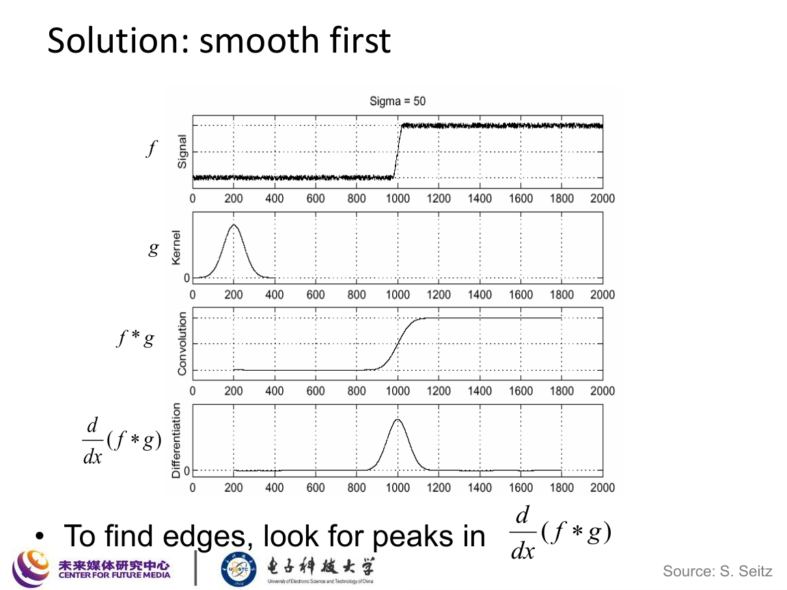

先用平滑核 $g$ 滤波，再对结果求导：

$$
\frac{\mathrm{d}}{\mathrm{d}x}(f*g).
$$

由卷积求导定理可得

$$
\frac{\mathrm{d}}{\mathrm{d}x}(f*g)
=
\left(\frac{\mathrm{d}f}{\mathrm{d}x}\right)*g
=
f*\left(\frac{\mathrm{d}g}{\mathrm{d}x}\right).
$$

因此在实现上常直接使用“高斯的一阶导数”作为滤波器。

### 4.1 导数高斯

若高斯函数为

$$
G_\sigma(x,y)=\frac{1}{2\pi\sigma^2}\exp\!\left(-\frac{x^2+y^2}{2\sigma^2}\right),
$$

则其一阶导数为

$$
\frac{\partial G_\sigma}{\partial x}
=
-\frac{x}{2\pi\sigma^4}\exp\!\left(-\frac{x^2+y^2}{2\sigma^2}\right),
$$

$$
\frac{\partial G_\sigma}{\partial y}
=
-\frac{y}{2\pi\sigma^4}\exp\!\left(-\frac{x^2+y^2}{2\sigma^2}\right).
$$

因此可定义

$$
I_x = I * \frac{\partial G_\sigma}{\partial x},
\qquad
I_y = I * \frac{\partial G_\sigma}{\partial y}.
$$

## 5. 平滑与定位之间的折中

课件给出一个非常关键的图示：

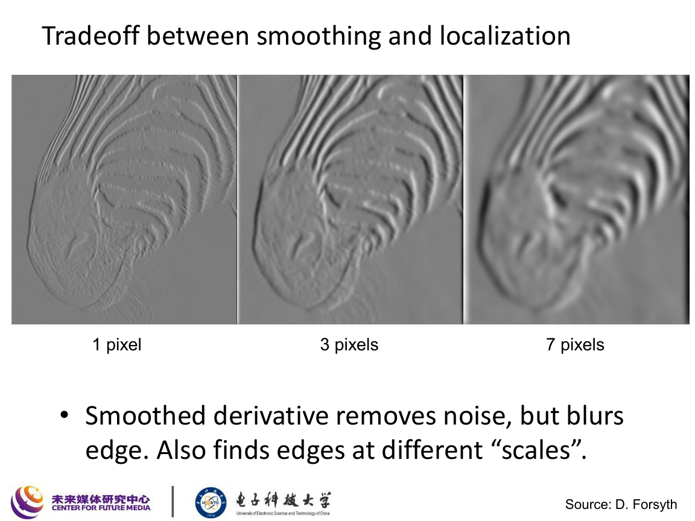

含义是：

- 平滑越强，噪声越小；
- 但边缘会被模糊，定位会变差。

这构成了边缘检测中的经典 trade-off：

### 5.1 Good detection

尽量把真实边缘都检测出来，并抑制噪声响应。

### 5.2 Good localization

检测到的位置要尽可能接近真实边缘位置。

### 5.3 Single response

一条边缘尽量只返回一条细边，而不是一片宽脊。

课件把这些总结成“好边缘检测器的标准”：

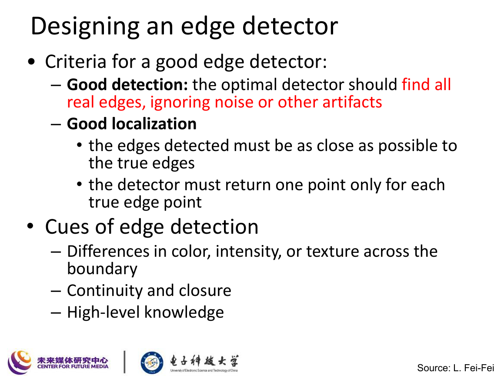

## 6. Canny 边缘检测器

课件明确指出：Canny 是最经典、应用最广的边缘检测器之一。

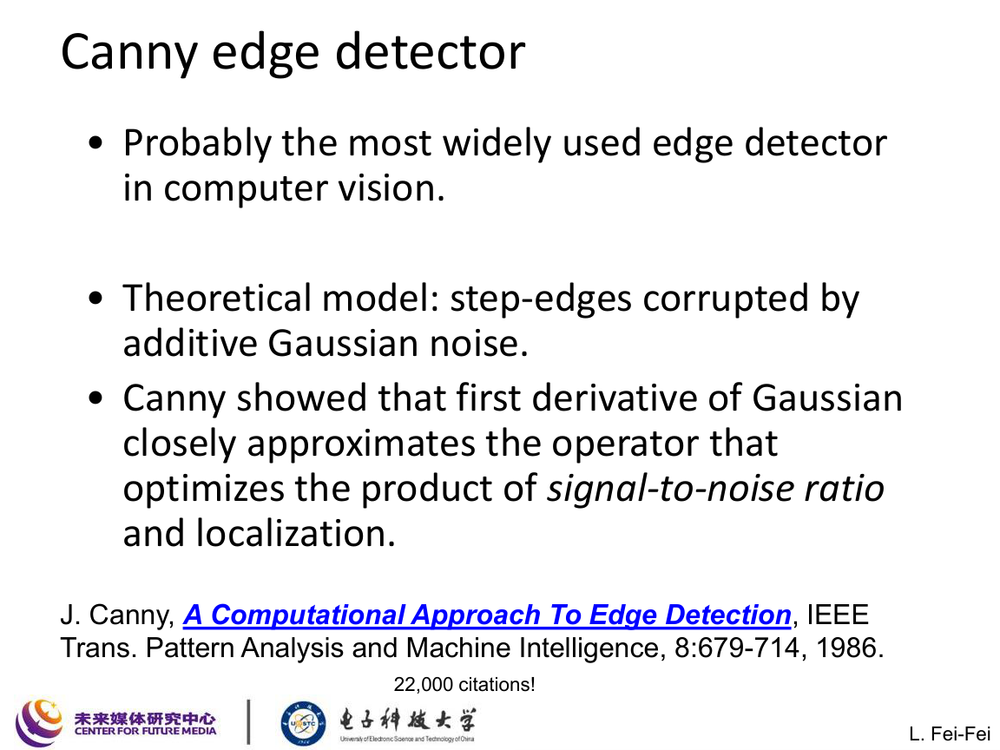

它针对“带高斯噪声的阶跃边缘”设计，并且在检测率、定位和单响应之间做了系统平衡。

## 7. Canny 的四个步骤

课件按标准流程展开。

### 7.1 第一步：高斯导数滤波

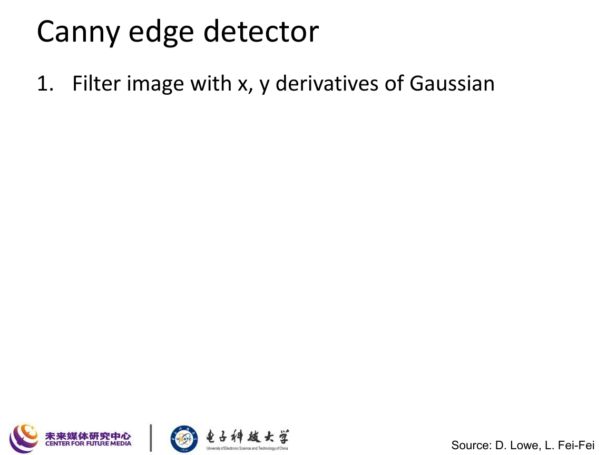

用 $x$ 和 $y$ 方向的高斯导数核滤波图像：

$$
I_x = I * \frac{\partial G_\sigma}{\partial x},
\qquad
I_y = I * \frac{\partial G_\sigma}{\partial y}.
$$

### 7.2 第二步：计算梯度幅值和方向

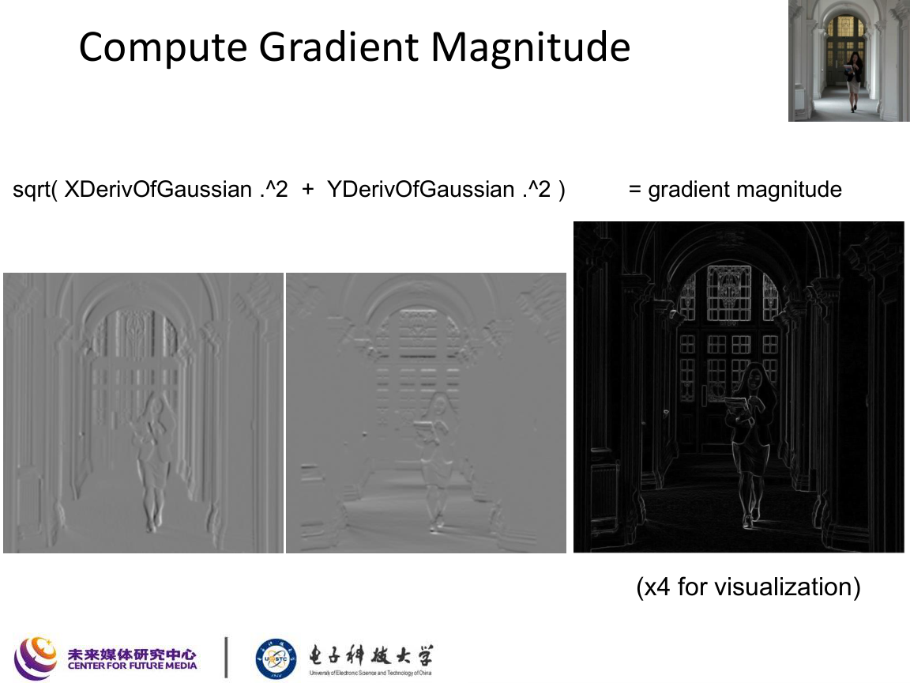

梯度幅值：

$$
M(x,y)=\sqrt{I_x(x,y)^2+I_y(x,y)^2}.
$$

梯度方向：

$$
\theta(x,y)=\operatorname{atan2}\bigl(I_y(x,y), I_x(x,y)\bigr).
$$

这一步得到的是“宽边缘响应图”，还不是最终细边。

### 7.3 第三步：非极大值抑制 Non-maximum Suppression

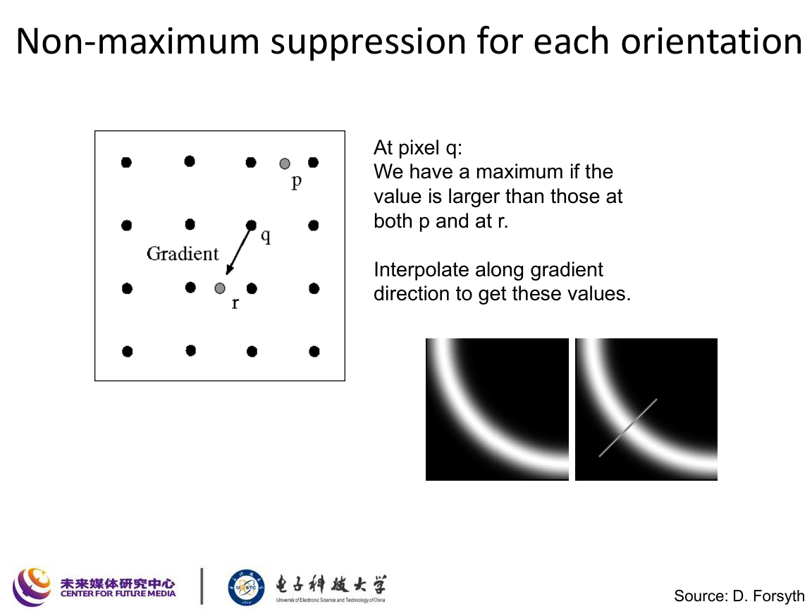

基本思想：

- 沿梯度方向检查当前像素是否是局部最大值；
- 若不是局部最大值，则抑制为 $0$；
- 若是，则保留。

因此非极大值抑制的作用是：

- 把多像素宽的边缘脊线压细成单像素宽；
- 提高定位精度。

形式上可写成：

若像素 $q$ 的梯度幅值 $M(q)$ 小于沿梯度方向相邻两个点的插值结果之一，则

$$
M(q)\leftarrow 0.
$$

### 7.4 第四步：双阈值滞后连接 Hysteresis Thresholding

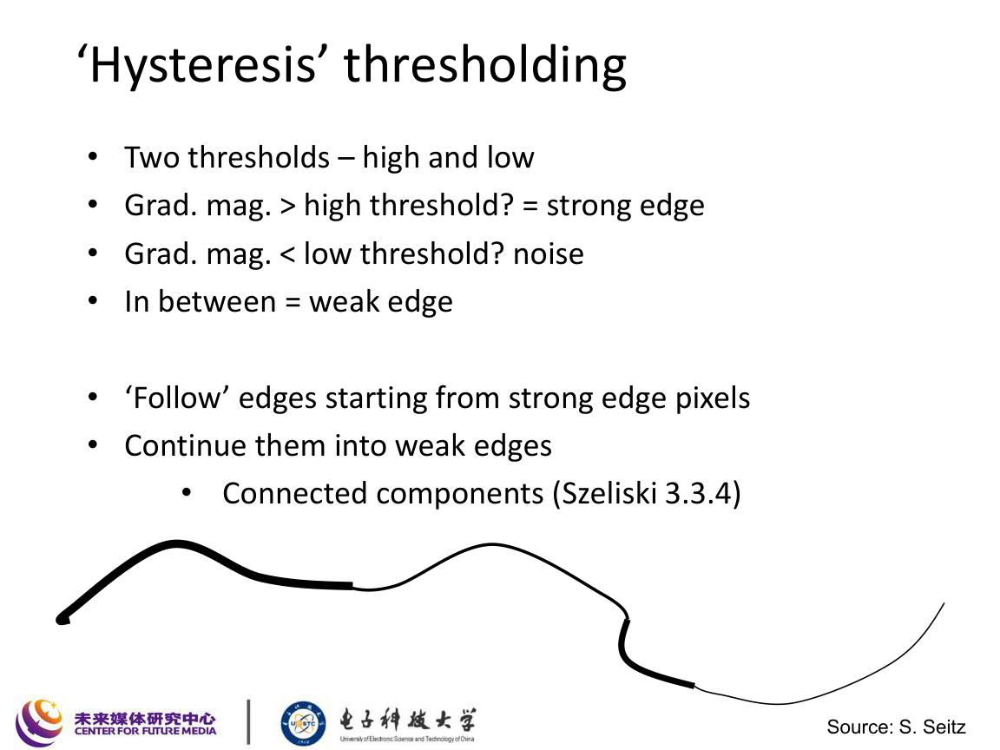

设高阈值为 $t_{\text{high}}$，低阈值为 $t_{\text{low}}$，则：

- 若
  $$
  M(x,y)\ge t_{\text{high}},
  $$
  则标记为强边缘；
- 若
  $$
  M(x,y)< t_{\text{low}},
  $$
  则直接视作噪声；
- 若
  $$
  t_{\text{low}}\le M(x,y)< t_{\text{high}},
  $$
  则记为弱边缘，仅当它与强边缘连通时才保留。

这样做的好处是：

- 既能避免单阈值太严格漏边；
- 又能避免阈值太低引入大量噪声。

## 8. $\sigma$ 的作用

课件专门展示了不同 $\sigma$ 的效果：

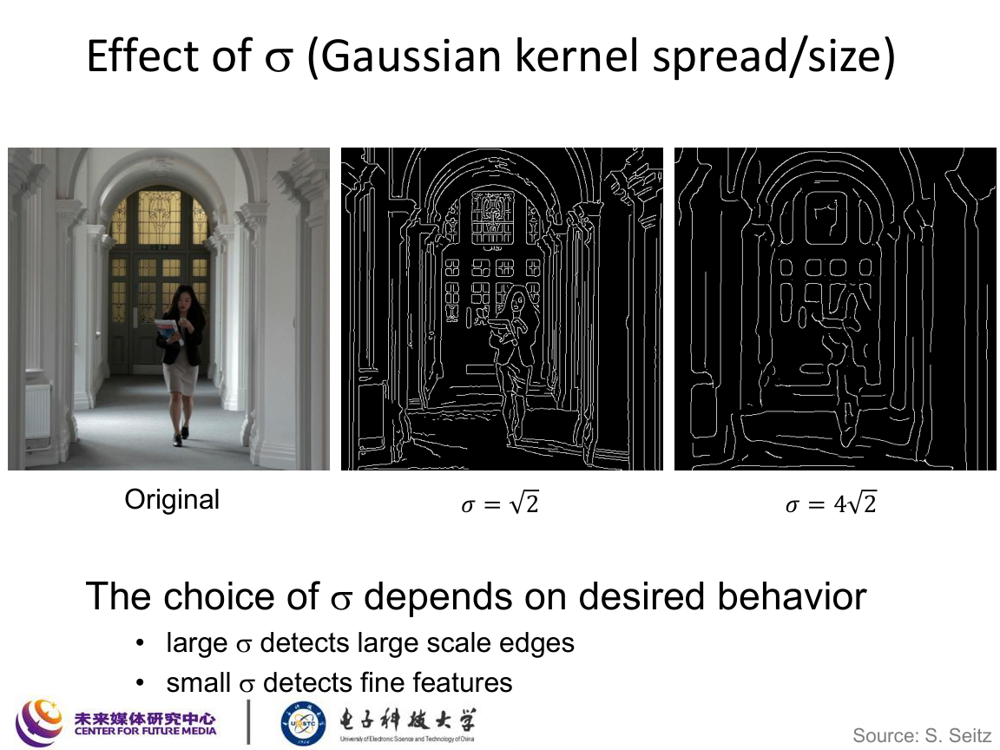

### 8.1 大 $\sigma$

- 平滑更强；
- 检测到的是大尺度边缘；
- 噪声更少；
- 细节更容易丢失。

### 8.2 小 $\sigma$

- 保留更多细节；
- 对细微结构更敏感；
- 也更容易受噪声影响。

因此 $\sigma$ 控制的是“检测的尺度”。

## 9. 课件中的扩展内容

### 9.1 Laplacian of Gaussian

课件开头回顾了 LoG：

$$
\operatorname{LoG}(I)=I*\nabla^2 G_\sigma.
$$

其中

$$
\nabla^2 G_\sigma=
\frac{\partial^2 G_\sigma}{\partial x^2}
+
\frac{\partial^2 G_\sigma}{\partial y^2}.
$$

LoG 常用于检测零交叉边缘，但实际工程中 Canny 更常用。

### 9.2 pB 边界检测器

课件还提到基于亮度、颜色和纹理综合的边界检测器 `pB`，说明：

- 真正的边界不只由灰度差分决定；
- 高层语义和区域组织也会影响边界感知。

## 10. Canny 流程一图记忆

建议把 Canny 记成下面这条链：

$$
I
\xrightarrow{\text{Gaussian Derivative}}
(I_x,I_y)
\xrightarrow{\text{Gradient}}
(M,\theta)
\xrightarrow{\text{NMS}}
\tilde{M}
\xrightarrow{\text{Hysteresis}}
\text{Edges}
$$

这是这讲最重要的流程图。

## 11. 本讲必须掌握的公式

### 11.1 梯度

$$
\nabla I=
\begin{bmatrix}
I_x\\I_y
\end{bmatrix}
$$

### 11.2 梯度幅值

$$
M=\sqrt{I_x^2+I_y^2}
$$

### 11.3 梯度方向

$$
\theta=\operatorname{atan2}(I_y,I_x)
$$

### 11.4 高斯函数

$$
G_\sigma(x,y)=\frac{1}{2\pi\sigma^2}\exp\!\left(-\frac{x^2+y^2}{2\sigma^2}\right)
$$

### 11.5 导数卷积定理

$$
\frac{\mathrm{d}}{\mathrm{d}x}(f*g)=f*\frac{\mathrm{d}g}{\mathrm{d}x}
$$

### 11.6 导数高斯滤波

$$
I_x=I*\frac{\partial G_\sigma}{\partial x},
\qquad
I_y=I*\frac{\partial G_\sigma}{\partial y}
$$

### 11.7 LoG

$$
\operatorname{LoG}(I)=I*\nabla^2G_\sigma
$$

## 12. 这讲应该记住什么

1. 边缘是灰度快速变化的位置，不只对应物体轮廓。
2. 求导能检测边缘，但也会放大噪声。
3. 所以必须先平滑，再求导。
4. 高斯导数是边缘检测中的核心滤波器。
5. Canny 的四步：高斯导数、梯度计算、非极大值抑制、滞后阈值。
6. $\sigma$ 决定检测尺度，高低阈值决定保留边缘的策略。
7. 好边缘检测器要兼顾检测率、定位和单响应。
